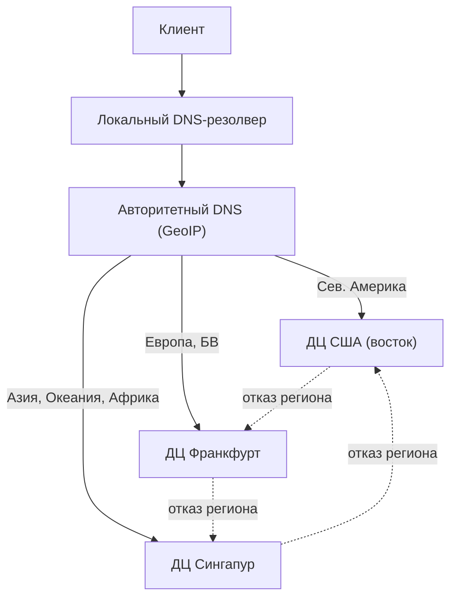
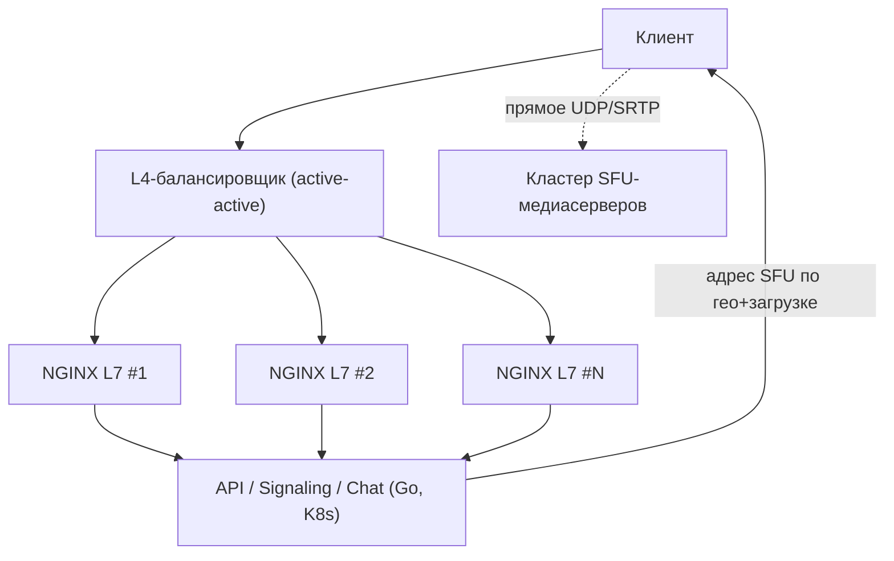
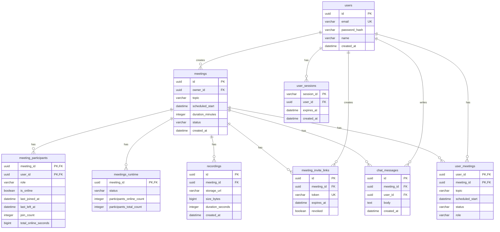
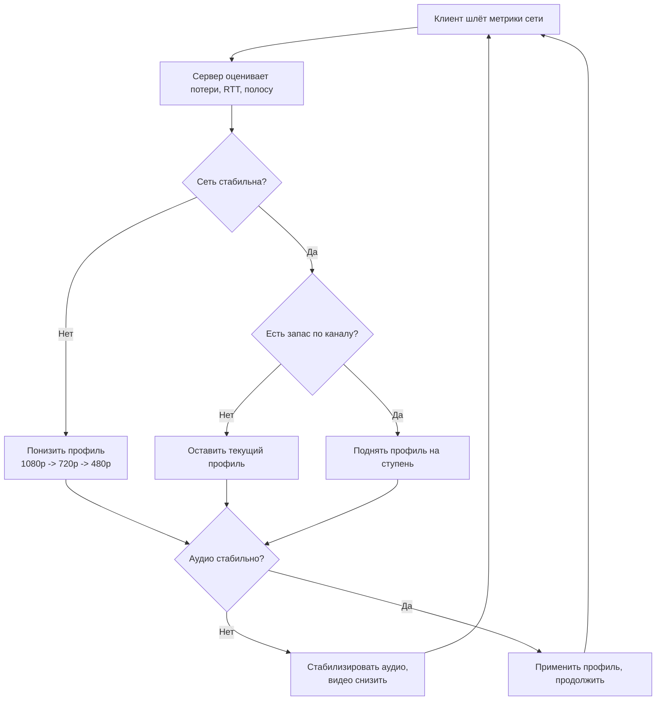
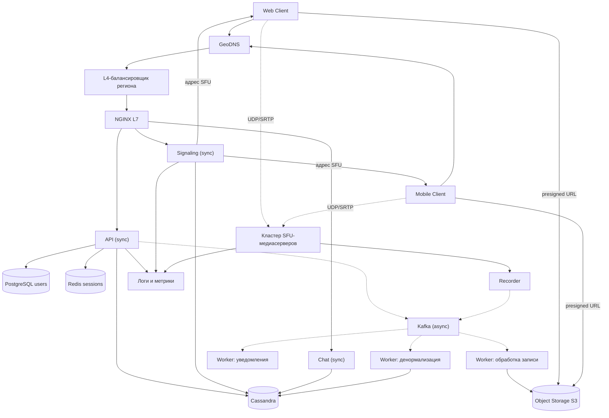

# Высоконагруженный сервис видеоконференций (Zoom-подобный сервис)

Расчётно-пояснительная записка (РПЗ) по проектированию высоконагруженной системы видеоконференцсвязи: от описания продукта и целевой аудитории до расчёта нагрузки, архитектуры, баз данных, алгоритмов, надёжности и стоимости инфраструктуры.

Все исходные (продуктовые) метрики взяты из открытых источников и снабжены ссылками вида `[^n]`. Технические метрики (RPS, объёмы хранения, трафик, количество серверов) являются **расчётными** и выводятся из исходных метрик и явно перечисленных допущений.

---

## Содержание

- [Основная часть](#основная-часть)
  - [1. Тема и целевая аудитория](#1-тема-и-целевая-аудитория)
    - [Тип сервиса и аналоги](#тип-сервиса-и-аналоги)
    - [Функционал MVP](#функционал-mvp)
    - [Ключевые продуктовые решения](#ключевые-продуктовые-решения)
    - [Целевая аудитория](#целевая-аудитория)
  - [2. Расчёт нагрузки](#2-расчёт-нагрузки)
    - [Допущения для расчёта нагрузки](#допущения-для-расчёта-нагрузки)
    - [Продуктовые метрики](#продуктовые-метрики)
    - [Технические метрики: объём хранилища](#технические-метрики-объём-хранилища)
    - [Технические метрики: сетевой трафик](#технические-метрики-сетевой-трафик)
    - [Технические метрики: RPS по типам запросов](#технические-метрики-rps-по-типам-запросов)
  - [3. Глобальная балансировка нагрузки](#3-глобальная-балансировка-нагрузки)
    - [Расположение дата-центров](#расположение-дата-центров)
    - [Распределение запросов по дата-центрам](#распределение-запросов-по-дата-центрам)
    - [Разбиение на поддомены](#разбиение-на-поддомены)
  - [4. Локальная балансировка нагрузки](#4-локальная-балансировка-нагрузки)
  - [5. Логическая схема БД](#5-логическая-схема-бд)
  - [6. Физическая схема баз данных](#6-физическая-схема-баз-данных)
  - [7. Алгоритмы](#7-алгоритмы)
  - [8. Технологии](#8-технологии)
  - [9. Обеспечение надёжности](#9-обеспечение-надёжности)
  - [10. Схема проекта](#10-схема-проекта)
  - [11. Список серверов и стоимость](#11-список-серверов-и-стоимость)
- [Список источников](#список-источников)

---

## Основная часть

### 1. Тема и целевая аудитория

#### Тип сервиса и аналоги

Проектируется **сервис видеоконференцсвязи** — платформа для онлайн-встреч, групповых звонков и вебинаров с записью в облако. Это нетривиальный по архитектуре сервис: основная нагрузка приходится на реалтайм-передачу медиа (аудио/видео) с низкой задержкой, что требует отдельного медиаслоя (SFU-серверов), глобальной геобалансировки и большого объёма хранения записей.

**Реальные аналоги:** Zoom, Microsoft Teams, Google Meet, Cisco Webex.

Рыночная ниша подтверждена: Zoom занимает около **55 %** мирового рынка ПО для видеоконференций, Microsoft Teams — около 32 % [^4]. Годовая выручка Zoom за финансовый 2025 год составила **$4 665,4 млн** [^3], что доказывает устойчивость и масштаб ниши.

#### Функционал MVP

В MVP проектируется ключевая часть системы — реалтайм-встречи с медиа и сопутствующими сервисами. Вспомогательные службы (биллинг, маркетплейс приложений, телефония) вынесены за рамки.

1. **Создание и подключение к встрече** — мгновенный старт и планирование встреч, вход по ссылке-приглашению, пароль/комната ожидания.
2. **Групповой видеозвонок** — одновременное участие десятков участников, передача аудио/видео через медиасерверы.
3. **Демонстрация экрана** — шеринг экрана, окна приложения или вкладки браузера.
4. **Чат во время встречи** — общий чат, реакции, короткие сообщения и ссылки.
5. **Запись встречи в облако** — запись аудио/видео на стороне сервиса, хранение и последующее скачивание.

#### Ключевые продуктовые решения

- **Серверная топология медиа (SFU, Selective Forwarding Unit).** Клиент отправляет один восходящий поток на сервер, сервер выборочно ретранслирует потоки остальным участникам. Это масштабируется лучше, чем mesh (p2p каждый-с-каждым), и дешевле, чем MCU (микширование на сервере).
- **Облачная запись.** Запись формируется и хранится на стороне сервиса (а не на клиенте), что даёт единый доступ к записи всем участникам, но создаёт основной объём хранения.
- **Разделение прав доступа:** организатор (host), участник (participant), зритель (viewer для вебинаров).
- **Адаптивное качество.** Битрейт подстраивается под канал, приоритет у стабильности звука (см. [раздел 7](#7-алгоритмы)).

#### Целевая аудитория

Глобальный рынок с доминированием в сегменте видеоконференций. Аудитория значительно превышает требуемый минимум в 1 млн активных пользователей.

| Параметр | Значение | Источник |
| -------- | -------: | -------- |
| **MAU (месячная аудитория)** | ≈ **500 000 000** пользователей/мес | [^5][^6] |
| **DAU (дневная аудитория)** | ≈ **300 000 000** участников встреч/день | [^1][^2][^5] |
| **География** | Глобальный рынок, > 50 % доли сегмента видеоконференций | [^4][^6] |
| **Корпоративные клиенты** | ≈ 192 600 enterprise-клиентов | [^3] |
| **Годовая выручка аналога (Zoom, FY2025)** | $4 665,4 млн | [^3] |

> **Важное уточнение по метрике DAU.** Заявленные «300 млн в день» — это **участники встреч (meeting participants)**, а не уникальные пользователи: один человек, зашедший в три встречи за день, считается трижды. Это разъяснение самого Zoom после критики в 2020 году [^1][^2]. Оценки MAU в открытых источниках варьируются от ≈ 450 млн (ядро платформы) до ≈ 700 млн (со всеми сервисами) [^5]; для расчётов берём консервативные **500 млн MAU**.

---

### 2. Расчёт нагрузки

Цель раздела — пересчитать аудиторные метрики в продуктовые и технические. Исходные метрики (MAU, DAU, длительность встречи, требования к полосе) — из открытых источников. Производные метрики выводятся из них и из допущений ниже.

#### Допущения для расчёта нагрузки

Все спорные величины вынесены в явные допущения; таблицы ниже ссылаются на их номера.

1. **А1.** Среднее число встреч (участий) на активного пользователя — **2 в день**. Тогда участий в день: `300 млн × 2 = 600 млн`.
2. **А2.** Пиковый коэффициент для запросов `k = 3` (концентрация в рабочие часы и будни внутри региона).
3. **А3.** Средний размер встречи — **10 участников** (микс встреч 1:1 и командных на 5–20 человек). Тогда встреч в день: `600 млн / 10 = 60 млн`.
4. **А4.** Пиковый коэффициент медиа-конкурентности `k_m = 2,5` (суточный пик сглажен распределением по часовым поясам).
5. **А5.** Записывается **10 % встреч** → `6 млн записей в день`.
6. **А6.** Среднее число сообщений чата — **20 на пользователя в день** → `6 млрд сообщений в день`; средний размер сообщения ≈ 300 Б.
7. **А7.** Средний размер облачной записи ≈ **400 МБ** (≈ 1,1 Мбит/с × 50 мин, сжатое 720p).
8. **А8.** Средняя длительность участия ≈ **50 мин** (по данным о средней длительности встречи ≈ 52 мин [^6]).
9. **А9.** Сигналинг — **0,1 управляющего события на участника-минуту** (mute, смена раскладки, смена активного докладчика, переподключение; медиапакеты идут по UDP и в RPS не учитываются).
10. **А10.** Горизонт хранения: записи — 365 дней, чат и runtime-таблицы — 30 дней.
11. **А11.** Целевая загрузка узлов ≤ 70 %, резервирование `N+1`.

#### Продуктовые метрики

Полоса пропускания на одного участника группового HD-звонка по официальным данным Zoom — **2,6 Мбит/с исходящих и 1,8 Мбит/с входящих** (720p); режим «галерея» потребляет до 2,0 Мбит/с (25 видов) и 4,0 Мбит/с (49 видов) [^7]. Для укрупнённого расчёта принимаем **2 Мбит/с** загрузки на участника (downlink от сервера) и **2,6 Мбит/с** отдачи (uplink к серверу).

| Метрика | Значение | Источник / расчёт |
| ------- | -------: | ----------------- |
| MAU | 500 млн/мес | [^5][^6] |
| DAU | 300 млн/день | [^1][^5] |
| Среднее число встреч на пользователя | 2 / день | А1 |
| Средняя длительность встречи | ≈ 50 мин | [^6], А8 |
| Средний размер встречи | 10 участников | А3 |
| Полоса на участника (downlink / uplink) | 1,8–2,0 / 2,6 Мбит/с | [^7] |
| Доля записываемых встреч | 10 % | А5 |
| Сообщений чата на пользователя | 20 / день (≈ 600/мес) | А6 |
| Хранилище записей на пользователя | ≈ 0,36 записи/мес ≈ **0,14 ГБ/мес** | расчёт: 6 млн × 30 / 500 млн |
| Объём чата на пользователя | ≈ 0,18 МБ/мес | А6, А8 |

> Хранилище **на пользователя** мало (записи централизованы и принадлежат организатору), но **системный** объём огромен из-за размера медиа — см. ниже.

#### Технические метрики: объём хранилища

Разбивка по существенным типам данных. Основной объём создают облачные записи.

| Тип данных | Кол-во объектов (за период) | Средний размер | Общий объём |
| ---------- | --------------------------: | -------------: | ----------: |
| **Записи встреч (за сутки)** | 6 000 000 | 400 МБ | **≈ 2,4 ПБ/сутки** |
| **Записи встреч (за 365 дней, А10)** | 2 190 000 000 | 400 МБ | **≈ 876 ПБ** |
| Сообщения чата (за сутки) | 6 000 000 000 | 300 Б | ≈ 1,8 ТБ/сутки |
| Сообщения чата (за 30 дней, А10) | 180 000 000 000 | 300 Б | ≈ 54 ТБ |
| Метаданные участий (за 30 дней) | 18 000 000 000 | 80 Б | ≈ 1,4 ТБ |
| Метаданные встреч (за 30 дней) | 1 800 000 000 | 130 Б | ≈ 234 ГБ |

Итог: доминирует объект-хранилище записей (**сотни петабайт**), реляционные/колоночные данные — десятки терабайт.

#### Технические метрики: сетевой трафик

Главный технический вызов сервиса — медиатрафик. Считаем по конкурентным участникам.

Средняя конкурентность участников:

$$
C_{avg} = \frac{\text{участий/день} \times \text{длительность}}{1440\ \text{мин}} = \frac{600\,000\,000 \times 50}{1440} \approx 20{,}8\ \text{млн}
$$

Пиковая конкурентность (А4):

$$
C_{peak} = C_{avg} \times k_m = 20{,}8\ \text{млн} \times 2{,}5 \approx 52\ \text{млн участников}
$$

Пиковый исходящий медиатрафик (отдача сервером клиентам, downlink 2 Мбит/с):

$$
T_{egress} = C_{peak} \times 2\ \text{Мбит/с} = 52\,000\,000 \times 2 = 104\,000\,000\ \text{Мбит/с} \approx 104\ \text{Тбит/с}
$$

| Тип трафика | Среднее (ПБ/сутки) | Пиковое (Гбит/с) | Основание |
| ----------- | -----------------: | ---------------: | --------- |
| **Медиа исходящий (downlink к клиентам)** | ≈ 454 | **≈ 104 000** | [^7], А4 |
| Медиа входящий (uplink от клиентов) | ≈ 590 | ≈ 135 200 | [^7], А4 |
| Сигналинг + HTTP (zoom.com, api) | ≈ 0,1 | ≈ 200 | расчёт RPS |
| **ИТОГО исходящий (для выбора интерфейсов)** | **≈ 454 ПБ/сутки** | **≈ 104 000 Гбит/с** | — |

> Такой объём отдачи нельзя обслуживать через платный egress облака (стоимость была бы запретительной): медиаслой размещается на собственных/colocation-серверах с пирингом и транзитом. Это ключевое отличие архитектуры видеосервиса от мессенджера.

#### Технические метрики: RPS по типам запросов

Оценка логических запросов плоскости управления (медиапакеты идут по UDP и здесь не считаются). Средний RPS = (запросов в сутки) / 86 400; пиковый = средний × `k` (А2).

| Тип запроса | Запросов в сутки | Средний RPS | Пиковый RPS (k=3) |
| ----------- | ---------------: | ----------: | ----------------: |
| `POST /meetings/{id}/join` (подключение) | 600 000 000 | ≈ 6 940 | ≈ 20 800 |
| `SIGNAL /events` (управление сессией, А9) | 3 000 000 000 | ≈ 34 700 | ≈ 104 100 |
| `POST /chat/messages` (сообщения чата) | 6 000 000 000 | ≈ 69 400 | ≈ 208 000 |
| `API` (auth, create, list — ≈ 3/польз.) | 900 000 000 | ≈ 10 400 | ≈ 31 200 |
| **ИТОГО (плоскость управления)** | **≈ 10 500 000 000** | **≈ 121 500** | **≈ 364 500** |

Итог: пиковая нагрузка плоскости управления ≈ **365 000 RPS**, при этом основная «тяжесть» сервиса — медиаплоскость на ≈ 104 Тбит/с.

---

### 3. Глобальная балансировка нагрузки

Опираемся на глобальную аудиторию и требование низкой задержки для видеосвязи: пользователь должен попадать на ближайший медиаслой.

#### Расположение дата-центров

| Регион | Расположение ДЦ | Аудитория (MAU) | Доля | Резервный ДЦ |
| ------ | --------------- | --------------: | ---: | ------------ |
| **Северная Америка** | Восточное побережье США | 225 000 000 | 45 % | Франкфурт |
| **Европа / Ближний Восток** | Франкфурт | 150 000 000 | 30 % | Сингапур |
| **Азия / Океания / Африка** | Сингапур | 125 000 000 | 25 % | США (восток) |

Три региональных ДЦ покрывают 500 млн MAU; на один ДЦ приходится не более ≈ 225 млн MAU. Доли по регионам — оценочное распределение глобальной аудитории и используются как веса для дальнейших расчётов ресурсов.

**Принцип работы GeoDNS:**

1. Клиент шлёт DNS-запрос на `zoom.example` через локальный резолвер.
2. Авторитетный DNS определяет географию резолвера по GeoIP-базе.
3. В ответ возвращается IP ближайшего регионального ДЦ.
4. Резолвер кэширует IP и отдаёт его клиенту.
5. Медиа-подключение дополнительно уточняется: API возвращает адрес наименее загруженного SFU-кластера в регионе.

#### Распределение запросов по дата-центрам

Пиковый RPS плоскости управления (≈ 364 500) и пиковый медиатрафик (≈ 104 000 Гбит/с) распределяются по ДЦ пропорционально долям региона.

| ДЦ | Доля | Пик RPS (управление) | Пик медиа (Гбит/с) |
| -- | ---: | -------------------: | -----------------: |
| США | 45 % | ≈ 164 000 | ≈ 46 800 |
| Европа | 30 % | ≈ 109 400 | ≈ 31 200 |
| Азия | 25 % | ≈ 91 100 | ≈ 26 000 |

#### Разбиение на поддомены

| Поддомен / сервис | Назначение | Характер трафика | Пик RPS (оценка) |
| ----------------- | ---------- | ---------------- | ---------------: |
| `zoom.example` | Веб-интерфейс, сессии | HTTP + WebSocket | ≈ 310 000 |
| `api.zoom.example` | Авторизация, создание/планирование встреч | HTTP API | ≈ 31 200 |
| `media.zoom.example` | SFU/TURN-медиасерверы | Долгоживущие UDP/SRTP-потоки | не оцениваем в RPS (Гбит/с) |

---

### 4. Локальная балансировка нагрузки

Внутри регионального ДЦ трафик делится на две плоскости: **управление** (HTTP/WebSocket через NGINX) и **медиа** (прямое подключение к SFU-кластерам, минуя L7).

1. L4-балансировщик (active-active) распределяет соединения на пул NGINX L7.
2. REST API балансируется по `round robin`.
3. WebSocket-сессии — по `least connections` (новые подключения на наименее загруженный узел).
4. Медиатрафик **не проходит через NGINX**: клиент получает от API адрес конкретного SFU-узла (по гео и текущей загрузке) и подключается к нему напрямую по UDP.

Как клиент попадает на L7: на регион выделен виртуальный IP (через GeoDNS), за ним — группа NGINX-инстансов, между которыми трафик делится по правилам выше. Резервирование внутри региона — `N+1` (А11).

#### Оценка количества L7-балансировщиков

Опираемся на бенчмарки NGINX: производительность TLS-обработки (CPS, новые TLS-соединения в секунду) растёт практически линейно с числом ядер [^8][^9]. Для планирования берём консервативные **2 000 HTTPS CPS на инстанс** при целевой загрузке 70 % (А11).

Из-за keep-alive доля новых TLS-соединений ≈ 30 % от пикового RPS управления:

$$
CPS_{peak} \approx 0{,}3 \times 364\,500 \approx 109\,000\ \text{соед/с}
$$

$$
N_{nginx} = \frac{CPS_{peak}}{2000 \times 0{,}7} = \frac{109\,000}{1400} \approx 78
$$

С учётом `N+1` и распределения по трём зонам доступности закладываем **90 инстансов** NGINX на весь сервис.

---

### 5. Логическая схема БД

#### Сущности и таблицы

| Таблица | Назначение |
| ------- | ---------- |
| `users` | Пользователи и данные аутентификации |
| `meetings` | Встречи, их параметры и состояние |
| `meeting_participants` | Участники встречи и статус подключения |
| `meeting_invite_links` | Инвайт-ссылки на встречу |
| `user_meetings` | Денормализация: список встреч пользователя без `JOIN` |
| `meetings_runtime` | Денормализация: открытие встречи без `JOIN` |
| `chat_messages` | Сообщения чата внутри встречи |
| `recordings` | Метаданные записей и ссылки на объект-хранилище |
| `user_sessions` | Активные сессии пользователей |

Переподключения не теряются: для участника храним `join_count`, `last_joined_at`, `last_left_at`, `total_online_seconds`.

#### Размеры таблиц и нагрузка

Допущения объёмов: пользователей 500 млн; встреч в день 60 млн; участий в день 600 млн; сообщений в день 6 млрд; горизонт хранения по А10.

| Таблица | Размер строки | Кол-во строк | Объём | Запись (QPS, ср.) | Чтение (QPS, ср.) |
| ------- | ------------: | -----------: | ----: | ----------------: | ----------------: |
| `users` | ≈ 220 Б | 500 000 000 | ≈ 110 ГБ | ≈ 1 000 | ≈ 10 000 |
| `meetings` | ≈ 130 Б | 1 800 000 000 | ≈ 234 ГБ | ≈ 700 | ≈ 50 000 |
| `meeting_invite_links` | ≈ 110 Б | 1 800 000 000 | ≈ 198 ГБ | ≈ 700 | ≈ 20 000 |
| `meetings_runtime` | ≈ 128 Б | 1 800 000 000 | ≈ 230 ГБ | ≈ 100 000 | ≈ 200 000 |
| `meeting_participants` | ≈ 80 Б | 18 000 000 000 | ≈ 1,4 ТБ | ≈ 13 900 | ≈ 50 000 |
| `user_meetings` | ≈ 128 Б | 18 000 000 000 | ≈ 2,3 ТБ | ≈ 13 900 | ≈ 100 000 |
| `chat_messages` | ≈ 300 Б | 180 000 000 000 | ≈ 54 ТБ | ≈ 69 400 | ≈ 69 400 |
| `recordings` | ≈ 180 Б | 2 190 000 000 | ≈ 394 ГБ | ≈ 70 | ≈ 10 000 |
| `user_sessions` | ≈ 96 Б | 300 000 000 | ≈ 29 ГБ | ≈ 5 000 | ≈ 50 000 |

Основные хот-таблицы по записи — `chat_messages` (≈ 69 400 QPS среднее, ≈ 208 000 пик) и `meeting_participants` (join/leave). Пик берём ×3 от среднего (А2).

#### Требования к консистентности

| Таблица | Консистентность | Обоснование |
| ------- | --------------- | ----------- |
| `users` | strong | вход и безопасность |
| `meeting_invite_links` | strong | контроль доступа на встречу |
| `meetings` | strong | параметры встречи |
| `meetings_runtime` | eventual | денормализация |
| `user_meetings` | eventual | денормализация |
| `meeting_participants` | eventual | допустима задержка статусов |
| `chat_messages` | eventual | допустима задержка доставки |
| `user_sessions` | session | достаточно в рамках сессии |

---

### 6. Физическая схема баз данных

#### Размещение данных по СУБД

| Таблица | СУБД | Причина |
| ------- | ---- | ------- |
| `users` | PostgreSQL | строгие ограничения, уникальность `email`, транзакции |
| `meetings`, `meeting_invite_links`, `meeting_participants`, `user_meetings`, `meetings_runtime`, `chat_messages`, `recordings` | Cassandra | высокая запись, горизонтальное масштабирование, чтение по ключу |
| `user_sessions` | Redis | быстрые сессии с TTL |
| файлы записей | Object Storage (S3) | большие бинарные объекты |

Выбор Cassandra обоснован профилем нагрузки: пиковая запись хот-таблиц ≈ 200 000+ QPS, при этом один узел Cassandra устойчиво держит порядка десятков тысяч операций в секунду, а кластер линейно масштабируется до миллиона записей в секунду [^10]. Чтение почти всегда идёт по ключу партиции (по `meeting_id` или `user_id`), что идеально ложится на модель Cassandra.

#### Индексы

| Таблица | Ключ / индекс | Оценка размера | Обоснование |
| ------- | ------------- | -------------: | ----------- |
| `users` | B-tree PostgreSQL по `email` | ≈ 20 ГБ | вход по email |
| `meetings` | Cassandra PK `((meeting_id))` | ≈ 29 ГБ | точечное чтение встречи |
| `meeting_participants` | PK `((meeting_id), user_id)` | ≈ 432 ГБ | список участников встречи |
| `user_meetings` | PK `((user_id), scheduled_start)` | ≈ 432 ГБ | список встреч пользователя |
| `chat_messages` | PK `((meeting_id), created_at, id)` | ≈ 5 ТБ | история чата по времени |
| `recordings` | PK `((meeting_id), created_at)` | ≈ 35 ГБ | список записей встречи |
| `user_sessions` | Redis key `session_id` | ≈ 20–30 ГБ | проверка сессии |

#### Шардирование и партиционирование

| Таблица | Ключ шардирования | Партиционирование | Почему |
| ------- | ----------------- | ----------------- | ------ |
| `meetings` | `meeting_id` | — | равномерное распределение записи |
| `meeting_participants` | `meeting_id` | — | чтение/запись локальны для встречи |
| `user_meetings` | `user_id` | — | список встреч читается по пользователю |
| `chat_messages` | `meeting_id` | по месяцу `created_at` | 180 млрд строк/30 дней, быстрый TTL |
| `recordings` | `meeting_id` | по месяцу `created_at` | проще архив и очистка |

**Резервирование БД:** Cassandra — `RF=3` в регионе + асинхронная межрегиональная репликация; PostgreSQL — primary + replica; Redis — master + replica; Object Storage — репликация объектов между зонами.

---

### 7. Алгоритмы

| Алгоритм | Где используется | Коротко |
| -------- | ---------------- | ------- |
| Selective Forwarding (SFU) | медиаслой | сервер выборочно ретранслирует потоки, не микшируя |
| Active Speaker Detection | раскладка участников | определяем говорящего и выводим главным |
| Adaptive Bitrate | видеопоток | подстраиваем качество под канал |
| Jitter Buffer | аудио/видео | сглаживаем неравномерную доставку пакетов |
| Идемпотентные join/leave | статусы участников | повторные события не ломают счётчики |

#### Adaptive Bitrate

1. Клиент раз в секунду шлёт метрики сети (потери, RTT, доступную полосу).
2. Сервер вычисляет целевой профиль качества (1080p / 720p / 480p).
3. При ухудшении сети профиль понижается сразу, при улучшении — поднимается плавно.
4. Приоритет у стабильного звука: первым режется видео.
5. Звонок не обрывается, качество меняется ступенчато.

---

### 8. Технологии

| Технология | Где | Почему |
| ---------- | --- | ------ |
| React + TypeScript | фронтенд | быстрый UI, типобезопасность |
| Go | бэкенд (API, signaling, chat) | высокая конкурентность на большом числе соединений |
| C++ / WebRTC (SFU) | медиаслой | низкая задержка, плотная упаковка потоков на узел |
| NGINX | L7 | HTTPS и WebSocket-проксирование |
| L4-балансировщик | вход в ДЦ | распределение соединений по пулу NGINX |
| Cassandra | хот-таблицы | высокая запись, горизонтальное масштабирование [^10] |
| PostgreSQL | аккаунты | строгие ограничения и транзакции |
| Redis | сессии, горячий кеш | быстрые чтения и TTL [^11] |
| Object Storage (S3) | файлы записей | дёшево хранить большой бинарный объём [^15] |
| Kafka | события, денормализация, воркеры | высокий throughput, хранение и повторное чтение событий [^12] |

**Kafka против RabbitMQ.** Kafka — потоковый лог: высокая пропускная способность, хранит события и позволяет перечитывать их (replay). RabbitMQ — классическая очередь задач, сообщение обычно забрали и удалили. Нам нужно одновременно вести поток событий, обновлять денормализованные таблицы и переигрывать события при сбоях воркеров, поэтому выбран **Kafka**.

---

### 9. Обеспечение надёжности

| Компонент | Схема резервирования |
| --------- | -------------------- |
| SFU-медиасерверы | пул узлов на регион, при отказе узла клиент переподключается на соседний (reconnect ≤ неск. сек) |
| API / Signaling / Chat | `N+1`, ≥ 2 инстанса в зоне, health-check и автоперезапуск |
| NGINX L7 | `N+1`, пул в 3 зонах, исключение нерабочих нод |
| L4-балансировщик | active-active, трафик через несколько инстансов |
| Cassandra | `RF=3` в регионе, асинхронная межрегиональная репликация |
| PostgreSQL (`users`) | primary + replica, автоматический failover |
| Redis (`user_sessions`) | master + replica, автоматический failover |
| Kafka | `replication factor = 3`, `acks=all` |
| Object Storage (S3) | репликация между зонами |
| Worker-сервисы | ≥ 2 воркера на тип задачи, повторная обработка через Kafka |
| Логи и метрики | отдельный контур, отказ узла не останавливает сбор |

**Graceful degradation.** При перегрузке региона: (1) новые встречи временно маршрутизируются в резервный ДЦ; (2) на медиаслое принудительно понижается профиль качества (Adaptive Bitrate); (3) облачная запись ставится в отложенную очередь; (4) чат переходит в режим «best effort» при сохранении видеосвязи.

---

### 10. Схема проекта

Как читать схему: плоскость управления (сплошные стрелки) проходит через NGINX и backend-сервисы к БД; плоскость медиа (пунктир) идёт напрямую клиент ↔ SFU по UDP; асинхронные события (Kafka) питают воркеров денормализации, уведомлений и обработки записей; готовые записи складываются в S3 и отдаются клиенту по `presigned URL`.

---

### 11. Список серверов и стоимость

#### 11.1. Удельное потребление ресурсов

| Технология | Тип нагрузки | Производительность | Источник |
| ---------- | ------------ | -----------------: | -------- |
| Go | лёгкий (JSON API) | 3 500 RPS/ядро | оценка |
| Go | средний (бизнес-логика) | 1 000 RPS/ядро | оценка |
| NGINX | TLS | 2 000 CPS/инстанс | [^8][^9] |
| Cassandra | смешанная | ≈ 30 000 оп/с на узел | [^10] |
| Redis | key-value | 100 000+ оп/с на узел | [^11] |
| Kafka | поток | сотни тыс. сообщений/с на брокер | [^12] |
| SFU | медиа | ≈ 3 000 участников/узел | допущение (С1) |

> **Допущение С1.** Ёмкость одного SFU-узла принимается ≈ 3 000 одновременных участников (48-ядерный узел, ограничение по упаковке/ретрансляции SRTP-потоков). Реальная ёмкость зависит от разрешения и раскладки; величина вынесена в допущение.

#### 11.2. Медиаслой (SFU) — доминирующий фронт

Самый ресурсоёмкий компонент. Считаем по пиковой конкурентности (52 млн участников) и целевой загрузке 70 % (А11):

$$
N_{sfu} = \frac{C_{peak}}{3000 \times 0{,}7} = \frac{52\,000\,000}{2100} \approx 24\,800 \Rightarrow \mathbf{25\,000\ узлов}
$$

| ДЦ | Доля | Пик участников | Узлов SFU |
| -- | ---: | -------------: | --------: |
| США | 45 % | 23,4 млн | ≈ 11 250 |
| Европа | 30 % | 15,6 млн | ≈ 7 500 |
| Азия | 25 % | 13,0 млн | ≈ 6 250 |
| **Всего** | 100 % | 52 млн | **≈ 25 000** |

#### 11.3. Stateless-сервисы (Kubernetes)

CPU = пик RPS / производительность ядра, с учётом загрузки 70 %.

| Сервис | Пик RPS | RPS/ядро | vCPU |
| ------ | ------: | -------: | ---: |
| Chat | 208 000 | 3 500 | ≈ 85 |
| Signaling | 104 100 | 3 500 | ≈ 43 |
| API | 31 200 | 1 000 | ≈ 45 |
| Join/meeting | 20 800 | 1 000 | ≈ 30 |
| Workers | — | — | ≈ 50 |
| Мониторинг | — | — | ≈ 16 |
| **Итого** | — | — | **≈ 270 vCPU** |

При 14 полезных ядрах на узел EX44 [^13] и резерве `N+1` по зонам: **≈ 24 узла**.

#### 11.4. Базы данных и инфраструктура

| Компонент | Расчёт | Узлов |
| --------- | ------ | ----: |
| **Cassandra** | объём хот-данных ≈ 58 ТБ × `RF=3` × 1,3 ≈ 226 ТБ; узел AX162 = 2×3,84 ТБ ≈ 7,7 ТБ → ограничение по объёму [^10][^14] | **≈ 30** |
| **NGINX L7** | см. [раздел 4](#4-локальная-балансировка-нагрузки) | **90** |
| **PostgreSQL** | 12 ядер (чтение+запись), 110 ГБ данных + 20 ГБ индекс, primary+replica ×3 ДЦ | **6** |
| **Redis** | 50 000 QPS, 30 ГБ, master+replica ×3 ДЦ [^11] | **6** |
| **Kafka** | ≈ 200 000 сообщений/с, `RF=3`, 3 брокера/ДЦ [^12] | **9** |
| **L4-балансировщики** | active-active, 3/ДЦ | **9** |
| **Мониторинг** | 2/ДЦ | **6** |

#### 11.5. Конфигурации и цены серверов (аренда Hetzner)

| Модель | CPU | RAM | Диски | Цена/мес | Источник |
| ------ | --- | ---:| ----- | -------: | -------- |
| EX44 | Intel Core i5-13500 (6P+8E) | 64 ГБ DDR4 | 2×512 ГБ NVMe | **€44** | [^13] |
| AX42 | AMD Ryzen 7 PRO 8700GE (8c) | 64 ГБ DDR5 | 2×512 ГБ NVMe | **€49** | [^14] |
| AX162-R | AMD EPYC 9454P (48c) | 256 ГБ DDR5 ECC | 2×3,84 ТБ NVMe | **€199** | [^14] |

#### 11.6. Итоговая стоимость compute

| Компонент | Модель | Кол-во | Цена/мес | Итого/мес |
| --------- | ------ | -----: | -------: | --------: |
| **SFU-медиасерверы** | AX162-R | 25 000 | €199 | **€4 975 000** |
| Cassandra | AX162-R | 30 | €199 | €5 970 |
| NGINX L7 | EX44 | 90 | €44 | €3 960 |
| Kubernetes (stateless) | EX44 | 24 | €44 | €1 056 |
| PostgreSQL | AX42 | 6 | €49 | €294 |
| Redis | EX44 | 6 | €44 | €264 |
| Kafka | AX42 | 9 | €49 | €441 |
| L4-балансировщики | EX44 | 9 | €44 | €396 |
| Мониторинг | EX44 | 6 | €44 | €264 |
| **Compute итого** | — | **25 180** | — | **≈ €4,99 млн/мес** |

> Медиаслой формирует ≈ 99 % стоимости compute. Это закономерно для видеосервиса: основная нагрузка — реалтайм-ретрансляция медиа, а не веб/БД-плоскость.

#### 11.7. Хранение записей (Object Storage)

Объём за год — ≈ 876 ПБ (см. [раздел 2](#технические-метрики-объём-хранилища)). Применяем тиринг: «горячие» записи (последние 30 дней) — S3 Standard; «холодные» — S3 Glacier Instant Retrieval [^15].

| Класс | Объём | Цена/ГБ·мес | Стоимость/мес |
| ----- | ----: | ----------: | ------------: |
| S3 Standard (30 дней) | ≈ 72 ПБ | $0,023 | ≈ $1,66 млн |
| Glacier Instant (335 дней) | ≈ 804 ПБ | $0,004 | ≈ $3,22 млн |
| **Итого хранение** | ≈ 876 ПБ | — | **≈ $4,9 млн/мес** |

Для сравнения: размещение всего объёма в S3 Standard стоило бы ≈ $20,1 млн/мес (876 ПБ × $0,023/ГБ) — тиринг экономит ≈ 75 %.

#### 11.8. Сетевой трафик (медиа)

Пиковая отдача ≈ 104 000 Гбит/с (см. [раздел 2](#технические-метрики-сетевой-трафик)) обслуживается **собственным/colocation-транзитом с пирингом**, а не платным egress облака. При ориентировочной ставке крупного транзита ≈ $0,10/Мбит·с в месяц затраты составляют порядка **$10 млн/мес** (величина сильно зависит от объёма пиринга и является оценкой, а не источниковой метрикой).

#### 11.9. Сводная стоимость

| Статья | Стоимость/мес | За 5 лет |
| ------ | ------------: | -------: |
| Compute (аренда Hetzner) | ≈ €4,99 млн (≈ $5,4 млн) | ≈ $324 млн |
| Хранение записей (S3 тиринг) | ≈ $4,9 млн | ≈ $294 млн |
| Сетевой транзит (оценка) | ≈ $10 млн | ≈ $600 млн |
| **Итого** | **≈ $20 млн/мес** | **≈ $1,2 млрд** |

**Вывод по стоимости.** Стоимость сервиса определяют три статьи — **медиасерверы, сетевой транзит и хранение записей**; веб- и БД-плоскость (NGINX, K8s, Cassandra, PostgreSQL, Redis, Kafka) в сумме дают менее 0,1 % затрат. Порядок итоговой суммы (≈ $240 млн/год инфраструктуры) согласуется с тем, что себестоимость реального Zoom составляет порядка четверти выручки в $4,66 млрд [^3].

---

## Список источников

[^1]: Reuters — «Zoom says it has 300 million daily meeting participants, not users» (2020). <https://www.reuters.com/article/us-zoom-video-commn-encryption/zoom-says-it-has-300-million-daily-meeting-participants-not-users-idUSKBN22C1T4>

[^2]: The Verge — «Zoom admits it doesn't have 300 million users, corrects misleading claims» (2020). <https://www.theverge.com/2020/4/30/21242421/zoom-300-million-users-incorrect-meeting-participants-statement>

[^3]: Zoom Communications — Q4 & Full Year Fiscal 2025 Financial Results (выручка $4 665,4 млн; ≈ 192 600 enterprise-клиентов). <https://investors.zoom.us/>

[^4]: Statista — «Videoconferencing software market share 2024» (Zoom ≈ 55 %, Teams ≈ 32 %). <https://www.statista.com/statistics/1331323/videoconferencing-market-share/>

[^5]: Business of Apps — «Zoom Revenue and Usage Statistics» (DAU ≈ 300 млн, оценки MAU, выручка, клиенты). <https://www.businessofapps.com/data/zoom-statistics/>

[^6]: Zoom Blog — «Video conferencing statistics» и «Meeting statistics» (средняя длительность встречи ≈ 52 мин, ≈ 3,3 трлн минут встреч в год, доля рынка). <https://www.zoom.com/en/blog/video-conferencing-statistics/>

[^7]: Zoom Technical Library — «Calculating Bandwidth Usage for Zoom Meetings and Phone» (720p group: 2,6 Мбит/с up / 1,8 down; 1080p: 3,8 / 3,0; галерея 25 — 2,0; 49 — 4,0). <https://library.zoom.com/admin-corner/network-management/quality-of-service-and-network-best-practices-explainer/calculating-bandwidth-usage-for-zoom-meetings-and-phone>

[^8]: NGINX — «NGINX SSL Performance» (линейный рост CPS с числом ядер). <https://www.nginx.com/wp-content/uploads/2014/07/NGINX-SSL-Performance.pdf>

[^9]: NGINX Blog — «Testing the Performance of NGINX and NGINX Plus Web Servers». <https://blog.nginx.org/blog/testing-the-performance-of-nginx-and-nginx-plus-web-servers>

[^10]: Google Cloud Blog — «Cassandra Hits One Million Writes Per Second on Google Compute Engine»; Instaclustr — «Node throughput Benchmarking for Apache Cassandra». <https://cloudplatform.googleblog.com/2014/03/cassandra-hits-one-million-writes-per-second-on-google-compute-engine.html>, <https://www.instaclustr.com/blog/node-throughput-benchmarking-for-apache-cassandra/>

[^11]: Redis — «How fast is Redis? (benchmarks)» (100 000+ оп/с на одиночном узле). <https://redis.io/docs/latest/operate/oss_and_stack/management/optimization/benchmarks/>

[^12]: LinkedIn Engineering — «Benchmarking Apache Kafka: 2 Million Writes Per Second (On Three Cheap Machines)». <https://engineering.linkedin.com/kafka/benchmarking-apache-kafka-2-million-writes-second-three-cheap-machines>

[^13]: Hetzner — выделенный сервер EX44 (Intel Core i5-13500, 64 ГБ, 2×512 ГБ NVMe). <https://www.hetzner.com/dedicated-rootserver/ex44/>

[^14]: Hetzner — матрица AX-серверов (AX42 ≈ €49/мес; AX162-R, AMD EPYC 9454P 48c, 256 ГБ, 2×3,84 ТБ ≈ €199/мес). <https://www.hetzner.com/dedicated-rootserver/matrix-ax/>

[^15]: Amazon Web Services — «Amazon S3 pricing» (S3 Standard $0,023/ГБ·мес; Glacier Instant Retrieval ≈ $0,004; Glacier Deep Archive $0,00099). <https://aws.amazon.com/s3/pricing/>
