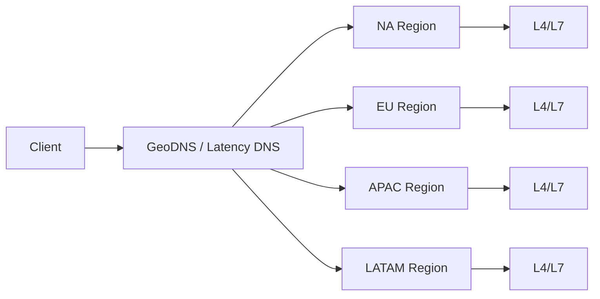
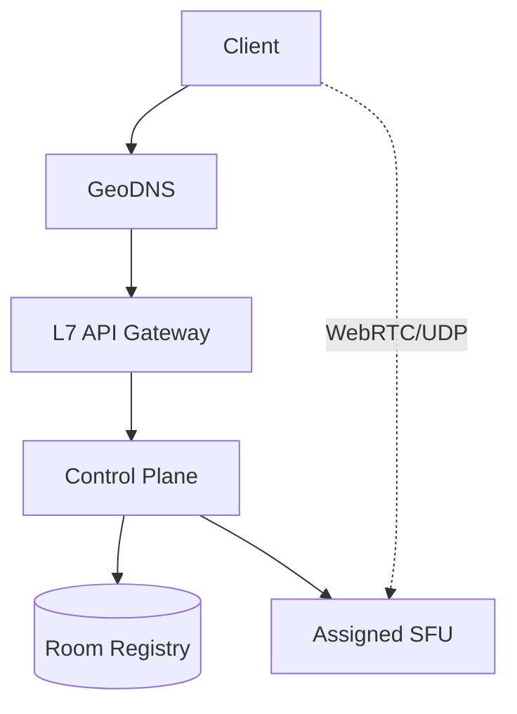
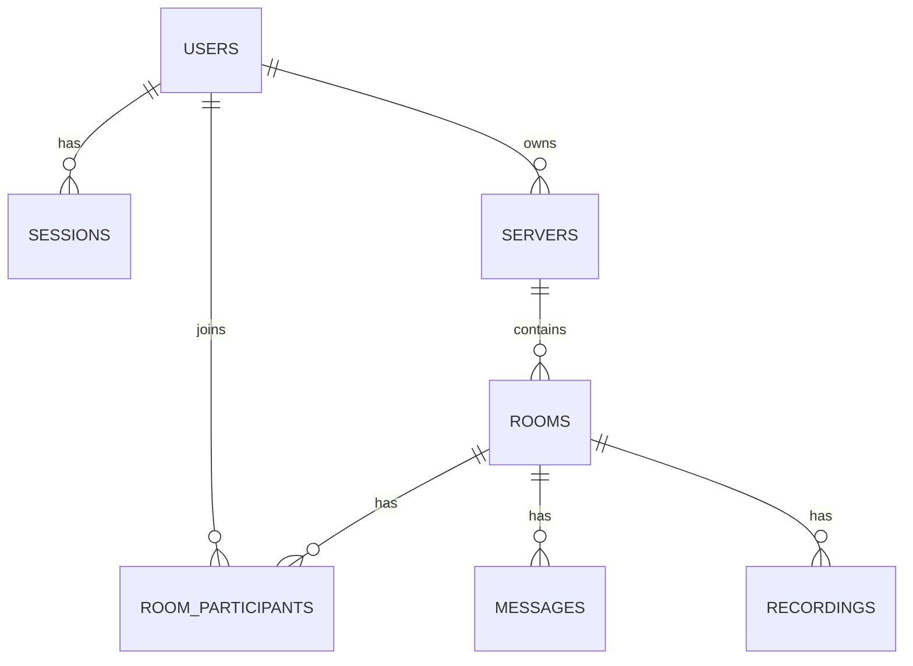
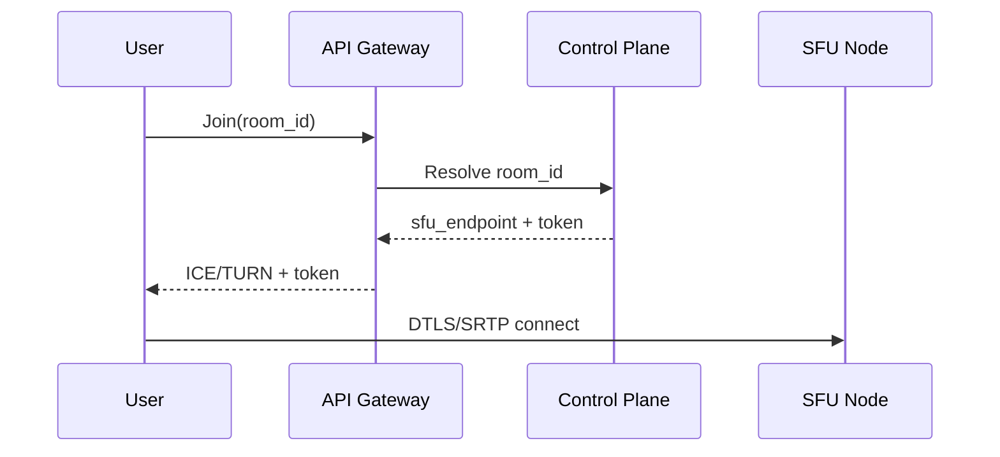
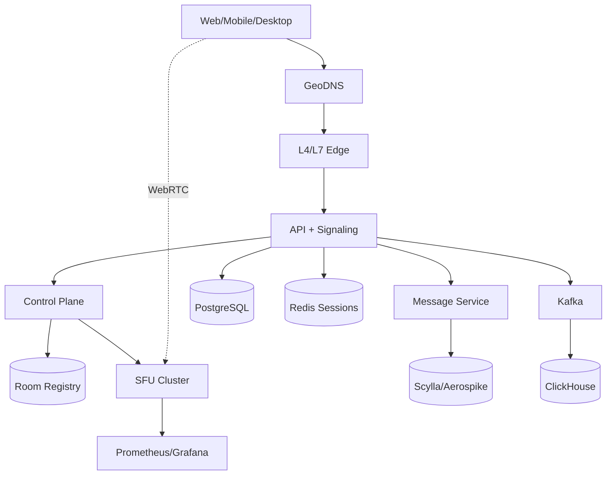

# Highload VK Education  
## Discord/Zoom-подобные голосовые и видео-звонки (WebRTC + SFU)

## Содержание
- [1. Тема, аудитория, функционал](#1-тема-аудитория-функционал)
- [2. Расчет нагрузки](#2-расчет-нагрузки)
- [3. Глобальная балансировка нагрузки](#3-глобальная-балансировка-нагрузки)
- [4. Локальная балансировка нагрузки](#4-локальная-балансировка-нагрузки)
- [5. Логическая схема БД](#5-логическая-схема-бд)
- [6. Физическая схема БД](#6-физическая-схема-бд)
- [7. Алгоритмы](#7-алгоритмы)
- [8. Технологии](#8-технологии)
- [9. Обеспечение надежности](#9-обеспечение-надежности)
- [10. Схема проекта](#10-схема-проекта)
- [11. Расчет ресурсов](#11-расчет-ресурсов)
- [Список источников](#список-источников)

## 1. Тема, аудитория, функционал

| Пункт | Значение |
|---|---|
| Тема | Высоконагруженный сервис голосовых/видео-звонков уровня Discord/Zoom |
| Ключевая модель | WebRTC + SFU (селективная пересылка медиапотоков) |
| Ключевой MVP | auth, community/server, text chat, voice/video room, invite link, запись звонка |
| Основной приоритет | Низкая задержка аудио/видео и масштабирование голосовых комнат |

### Базовые продуктовые метрики (только подтвержденные)

| Метрика | Значение | Источник |
|---|---:|---|
| MAU | 150,000,000 | [helplama.com/discord-statistics](https://helplama.com/discord-statistics/) |
| DAU | 29,000,000 | [helplama.com/discord-statistics](https://helplama.com/discord-statistics/) |
| Зарегистрированные пользователи | 600,000,000 | [demandsage.com/discord-statistics](https://www.demandsage.com/discord-statistics/) |
| Сообщений в день | 850,000,000 | [venturebeat.com](https://venturebeat.com/business/discord-crosses-250-million-users-as-it-hits-4-year-anniversary/) |
| Минут голосовых разговоров в день | 4,000,000,000 | [cloudwards.net/discord-statistics](https://www.cloudwards.net/discord-statistics/) |
| Пиковый concurrent users | 8,200,000 | [cloudwards.net/discord-statistics](https://www.cloudwards.net/discord-statistics/) |
| Количество сообществ | 19,000,000+ | [thesmallbusinessblog.com](https://thesmallbusinessblog.com/how-many-discord-servers-are-there/) |
| Zoom daily meeting participants | 300,000,000 | [reuters.com](https://www.reuters.com/article/us-zoom-video-commn-encryption/zoom-says-it-has-300-million-daily-meeting-participants-not-users-idUSKBN22C1T4) |

## 2. Расчет нагрузки

Детальные формулы вынесены в отдельный файл: [`docs/calculations.md`](docs/calculations.md).

### Производные метрики

| Метрика | Значение | Основание |
|---|---:|---|
| Сообщений на 1 DAU в день | 29.31 | D1 |
| RPS отправки сообщений | 9,838 RPS | D2 |
| Средний concurrent voice users | 2,777,778 | D3 |
| Peak коэффициент voice-нагрузки | 2.95 | D4 |
| Средний voice-трафик | ~235 Gbit/s | D6 |
| Пиковый voice-трафик | ~694 Gbit/s | D7 |
| RTP packets/s (20 ms packetization) | 138,888,889 packets/s | D8 |
| RTCP reports/s (каждые 5 сек) | 555,556 reports/s | D9 |
| RPS авторизации (1 вход/DAU/день) | 336 RPS | D10 |

### Профили видеоканала (для sizing, не расчет DAU-трафика)

| Профиль Zoom Meeting | Upstream | Downstream | Источник |
|---|---:|---:|---|
| 720p | ~2.6 Mbit/s | ~1.8 Mbit/s | [library.zoom.com](https://library.zoom.com/admin-corner/network-management/quality-of-service-and-network-best-practices-explainer/calculating-bandwidth-usage-for-zoom-meetings-and-phone) |
| 1080p | ~3.8 Mbit/s | ~3.0 Mbit/s | [library.zoom.com](https://library.zoom.com/admin-corner/network-management/quality-of-service-and-network-best-practices-explainer/calculating-bandwidth-usage-for-zoom-meetings-and-phone) |

### Сводная таблица RPS (API + media plane)

| Контур | Метрика | Avg | Peak |
|---|---|---:|---:|
| API plane | Auth RPS | 336 | 1,000 (буфер x3) |
| API plane | Message write RPS | 9,838 | 29,514 (буфер x3) |
| Media plane | RTP packets/s | 138,888,889 | 416,666,667 (буфер x3) |
| Media plane | RTCP reports/s | 555,556 | 1,666,668 (буфер x3) |

## 3. Глобальная балансировка нагрузки

### География трафика (discord.com)

| Страна | Доля | Источник |
|---|---:|---|
| США | 24.27% | [similarweb.com/website/discord.com/#geography](https://www.similarweb.com/website/discord.com/#geography) |
| Бразилия | 5.84% | [similarweb.com/website/discord.com/#geography](https://www.similarweb.com/website/discord.com/#geography) |
| Индия | 5.18% | [similarweb.com/website/discord.com/#geography](https://www.similarweb.com/website/discord.com/#geography) |
| Канада | 3.22% | [similarweb.com/website/discord.com/#geography](https://www.similarweb.com/website/discord.com/#geography) |
| Филиппины | 3.06% | [similarweb.com/website/discord.com/#geography](https://www.similarweb.com/website/discord.com/#geography) |
| Прочие | 58.43% | расчет из таблицы |

### Размещение регионов

| Регион | Локации DC (пример) | Роль |
|---|---|---|
| NA | New York, Chicago, Los Angeles, Vancouver | API + SFU |
| EU | London, Frankfurt, Warsaw | API + SFU |
| APAC | Singapore, Tokyo, Mumbai, Manila | API + SFU |
| LATAM | Sao Paulo | SFU + read-replica API |

## 4. Локальная балансировка нагрузки

| Слой | Технология | Что балансируется |
|---|---|---|
| L4 | Maglev / Envoy L4 / IPVS | UDP media (RTP/RTCP/DTLS) |
| L7 | Nginx / Envoy | HTTPS, WSS signaling, API |
| Application | Control Plane + SFU allocator | Назначение комнаты на SFU |

| Контур | Резервирование | Формула |
|---|---|---|
| L7/API | N+1 | `N_total = N + 1` |
| SFU pool | N+1 per region | `N_total = N + 1` |
| Registry/State | RF=3 | `quorum >= 2` |

## 5. Логическая схема БД

### Сущности и нагрузки

| Сущность | Назначение | Write path | Read path | Консистентность |
|---|---|---|---|---|
| `users` | Профиль и учетные данные | low | medium | strong |
| `sessions` | Токены/сессии | medium | high | strong |
| `servers` | Сообщества | low | medium | strong |
| `rooms` | Voice/video комнаты | medium | high | strong |
| `room_participants` | Участники активных комнат | very high | very high | eventual |
| `messages` | Текстовые сообщения | high | high | eventual |
| `recordings` | Метаданные записей | medium | medium | eventual |
| `analytics_events` | Технические/продуктовые события | very high | medium | eventual |

## 6. Физическая схема БД

| Данные | Хранилище | Ключ/индексы | Шардирование | Репликация |
|---|---|---|---|---|
| `users`, `servers`, `rooms` | PostgreSQL | PK, `email`, `owner_id` | Citus hash by `id` | 1 primary + 2 replicas |
| `sessions`, `room_registry` | Redis / Aerospike | key by `token`/`room_id` | hash by key | RF=3 |
| `messages` | ScyllaDB / Aerospike | `(room_id, created_at)` | hash by `room_id` | RF=3 |
| `analytics_events` | Kafka -> ClickHouse | `event_time`, `room_id` | partition by time | ReplicatedMergeTree |
| `recordings` binary | S3 | object key | auto | cross-AZ |

### Backup

| Компонент | Политика |
|---|---|
| PostgreSQL | daily full + WAL |
| Scylla/Aerospike | snapshots + restore drill |
| ClickHouse | partition backup to S3 |
| Redis | AOF/RDB + replica |
| S3 | versioning + lifecycle |

## 7. Алгоритмы

| Алгоритм | Где используется | Цель |
|---|---|---|
| Weighted Rendezvous Hashing | Назначение room -> SFU | минимальный remap при failover |
| Simulcast/SVC | Видеопотоки | адаптация качества под канал |
| GCC (WebRTC congestion control) | Media transport | контроль bitrate/packet loss |
| Jitter buffer + PLC | Аудио тракт | стабилизация звука |
| Opus DTX | Аудио | снижение трафика в тишине |
| NACK/PLI/FIR | Видео восстановление | устойчивость к packet loss |

## 8. Технологии

| Слой | Технологии |
|---|---|
| Clients | Web (TS/React), Desktop (Tauri/Electron), Mobile (Flutter/Kotlin/Swift) |
| Realtime | WebRTC, WebSocket, STUN/TURN |
| Media | SFU (Rust/Go), Opus, VP8/VP9/H.264, Simulcast/SVC |
| Backend | Go/Rust, gRPC, NATS/Kafka |
| Data | PostgreSQL, ScyllaDB/Aerospike, Redis, ClickHouse, S3 |
| Infra | Kubernetes, Nginx/Envoy, Prometheus, Grafana, Loki, Jaeger |

## 9. Обеспечение надежности

| Компонент | Резервирование | Деградация при сбое |
|---|---|---|
| API Gateway | N+1 | read-only сценарии для части API |
| SFU pool | N+1 + room remap | reconnect на резервный SFU |
| Redis/Aerospike registry | RF=3 | временное увеличение latency join |
| PostgreSQL | primary + replicas | блок write-only функций при failover |
| Kafka/ClickHouse | RF=3 + replay | временное отставание аналитики |
| S3 recording | multi-AZ | задержка публикации записи |

| Паттерн | Применение |
|---|---|
| Retry + exponential backoff | reconnect signaling/media |
| Circuit breaker | межсервисные вызовы |
| Graceful shutdown | rolling updates без обрыва звонков |
| Graceful degradation | отключение non-critical функций (записи/аналитика) |

## 10. Схема проекта

## 11. Расчет ресурсов

### Входные точки для sizing

| Метрика | Значение | Основание |
|---|---:|---|
| Message write peak | 29,514 RPS | `9,838 * 3` |
| Voice traffic peak | ~694 Gbit/s | D7 |
| RTP peak | 416,666,667 packets/s | `D8 * 3` |
| RTCP peak | 1,666,668 reports/s | `D9 * 3` |

### Сводная оценка мощностей (целевые пулы)

| Пул | CPU (cores) | RAM | Network | Кол-во узлов |
|---|---:|---:|---:|---:|
| Edge L7/API | 192 | 768 GB | 200 Gbit/s | 24 |
| SFU media | 1,280 | 5 TB | 1,200 Gbit/s | 80 |
| Messaging | 256 | 1 TB | 250 Gbit/s | 16 |
| PostgreSQL/Citus | 96 | 384 GB | 40 Gbit/s | 6 |
| Redis/Aerospike | 192 | 1.5 TB | 80 Gbit/s | 12 |
| Kafka/ClickHouse | 160 | 640 GB | 60 Gbit/s | 10 |
| Observability | 64 | 256 GB | 20 Gbit/s | 4 |

### Размещение

| Компонент | Размещение |
|---|---|
| SFU | Bare metal (приоритет latency + NIC throughput) |
| API/Control Plane | Kubernetes |
| Data services | Bare metal / managed |
| S3 | Cloud object storage |

## Список источников

1. [Discord Statistics 2025](https://helplama.com/discord-statistics/)
2. [Discord statistics and users](https://www.demandsage.com/discord-statistics/)
3. [Discord crosses 250 million users](https://venturebeat.com/business/discord-crosses-250-million-users-as-it-hits-4-year-anniversary/)
4. [Discord statistics and trends](https://www.cloudwards.net/discord-statistics/)
5. [How many Discord servers are there](https://thesmallbusinessblog.com/how-many-discord-servers-are-there/)
6. [Discord geography traffic](https://www.similarweb.com/website/discord.com/#geography)
7. [Zoom 300M daily meeting participants](https://www.reuters.com/article/us-zoom-video-commn-encryption/zoom-says-it-has-300-million-daily-meeting-participants-not-users-idUSKBN22C1T4)
8. [Zoom bandwidth requirements](https://library.zoom.com/admin-corner/network-management/quality-of-service-and-network-best-practices-explainer/calculating-bandwidth-usage-for-zoom-meetings-and-phone)
9. [Discord voice scale (2018)](https://habr.com/ru/articles/423171/)
10. [Nginx performance benchmark](https://blog.nginx.org/blog/testing-the-performance-of-nginx-and-nginx-plus-web-servers)
11. [Aerospike benchmark](https://aerospike.com/blog/new-aerospike-benchmark-demonstrates-real-time-performance-at-petabyte-scale/)
12. [Data center map](https://map.datacente.rs/)