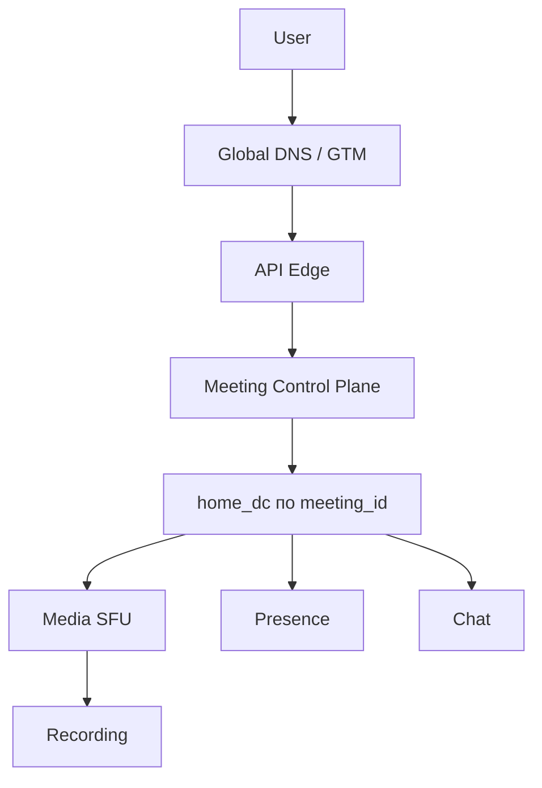
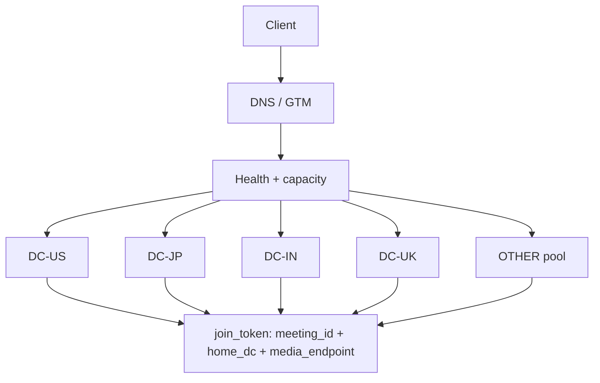
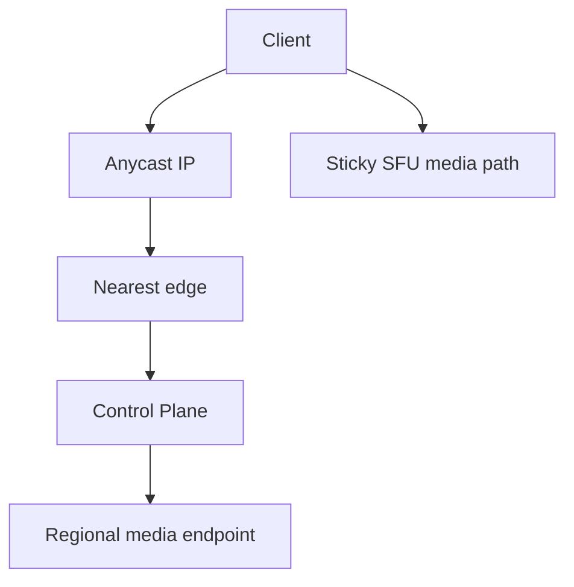
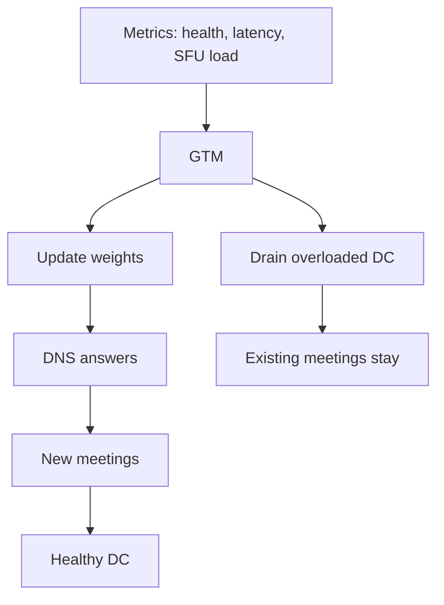
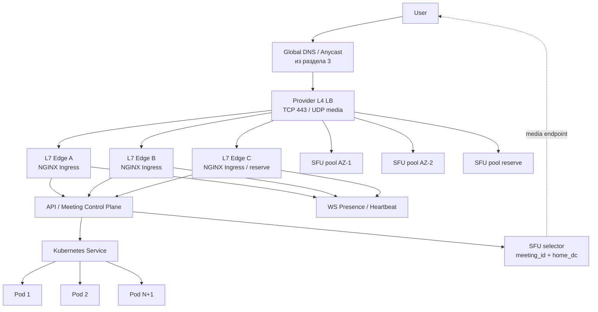

# Проектирование высоконагруженного Zoom-подобного сервиса видеовстреч

## Содержание

- [Основная часть](#основная-часть)
  - [1. Тема и целевая аудитория](#1-тема-и-целевая-аудитория)
    - [1.1. Тип сервиса](#11-тип-сервиса)
    - [1.2. Рыночная ниша и реальные аналоги](#12-рыночная-ниша-и-реальные-аналоги)
    - [1.3. Функционал MVP](#13-функционал-mvp)
    - [1.4. Ключевые продуктовые решения](#14-ключевые-продуктовые-решения)
    - [1.5. Целевая аудитория](#15-целевая-аудитория)
  - [2. Расчёт нагрузки](#2-расчёт-нагрузки)
    - [2.1. Исходные метрики и методика расчёта](#21-исходные-метрики-и-методика-расчёта)
    - [2.2. Продуктовая оценка видеовстреч](#22-продуктовая-оценка-видеовстреч)
    - [2.3. Хранилище пользователя и техническое хранение](#23-хранилище-пользователя-и-техническое-хранение)
    - [2.4. Сетевой трафик и RPS](#24-сетевой-трафик-и-rps)
  - [3. Глобальная балансировка нагрузки](#3-глобальная-балансировка-нагрузки)
    - [3.1. Функциональное разбиение по доменам](#31-функциональное-разбиение-по-доменам)
    - [3.2. Выбор и расположение дата-центров](#32-выбор-и-расположение-дата-центров)
    - [3.3. Распределение нагрузки по дата-центрам](#33-распределение-нагрузки-по-дата-центрам)
    - [3.4. Схема DNS-балансировки](#34-схема-dns-балансировки)
    - [3.5. Схема Anycast-балансировки](#35-схема-anycast-балансировки)
    - [3.6. Регулировка трафика между дата-центрами](#36-регулировка-трафика-между-дата-центрами)
    - [3.7. Вывод по глобальной балансировке](#37-вывод-по-глобальной-балансировке)
  - [4. Локальная балансировка нагрузки](#4-локальная-балансировка-нагрузки)
    - [4.1. Что балансируем локально](#41-что-балансируем-локально)
    - [4.2. Схема локальной балансировки](#42-схема-локальной-балансировки)
    - [4.3. Механизмы резервирования](#43-механизмы-резервирования)
    - [4.4. Ограничители для расчёта](#44-ограничители-для-расчёта)
    - [4.5. Расчёт входной нагрузки на L7 Edge](#45-расчёт-входной-нагрузки-на-l7-edge)
    - [4.6. Расчёт количества L7-балансировщиков](#46-расчёт-количества-l7-балансировщиков)
    - [4.7. Вывод по локальной балансировке](#47-вывод-по-локальной-балансировке)
- [Список источников](#список-источников)

## Основная часть

---

### 1. Тема и целевая аудитория

#### 1.1. Тип сервиса

| Параметр            | Значение                                                                                                   |
| ------------------- | ---------------------------------------------------------------------------------------------------------- |
| Учебное название    | **MeetFlow**                                                                                               |
| Тип сервиса         | Zoom-подобный сервис видеовстреч                                                                           |
| Основной сценарий   | Групповая онлайн-встреча с аудио, видео, демонстрацией экрана, чатом и записью                             |
| Целевые страны      | США, Европа, Россия, Япония                                                                                |
| Реальные аналоги    | Zoom, Microsoft Teams, Google Meet                                                                         |
| Масштаб для расчёта | `MF_MAU = 320 млн MAU`, `MF_DAU = 115 млн DAU`, `MF_DMP = 300 млн участий во встречах в день` [^1][^2][^3] |

#### 1.2. Рыночная ниша и реальные аналоги

| Аналог | Метрика | Что подтверждает |
| ------ | ------- | ---------------- |
| Microsoft Teams | 320 млн monthly active users, раскрыто в FY24 Q1 [^1] | Массовый размер аудитории коммуникационного сервиса |
| Microsoft Teams | 115 млн daily active users, октябрь 2020 [^2] | Нижнюю публичную границу daily-аудитории для расчёта |
| Zoom | 300 млн daily meeting participants, апрель 2020; это участники встреч, а не unique users [^3] | Массовую ежедневную нагрузку именно на видеовстречи |
| Zoom | Средняя встреча — 54 минуты и 10 участников, данные за 15.11.2020–15.11.2021 [^4] | Базу для продуктовой оценки видеозвонков |
| Zoom | $4.8688 млрд выручки за FY2026 и 4 468 клиентов с TTM-выручкой больше $100 000 [^10] | Актуальность ниши на 2026 год |

#### 1.3. Функционал MVP

| № | Функция MVP | Кратко | Метрика для расчёта |
| -: | ----------- | ------ | ------------------- |
| 1 | Создание встречи | Пользователь создаёт мгновенную или запланированную встречу | `MF_MEETINGS_DAY`, `POST /meetings` |
| 2 | Подключение к встрече | Участник входит по ссылке или приглашению | `MF_DMP`, `POST /meetings/{id}/join` |
| 3 | Групповая аудио- и видеосвязь | Участники общаются в 720p group video | `MF_VIDEO_UP_MBPS`, `MF_VIDEO_DOWN_MBPS`, `MF_AUDIO_MBPS` |
| 4 | Демонстрация экрана | Участник показывает экран | `MF_SCREEN_MBPS_MAX` |
| 5 | Чат во время встречи | Участники отправляют текстовые сообщения | `MF_CHAT_MSG_LIMIT` |
| 6 | Облачная запись | Организатор включает запись встречи | `MF_RECORD_QUOTA_GB`, `MF_RECORDING_SIZE_GB` |

#### 1.4. Ключевые продуктовые решения

| Решение | Значение для MVP | Что считается дальше |
| ------- | ---------------- | -------------------- |
| Расчёт ведётся от групповой встречи | Средняя встреча: `MF_MEET_SIZE = 10` участников | Количество встреч в сутки |
| Базовый профиль качества | 720p group video по официальным требованиям Zoom [^5] | Видео-трафик upload/download |
| Запись встречи включается в облако | Cloud recording сохраняет видео, аудио и текст чата [^7] | Хранилище записей |
| Хранилище записей ограничено квотой | Для Pro/Business у Zoom — 10 GB на licensed user [^8] | Верхняя граница object storage |
| Частота чата не выдумывается | Есть лимит сообщения, но нет публичной частоты сообщений на пользователя [^6] | Для чата оставлена формула без подстановки |

#### 1.5. Целевая аудитория

| Параметр | Значение |
| -------- | -------: |
| География | Глобальный рынок; Zoom использовался почти в 200 странах и территориях [^4] |
| Месячная аудитория | `MF_MAU = 320 000 000` пользователей/месяц |
| Дневная аудитория | `MF_DAU = 115 000 000` пользователей/день |
| Участий во встречах в день | `MF_DMP = 300 000 000` участий/день |
| Средний размер встречи | `MF_MEET_SIZE = 10` участников |
| Средняя длительность встречи | `MF_MEET_LEN_MIN = 54` минуты |

---

### 2. Расчёт нагрузки

#### 2.1. Исходные метрики и методика расчёта

| Название | Описание (бывшее значение) | Источник / расчёт |
| -------- | -------------------------- | ----------------- |
| `MF_MAU` | 320 000 000 monthly active users; публичное значение Microsoft Teams, FY24 Q1 / 2023 | Берётся как целевой месячный масштаб аналога; без пересчёта на 2026, потому что более новой публичной MAU-метрики Teams в открытых источниках не найдено [^1] |
| `MF_DAU` | 115 000 000 daily active users; публичное значение Microsoft Teams, октябрь 2020 | Берётся как консервативная daily-аудитория аналога; это не статистика Zoom и не результат экстраполяции [^2] |
| `MF_DMP` | 300 000 000 daily meeting participants; публичное значение Zoom, апрель 2020 | Используется для нагрузки на видеовстречи; это участники встреч, один пользователь может считаться несколько раз [^3] |
| `MF_MEET_SIZE` | 10 участников в средней Zoom-встрече; данные за 15.11.2020–15.11.2021 | Используется для расчёта `MF_MEETINGS_DAY = MF_DMP / MF_MEET_SIZE` [^4] |
| `MF_MEET_LEN_MIN` | 54 минуты — средняя длительность Zoom-встречи; данные за 15.11.2020–15.11.2021 | Используется для расчёта participant-minutes [^4] |
| `MF_VIDEO_UP_MBPS` | 2.6 Mbps на участника для 720p group video upload | Официальные требования Zoom к bandwidth [^5] |
| `MF_VIDEO_DOWN_MBPS` | 1.8 Mbps на участника для 720p group video download | Официальные требования Zoom к bandwidth [^5] |
| `MF_AUDIO_MBPS` | 0.08 Mbps на участника для VoIP audio | Верхняя граница диапазона 60–80 kbps из требований Zoom [^5] |
| `MF_SCREEN_MBPS_MAX` | 0.15 Mbps на участника для screen sharing upper-bound | Верхняя граница диапазона 50–150 kbps из требований Zoom [^5] |
| `MF_CHAT_MSG_LIMIT` | 4 000 символов на одно chat-сообщение | Лимит Zoom Team Chat; частота сообщений в открытых источниках не подставляется [^6] |
| `MF_RECORD_QUOTA_GB` | 10 GB cloud recording storage на licensed user | Квота Zoom для Pro/Business [^8] |
| `MF_HEARTBEAT_SEC` | 25 секунд между heartbeat-событиями | Дефолтный `pingInterval = 25000 ms` в Socket.IO [^9] |
| `MF_K_PEAK` | 3 | Проектный коэффициент суточного пика: используется одинаково для RPS и bandwidth |

Текущая актуальность ниши проверяется не устаревшими usage-числами, а финансовой метрикой: Zoom в FY2026 показал $4.8688 млрд выручки и 4 468 крупных клиентов с TTM-выручкой больше $100 000 [^10]. Старые usage-метрики используются только там, где они прямо подписаны по году и где показана формула расчёта.

#### 2.2. Продуктовая оценка видеовстреч

| Название | Расчёт | Значение |
| -------- | ------ | -------: |
| `MF_MEETINGS_DAY` | `MF_DMP / MF_MEET_SIZE` = `300 000 000 / 10` | **30 000 000 встреч/сутки** |
| `MF_JOINS_PER_DAU_DAY` | `MF_DMP / MF_DAU` = `300 000 000 / 115 000 000` | **2.61 подключения/DAU/день** |
| `MF_CREATED_MEETINGS_PER_DAU_DAY` | `MF_MEETINGS_DAY / MF_DAU` = `30 000 000 / 115 000 000` | **0.26 созданных встреч/DAU/день** |
| `MF_PARTICIPANT_MIN_DAY` | `MF_DMP * MF_MEET_LEN_MIN` = `300 000 000 * 54` | **16 200 000 000 participant-minutes/сутки** |
| `MF_AVG_ONLINE_PARTICIPANTS` | `MF_PARTICIPANT_MIN_DAY / 1440` | **11 250 000 участников online в среднем** |
| `MF_PEAK_ONLINE_PARTICIPANTS` | `MF_AVG_ONLINE_PARTICIPANTS * MF_K_PEAK` | **33 750 000 участников online в пик** |
| `MF_HEARTBEAT_EVENTS_DAY` | `MF_PARTICIPANT_MIN_DAY * 60 / MF_HEARTBEAT_SEC` | **38 880 000 000 heartbeat-событий/сутки** |

#### 2.3. Хранилище пользователя и техническое хранение

| Блок данных | Название | Расчёт | Общий объём |
| ----------- | -------- | ------ | ----------: |
| Профили пользователей | `MF_USERS_STORAGE_GB` | `MF_MAU * 256 B` | **81.92 GB** |
| Метаданные встреч, 30 дней | `MF_MEETINGS_META_STORAGE_GB` | `MF_MEETINGS_DAY * 30 * 256 B` | **230.4 GB** |
| Участники встреч, 30 дней | `MF_PARTICIPANTS_STORAGE_TB` | `MF_DMP * 30 * 128 B` | **1.152 TB** |
| Активные сессии | `MF_SESSIONS_STORAGE_GB` | `MF_DAU * 128 B` | **14.72 GB** |
| Суммарное техническое хранение без записей | `MF_TECH_STORAGE_TOTAL_TB` | `MF_USERS_STORAGE_GB + MF_MEETINGS_META_STORAGE_GB + MF_PARTICIPANTS_STORAGE_TB + MF_SESSIONS_STORAGE_GB` | **1.48 TB** |
| Квота облачных записей | `MF_RECORDING_QUOTA_EB` | `MF_MAU * MF_RECORD_QUOTA_GB` | **3.2 EB квоты** |
| Размер одной записи | `MF_RECORDING_SIZE_GB` | `(MF_VIDEO_DOWN_MBPS + MF_AUDIO_MBPS) * MF_MEET_LEN_MIN * 60 / 8 / 1000` | **0.761 GB** |
| Worst-case рост записей | `MF_RECORDING_WORST_PB_DAY` | `MF_MEETINGS_DAY * MF_RECORDING_SIZE_GB` | **22.842 PB/сутки** |
| Записи за 30 дней, worst-case | `MF_RECORDING_WORST_PB_30D` | `MF_RECORDING_WORST_PB_DAY * 30` | **685.26 PB за 30 дней** |
| Суммарное хранение, 30 дней | `MF_STORAGE_TOTAL_30D_PB` | `MF_RECORDING_WORST_PB_30D + MF_TECH_STORAGE_TOTAL_TB` | **≈ 685.261 PB** |
| Чат встречи | `MF_CHAT_STORAGE_FORMULA` | `messages_count * avg_message_size` | Считается после появления фактической частоты сообщений |

В итоговый суммарный объём не включается `MF_RECORDING_QUOTA_EB`, потому что это продуктовая квота, а не фактически занятое хранилище. Для sizing object storage используется worst-case 30-дневное хранение записей: `MF_RECORDING_WORST_PB_30D = 685.26 PB`.

#### 2.4. Сетевой трафик и RPS

##### Сетевой трафик

| Тип трафика | Название | Формула суточного объёма | Суточный объём | Средний bandwidth | Пиковый bandwidth |
| ----------- | -------- | ------------------------ | -------------: | ----------------: | ----------------: |
| Video upload | `MF_VIDEO_UP_GB_DAY` | `MF_PARTICIPANT_MIN_DAY * 60 * MF_VIDEO_UP_MBPS / 8 / 1000` | **315 900 000 GB/сутки** | **29 250 Gbps** | **87 750 Gbps** |
| Video download | `MF_VIDEO_DOWN_GB_DAY` | `MF_PARTICIPANT_MIN_DAY * 60 * MF_VIDEO_DOWN_MBPS / 8 / 1000` | **218 700 000 GB/сутки** | **20 250 Gbps** | **60 750 Gbps** |
| Audio VoIP | `MF_AUDIO_GB_DAY` | `MF_PARTICIPANT_MIN_DAY * 60 * MF_AUDIO_MBPS / 8 / 1000` | **9 720 000 GB/сутки** | **900 Gbps** | **2 700 Gbps** |
| Screen sharing upper-bound | `MF_SCREEN_GB_DAY_MAX` | `MF_PARTICIPANT_MIN_DAY * 60 * MF_SCREEN_MBPS_MAX / 8 / 1000` | **18 225 000 GB/сутки** | **1 687.5 Gbps** | **5 062.5 Gbps** |

Расчёт bandwidth в таблице:

```text
avg_bandwidth_Gbps  = MF_AVG_ONLINE_PARTICIPANTS * bitrate_Mbps / 1000
peak_bandwidth_Gbps = avg_bandwidth_Gbps * MF_K_PEAK
```

##### RPS по основным методам

| Метод / событие | Название | Событий в сутки | Средний RPS | Пиковый RPS |
| --------------- | -------- | --------------: | ----------: | ----------: |
| `POST /meetings` | `MF_CREATE_MEETING_RPS` | `MF_MEETINGS_DAY` = 30 000 000 | **347** | **1 042** |
| `POST /meetings/{id}/join` | `MF_JOIN_RPS` | `MF_DMP` = 300 000 000 | **3 472** | **10 417** |
| `POST /meetings/{id}/leave` | `MF_LEAVE_RPS` | `MF_DMP` = 300 000 000 | **3 472** | **10 417** |
| `WS /presence/heartbeat` | `MF_HEARTBEAT_RPS` | `MF_HEARTBEAT_EVENTS_DAY` = 38 880 000 000 | **450 000** | **1 350 000** |
| `POST /recordings/metadata` | `MF_RECORDING_META_RPS` | до `MF_MEETINGS_DAY` = 30 000 000 | **до 347** | **до 1 042** |
| `POST /meeting-chat/messages` | `MF_CHAT_RPS_FORMULA` | `MF_DAU * chat_messages_per_DAU_day` | формула | формула |

Формула для RPS:

```text
avg_RPS  = events_per_day / 86400
peak_RPS = avg_RPS * MF_K_PEAK
```


---

### 3. Глобальная балансировка нагрузки

#### 3.1. Функциональное разбиение по доменам

| Домен | Основная нагрузка | Как балансируем |
| ----- | ----------------- | --------------- |
| `Auth / Users` | Логин, профиль, токены | Любой здоровый ДЦ |
| `Meeting Control Plane` | `POST /meetings`, `join`, `leave` | Ближайший ДЦ, встрече выдаётся `home_dc` |
| `Media Plane / SFU` | Видео, аудио, screen sharing | Только ближайший/разрешённый media-ДЦ |
| `Presence / Heartbeat` | `WS /presence/heartbeat` | В том же ДЦ, что и встреча |
| `Meeting Chat` | Сообщения внутри встречи | В `home_dc`, репликация асинхронно |
| `Recording` | Запись встречи | В `home_dc`, object storage реплицируется отдельно |


```mermaid
flowchart TD
    U["User"] --> DNS["Global DNS / GTM"]
    DNS --> API["API Edge"]
    API --> CP["Meeting Control Plane"]
    CP --> HOME["home_dc по meeting_id"]
    HOME --> SFU["Media SFU"]
    SFU --> REC["Recording"]
    HOME --> PRES["Presence"]
    HOME --> CHAT["Chat"]
```

#### 3.2. Расположение ДЦ по статистике использования

Для численного распределения берём: U.S. — 40.73%, Japan — 5%, India — 4.35%, UK — 3.72%, Canada — 3.69%, Other — 42.5% [^12].

`Other` не дробится по странам, потому что в источнике нет детализации. Поэтому для расчёта он оставлен как отдельный `OTHER_REGIONAL_POOL`.

| Страна / группа |     Доля | Логический ДЦ / пул   | Почему так                                                 |
| --------------- | -------: | --------------------- | ---------------------------------------------------------- |
| U.S.            |   40.73% | `DC-US-NORTHAMERICA`  | Самая большая доля пользователей                           |
| Canada          |    3.69% | `DC-US-NORTHAMERICA`  | Близко к североамериканскому ДЦ                            |
| Japan           |    5.00% | `DC-JP-TOKYO`         | Отдельный ДЦ снижает media RTT в Японии                    |
| India           |    4.35% | `DC-IN-MUMBAI`        | Отдельный ДЦ нужен из-за удалённости от США/Европы         |
| UK              |    3.72% | `DC-UK-LONDON`        | Низкая задержка для UK и близкий вход в Европу             |
| Other           |   42.51% | `OTHER_REGIONAL_POOL` | Остальные страны направляются по geo/latency routing       |
| **Итого**       | **100%** | —                     | `Other` увеличен на 0.01 п.п. из-за округления в источнике |

Zoom как реальный аналог позволяет платным аккаунтам выбирать дата-центры, которые будут обрабатывать real-time video/audio/shared content meeting traffic [^13]. Поэтому для MeetFlow тоже разделяем **control-plane** и **media-plane**: API можно балансировать шире, а медиа — только в разрешённый/ближайший регион.

| ДЦ / пул | Доля нагрузки | На какие продуктовые метрики влияет |
| -------- | ------------: | ----------------------------------- |
| `DC-US-NORTHAMERICA` | 44.42% | `join latency`, media RTT, стабильность видео для США/Канады |
| `DC-JP-TOKYO` | 5.00% | media RTT для Японии, меньше packet loss на видео |
| `DC-IN-MUMBAI` | 4.35% | latency для Индии, стабильность screen sharing |
| `DC-UK-LONDON` | 3.72% | latency для UK, быстрый вход в европейский сегмент |
| `OTHER_REGIONAL_POOL` | 42.51% | глобальный fallback; точная разбивка появится после real GEO analytics |

#### 3.3. Распределение нагрузки по ДЦ

Формула:

```text
dc_metric = global_metric * dc_share
```

##### Продуктовая нагрузка

| ДЦ / пул | Доля | DAU | Участий/сутки | Встреч/сутки | Peak online |
| -------- | ---: | --: | ------------: | -----------: | ----------: |
| `DC-US-NORTHAMERICA` | 44.42% | **51 083 000** | **133 260 000** | **13 326 000** | **14 991 750** |
| `DC-JP-TOKYO` | 5.00% | **5 750 000** | **15 000 000** | **1 500 000** | **1 687 500** |
| `DC-IN-MUMBAI` | 4.35% | **5 002 500** | **13 050 000** | **1 305 000** | **1 468 125** |
| `DC-UK-LONDON` | 3.72% | **4 278 000** | **11 160 000** | **1 116 000** | **1 255 500** |
| `OTHER_REGIONAL_POOL` | 42.51% | **48 886 500** | **127 530 000** | **12 753 000** | **14 347 125** |
| **Итого** | **100%** | **115 000 000** | **300 000 000** | **30 000 000** | **33 750 000** |

##### Пиковый RPS

| ДЦ / пул | `POST /meetings` | `POST /join` | `POST /leave` | `WS /heartbeat` | `POST /recordings/metadata` |
| -------- | ---------------: | -----------: | ------------: | ---------------: | ---------------------------: |
| `DC-US-NORTHAMERICA` | **463** | **4 627** | **4 627** | **599 670** | **463** |
| `DC-JP-TOKYO` | **52** | **521** | **521** | **67 500** | **52** |
| `DC-IN-MUMBAI` | **45** | **453** | **453** | **58 725** | **45** |
| `DC-UK-LONDON` | **39** | **388** | **388** | **50 220** | **39** |
| `OTHER_REGIONAL_POOL` | **443** | **4 428** | **4 428** | **573 885** | **443** |
| **Итого** | **1 042** | **10 417** | **10 417** | **1 350 000** | **1 042** |

##### Пиковый media bandwidth

| ДЦ / пул | Video upload | Video download | Audio | Screen sharing | Суммарно |
| -------- | -----------: | -------------: | ----: | -------------: | -------: |
| `DC-US-NORTHAMERICA` | **38 978.6 Gbps** | **26 985.2 Gbps** | **1 199.3 Gbps** | **2 248.8 Gbps** | **69 411.8 Gbps** |
| `DC-JP-TOKYO` | **4 387.5 Gbps** | **3 037.5 Gbps** | **135.0 Gbps** | **253.1 Gbps** | **7 813.1 Gbps** |
| `DC-IN-MUMBAI` | **3 817.1 Gbps** | **2 642.6 Gbps** | **117.4 Gbps** | **220.2 Gbps** | **6 797.4 Gbps** |
| `DC-UK-LONDON` | **3 264.3 Gbps** | **2 259.9 Gbps** | **100.4 Gbps** | **188.3 Gbps** | **5 813.0 Gbps** |
| `OTHER_REGIONAL_POOL` | **37 302.5 Gbps** | **25 824.8 Gbps** | **1 147.8 Gbps** | **2 152.1 Gbps** | **66 427.2 Gbps** |
| **Итого** | **87 750.0 Gbps** | **60 750.0 Gbps** | **2 700.0 Gbps** | **5 062.5 Gbps** | **156 262.5 Gbps** |

##### Записи встреч

| ДЦ / пул | Worst-case запись/сутки | Worst-case запись за 30 дней |
| -------- | ----------------------: | ---------------------------: |
| `DC-US-NORTHAMERICA` | **10.146 PB/сутки** | **304.392 PB** |
| `DC-JP-TOKYO` | **1.142 PB/сутки** | **34.263 PB** |
| `DC-IN-MUMBAI` | **0.994 PB/сутки** | **29.809 PB** |
| `DC-UK-LONDON` | **0.850 PB/сутки** | **25.492 PB** |
| `OTHER_REGIONAL_POOL` | **9.710 PB/сутки** | **291.304 PB** |
| **Итого** | **22.842 PB/сутки** | **685.260 PB** |

#### 3.4. DNS-балансировка

DNS используется для первого выбора региона. Latency-based routing выбирает регион с меньшей задержкой среди доступных регионов [^15]. Geo/traffic steering нужен, чтобы учитывать страну, health и веса пулов [^16].

| DNS-имя | Что выбирает | Политика |
| ------- | ------------ | -------- |
| `api.meetflow.example` | API edge | latency + health |
| `ws.meetflow.example` | WebSocket edge | geo + session affinity |
| `media.meetflow.example` | media bootstrap | возвращает regional SFU endpoint |
| `recording.meetflow.example` | запись встречи | routing в `home_dc` |


```mermaid
flowchart TD
    C["Client"] --> DNS["DNS / GTM"]
    DNS --> H["Health + capacity"]
    H --> US["DC-US"]
    H --> JP["DC-JP"]
    H --> IN["DC-IN"]
    H --> UK["DC-UK"]
    H --> O["OTHER pool"]
    US --> T["join_token: meeting_id + home_dc + media_endpoint"]
    JP --> T
    IN --> T
    UK --> T
    O --> T
```

#### 3.5. Anycast-балансировка

Anycast используем только для входного front door. Google Cloud описывает глобальные proxy load balancers с одним Anycast IP и backends в разных регионах [^18]. Для media-flow после join нужен конкретный regional endpoint, иначе активная встреча может пострадать при смене маршрута.

| Трафик | Anycast | Почему |
| ------ | ------- | ------ |
| API | Да | Короткие HTTPS-запросы |
| WebSocket bootstrap | Да, до закрепления | Нужен быстрый вход |
| RTP/SRTP media | Нет | Встреча sticky к SFU-региону |
| Recording upload | Нет | Запись идёт в `home_dc` |


```mermaid
flowchart TD
    C["Client"] --> A["Anycast IP"]
    A --> EDGE["Nearest edge"]
    EDGE --> CP["Control Plane"]
    CP --> R["Regional media endpoint"]
    C --> SFU["Sticky SFU media path"]
```

#### 3.6. Регулировка трафика между ДЦ

Регулировка идёт через веса в GTM. Cloudflare Load Balancing использует healthy pools для traffic steering, а monitors регулярно проверяют endpoints и выводят unhealthy pool из ротации [^16][^17].

```text
effective_weight = geo_match * health * capacity_weight * manual_weight
```

| Ситуация | Что делаем |
| -------- | ---------- |
| Норма | Страна пользователя → ближайший healthy ДЦ |
| ДЦ перегружен | Уменьшаем `capacity_weight`, новые встречи уходят в fallback |
| Maintenance | `manual_weight = 0`, старые встречи доживают |
| ДЦ down | `health = 0`, ДЦ убирается из DNS/GTM |
| SFU pool degraded | Новые `meeting_id` не выдаются на этот SFU pool |

| Основной ДЦ / пул | Fallback |
| ----------------- | -------- |
| `DC-US-NORTHAMERICA` | `DC-UK-LONDON`, затем `OTHER_REGIONAL_POOL` |
| `DC-JP-TOKYO` | `OTHER_REGIONAL_POOL`, затем `DC-US-NORTHAMERICA` |
| `DC-IN-MUMBAI` | `OTHER_REGIONAL_POOL`, затем `DC-UK-LONDON` |
| `DC-UK-LONDON` | `OTHER_REGIONAL_POOL`, затем `DC-US-NORTHAMERICA` |
| `OTHER_REGIONAL_POOL` | Ближайший healthy ДЦ по latency |


```mermaid
flowchart TD
    M["Metrics: health, latency, SFU load"] --> GTM["GTM"]
    GTM --> W["Update weights"]
    W --> DNS["DNS answers"]
    DNS --> NEW["New meetings"]
    NEW --> DC["Healthy DC"]
    GTM --> DRAIN["Drain overloaded DC"]
    DRAIN --> OLD["Existing meetings stay"]
```


---

### 4. Локальная балансировка нагрузки

Локальная балансировка нужна внутри каждого ДЦ после глобального выбора региона. L4-слой отдаётся провайдеру. В своей инфраструктуре считаем только L7 Edge-балансировщики, которые принимают `HTTPS/WSS`, делают SSL Termination и направляют запросы в сервисы.

Медиа-трафик (`video/audio/screen sharing`) не пропускается через NGINX Ingress. Он идёт через провайдерский L4 и дальше в `SFU`-пулы, иначе L7-балансировщики станут главным bottleneck.

#### 4.1. Что балансируем локально

| Уровень | Трафик | Компонент | Что делает | Считаем в этом разделе |
| ------- | ------ | --------- | ---------- | ---------------------- |
| L4 Provider LB | `TCP 443`, `UDP/TCP media` | Провайдерский Load Balancer | Принимает внешний трафик, делает health-based routing до edge/SFU | Нет |
| L7 Edge | `HTTPS`, `WSS` | NGINX Ingress / NGINX Edge | SSL Termination, routing, WebSocket proxy | Да |
| Service LB | Внутренний HTTP/gRPC | Kubernetes Service | Балансирует трафик на pods сервиса | Нет |
| Media Plane | `RTP/SRTP`, `WebRTC media` | Provider L4 + SFU selector | Sticky-направление участника на SFU | Нет |
| Recording Upload | HTTPS upload | Upload service + object storage | Принимает запись и кладёт в storage | Нет |

Kubernetes `Service` типа `LoadBalancer` использует внешний load balancer; сам Kubernetes не предоставляет L4-балансировщик без провайдера или внешней интеграции [^22]. Поэтому L4 в расчёте серверов MeetFlow не учитывается.

#### 4.2. Схема локальной балансировки


```mermaid
flowchart TD
    U["User"] --> GLB["Global DNS / Anycast<br/>из раздела 3"]
    GLB --> PL4["Provider L4 LB<br/>TCP 443 / UDP media"]

    PL4 --> E1["L7 Edge A<br/>NGINX Ingress"]
    PL4 --> E2["L7 Edge B<br/>NGINX Ingress"]
    PL4 --> E3["L7 Edge C<br/>NGINX Ingress / reserve"]

    E1 --> API["API / Meeting Control Plane"]
    E2 --> API
    E3 --> API

    E1 --> WS["WS Presence / Heartbeat"]
    E2 --> WS
    E3 --> WS

    API --> SVC["Kubernetes Service"]
    SVC --> P1["Pod 1"]
    SVC --> P2["Pod 2"]
    SVC --> P3["Pod N+1"]

    API --> SEL["SFU selector<br/>meeting_id + home_dc"]
    PL4 --> SFU1["SFU pool AZ-1"]
    PL4 --> SFU2["SFU pool AZ-2"]
    PL4 --> SFU3["SFU pool reserve"]

    SEL -. "media endpoint" .-> U
```

#### 4.3. Механизмы резервирования

| Уровень | Формула | Механизм | Что происходит при отказе |
| ------- | ------- | -------- | ------------------------- |
| Provider L4 LB | `N * 2` | Active-active в двух зонах провайдера | Провайдер убирает unhealthy backend из ротации |
| L7 Edge NGINX | `N + 1` | Несколько stateless edge-узлов в разных AZ | Один узел можно потерять без просадки пика |
| API / Control Plane | `N + 1` | Горизонтальные replicas + readiness/liveness | Kubernetes убирает pod из Service endpoints |
| WS Presence | `N + 1` | Sticky session по connection-id / user-id | Новое подключение уходит на живой pod |
| SFU pool | `N + 1` | Новые встречи не выдаются на degraded SFU | Старые встречи доживают, новые идут в другой pool |
| Recording upload | `N + 1` | Несколько upload workers | Повтор upload по idempotency key |

Для upstream-сервисов NGINX может использовать passive health checks, а NGINX Plus — active health checks [^21]. В проектном расчёте считаем, что внешний L4 и Kubernetes readiness/liveness закрывают базовое исключение unhealthy-узлов.

#### 4.4. Ограничители для расчёта

Для расчёта L7 Edge используем два ограничения: SSL Termination и пропускную способность сети.

| Ограничитель | Бенчмарк | Значение | Как используем |
| ------------ | -------- | -------: | --------------- |
| SSL/TLS TPS в Kubernetes Ingress | NGINX Ingress Controller, 24 CPU, HT enabled | **58 811 SSL TPS** | Верхняя оценка для Ingress в Kubernetes [^19] |
| HTTPS CPS | NGINX web server, 24 CPU | **10 274 CPS** | Консервативный лимит для новых HTTPS-соединений [^20] |
| Throughput | NGINX Ingress Controller, 16/24 CPU | **8.8 Gbps** | Лимит по сети для L7 Edge [^19] |
| Целевая утилизация | Проектное допущение | **70%** | Оставляем запас на пики и деградацию |

Для sizing берём **10 274 HTTPS CPS**, потому что это более строгий лимит для worst-case сценария с большим числом новых TLS-соединений. Значение **58 811 SSL TPS** оставляем как проверку, что Kubernetes Ingress в тесте NGINX способен на более высокий TLS TPS при другой методике.

Рабочие лимиты на один L7 Edge-узел:

```text
MF_L7_SSL_CPS_NODE_SAFE = 10 274 * 0.7 = 7 192 CPS
MF_L7_NET_GBPS_NODE_SAFE = 8.8 * 0.7 = 6.16 Gbps
```

#### 4.5. Расчёт входной нагрузки на L7 Edge

В L7 Edge включаем только `control-plane` трафик. Heartbeat идёт по уже открытому `WSS`, поэтому он создаёт сетевую нагрузку, но не создаёт новый TLS handshake на каждый heartbeat.

| Метрика | Расчёт | Значение |
| ------- | ------ | -------: |
| `MF_TLS_PEAK_CPS` | `POST /meetings + join + leave + recordings/metadata` | **22 918 CPS** |
| `MF_HEARTBEAT_PEAK_RPS` | из раздела 2.4 | **1 350 000 events/s** |
| `MF_CONTROL_EVENT_SIZE_KB` | проектная верхняя оценка | **4 KB** |
| `MF_HEARTBEAT_EVENT_SIZE_KB` | проектная верхняя оценка | **1 KB** |
| `MF_L7_BW_PEAK_GBPS` | `(22 918 * 4 KB * 8 + 1 350 000 * 1 KB * 8) / 1 000 000` | **11.53 Gbps** |

Медиа-трафик из раздела 3.3 через L7 Edge не идёт.

| Трафик | Пиковое значение | Где балансируется |
| ------ | ---------------: | ----------------- |
| Control-plane `HTTPS/WSS` | **11.53 Gbps** | L7 Edge NGINX |
| Media-plane `video/audio/screen` | **156 262.5 Gbps** | Provider L4 + SFU |

Контрольная проверка:

```text
N_wrong_media = ceil(156 262.5 / 6.16) = 25 367 L7-балансировщиков
```

Такой результат означает, что пропускать WebRTC media через NGINX Ingress архитектурно нельзя.

#### 4.6. Расчёт количества L7-балансировщиков

Формулы:

```text
N_ssl = ceil(dc_tls_cps / MF_L7_SSL_CPS_NODE_SAFE)
N_net = ceil(dc_l7_bw_gbps / MF_L7_NET_GBPS_NODE_SAFE)
N_base = max(N_ssl, N_net, 1)
N_final = N_base + 1
```

| ДЦ / пул | Peak TLS CPS | Peak L7 BW | `N_ssl` | `N_net` | `N_base` | Резерв | Итого L7 Edge |
| -------- | -----------: | ---------: | ------: | ------: | -------: | ------ | -------------: |
| `DC-US-NORTHAMERICA` | **10 180** | **5.12 Gbps** | 2 | 1 | 2 | `N + 1` | **3** |
| `DC-JP-TOKYO` | **1 146** | **0.58 Gbps** | 1 | 1 | 1 | `N + 1` | **2** |
| `DC-IN-MUMBAI` | **997** | **0.50 Gbps** | 1 | 1 | 1 | `N + 1` | **2** |
| `DC-UK-LONDON` | **853** | **0.43 Gbps** | 1 | 1 | 1 | `N + 1` | **2** |
| `OTHER_REGIONAL_POOL` | **9 742** | **4.90 Gbps** | 2 | 1 | 2 | `N + 1` | **3** |
| **Итого** | **22 918** | **11.53 Gbps** | — | — | — | — | **12 L7 Edge** |

#### 4.7. Вывод по локальной балансировке

| Решение | Итог |
| ------- | ---- |
| L4 | Отдаётся провайдеру, резервирование `N * 2` |
| L7 | NGINX Ingress / NGINX Edge, резервирование `N + 1` |
| Минимум L7 Edge | **12 балансировщиков на все ДЦ/пулы** |
| Главный ограничитель | SSL Termination в `DC-US-NORTHAMERICA` и `OTHER_REGIONAL_POOL` |
| Network bottleneck | Не является главным, если media-plane не идёт через L7 |
| Media-plane | Балансируется отдельно через Provider L4 + SFU selector |

Итоговая схема подходит для текущего расчёта: `control-plane` выдерживается 12 L7 Edge-узлами, а тяжёлый media-plane не ломает L7-слой, потому что уходит напрямую в SFU-пулы через провайдерский L4.

---

## Список источников

[^1]: [Microsoft Tech Community — Teams Grows to 320 Million Monthly Active Users](https://techcommunity.microsoft.com/discussions/microsoftteams/teams-grows-to-320-million-monthly-active-users/3964746)

[^2]: [Microsoft 365 Blog — Microsoft Teams reaches 115 million DAU](https://www.microsoft.com/en-us/microsoft-365/blog/2020/10/28/microsoft-teams-reaches-115-million-dau-plus-a-new-daily-collaboration-minutes-metric-for-microsoft-365/)

[^3]: [Reuters — Zoom says it has 300 million daily meeting participants, not users](https://www.reuters.com/article/business/zoom-says-it-has-300-million-daily-meeting-participants-not-users-idUSKBN22C1IE/)

[^4]: [Zoom Blog — Here’s How You Zoomed Over the Past Year](https://www.zoom.com/en/blog/how-you-zoomed-over-the-past-year-2021/)

[^5]: [Zoom Support — Zoom system requirements: Zoom Web App](https://support.zoom.com/hc/en/article?id=zm_kb&sysparm_article=KB0058323)

[^6]: [Zoom Support — Zoom Chat specifications and limitations](https://support.zoom.com/hc/en/article?id=zm_kb&sysparm_article=KB0079326)

[^7]: [Zoom Support — Starting a cloud recording](https://support.zoom.com/hc/en/article?id=zm_kb&sysparm_article=KB0062627)

[^8]: [Zoom Support — Cloud recording storage capacity](https://support.zoom.com/hc/en/article?id=zm_kb&sysparm_article=KB0067670)

[^9]: [Socket.IO Documentation — Server options](https://socket.io/docs/v4/server-options/)

[^10]: [Zoom Investor Relations — Zoom Communications Reports Fourth Quarter and Fiscal Year 2026 Financial Results](https://investors.zoom.us/news-releases/news-release-details/zoom-communications-reports-fourth-quarter-and-fiscal-year-2026)

[^11]: [WebbyCrown — Zoom Users by Country: Insights on Global Adoption and Trends in 2026](https://www.webbycrown.com/zoom-users-by-country/)

[^12]: [WallStreetZen — Zoom Users by Country, source: SimilarWeb](https://www.wallstreetzen.com/stocks/us/nasdaq/zm/statistics)

[^13]: [Zoom Support — Selecting data center for meetings, webinars, whiteboards, notes and docs](https://support.zoom.com/hc/en/article?id=zm_kb&sysparm_article=KB0060026)

[^14]: [mediasoup Documentation — SFU overview](https://mediasoup.org/documentation/overview/)

[^15]: [AWS Route 53 Documentation — Latency-based routing](https://docs.aws.amazon.com/Route53/latest/DeveloperGuide/routing-policy-latency.html)

[^16]: [Cloudflare Docs — Global traffic steering policies](https://developers.cloudflare.com/load-balancing/understand-basics/traffic-steering/steering-policies/)

[^17]: [Cloudflare Docs — Load Balancing monitors](https://developers.cloudflare.com/load-balancing/monitors/)

[^18]: [Google Cloud Documentation — Cloud Load Balancing overview](https://docs.cloud.google.com/load-balancing/docs/load-balancing-overview)

[^19]: [NGINX Community Blog — Testing the Performance of NGINX Ingress Controller for Kubernetes](https://blog.nginx.org/blog/testing-performance-nginx-ingress-controller-kubernetes)

[^20]: [NGINX Community Blog — Testing the Performance of NGINX and NGINX Plus Web Servers](https://blog.nginx.org/blog/testing-the-performance-of-nginx-and-nginx-plus-web-servers)

[^21]: [NGINX Documentation — HTTP Health Checks](https://docs.nginx.com/nginx/admin-guide/load-balancer/http-health-check/)

[^22]: [Kubernetes Documentation — Service](https://kubernetes.io/docs/concepts/services-networking/service/)
