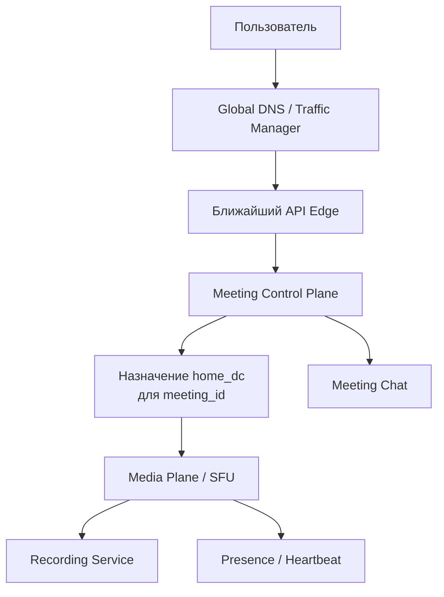
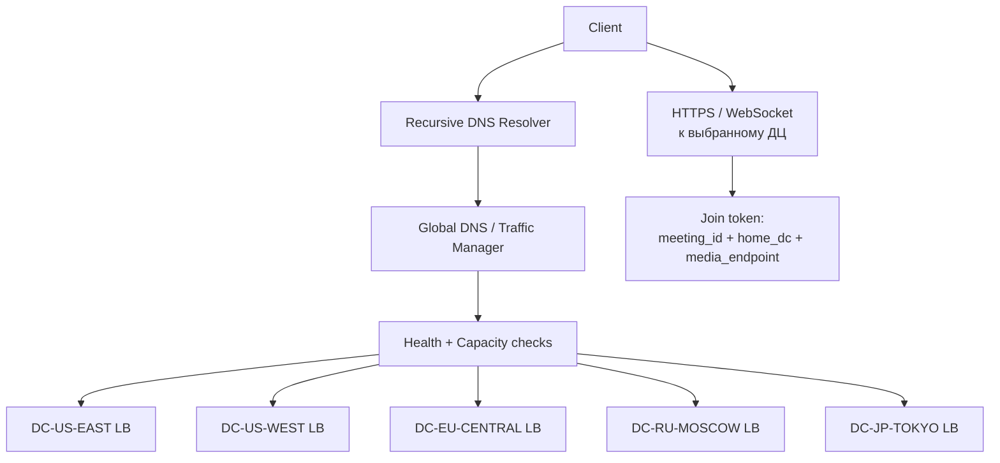
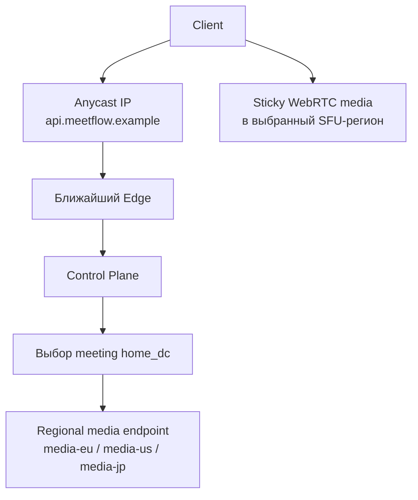
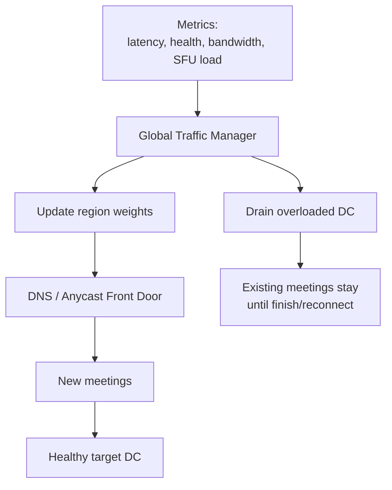

# Проектирование высоконагруженного Zoom-подобного сервиса видеовстреч

## Содержание

- [Основная часть](#основная-часть)
  - [1. Тема и целевая аудитория](#1-тема-и-целевая-аудитория)
    - [1.1. Тип сервиса](#11-тип-сервиса)
    - [1.2. Рыночная ниша и реальные аналоги](#12-рыночная-ниша-и-реальные-аналоги)
    - [1.3. Функционал MVP](#13-функционал-mvp)
    - [1.4. Ключевые продуктовые решения](#14-ключевые-продуктовые-решения)
    - [1.5. Целевая аудитория](#15-целевая-аудитория)
  - [2. Расчёт нагрузки](#2-расчёт-нагрузки)
    - [2.1. Исходные метрики и методика расчёта](#21-исходные-метрики-и-методика-расчёта)
    - [2.2. Продуктовая оценка видеовстреч](#22-продуктовая-оценка-видеовстреч)
    - [2.3. Хранилище пользователя и техническое хранение](#23-хранилище-пользователя-и-техническое-хранение)
    - [2.4. Сетевой трафик и RPS](#24-сетевой-трафик-и-rps)
  - [3. Глобальная балансировка нагрузки](#3-глобальная-балансировка-нагрузки)
    - [3.1. Функциональное разбиение по доменам](#31-функциональное-разбиение-по-доменам)
    - [3.2. Выбор и расположение дата-центров](#32-выбор-и-расположение-дата-центров)
    - [3.3. Распределение нагрузки по дата-центрам](#33-распределение-нагрузки-по-дата-центрам)
    - [3.4. Схема DNS-балансировки](#34-схема-dns-балансировки)
    - [3.5. Схема Anycast-балансировки](#35-схема-anycast-балансировки)
    - [3.6. Регулировка трафика между дата-центрами](#36-регулировка-трафика-между-дата-центрами)
    - [3.7. Вывод по глобальной балансировке](#37-вывод-по-глобальной-балансировке)
- [Список источников](#список-источников)

## Основная часть

---

### 1. Тема и целевая аудитория

#### 1.1. Тип сервиса

| Параметр            | Значение                                                                                                   |
| ------------------- | ---------------------------------------------------------------------------------------------------------- |
| Учебное название    | **MeetFlow**                                                                                               |
| Тип сервиса         | Zoom-подобный сервис видеовстреч                                                                           |
| Основной сценарий   | Групповая онлайн-встреча с аудио, видео, демонстрацией экрана, чатом и записью                             |
| Целевые страны      | США, Европа, Россия, Япония                                                                                |
| Реальные аналоги    | Zoom, Microsoft Teams, Google Meet                                                                         |
| Масштаб для расчёта | `MF_MAU = 320 млн MAU`, `MF_DAU = 115 млн DAU`, `MF_DMP = 300 млн участий во встречах в день` [^1][^2][^3] |

#### 1.2. Рыночная ниша и реальные аналоги

| Аналог | Метрика | Что подтверждает |
| ------ | ------- | ---------------- |
| Microsoft Teams | 320 млн monthly active users, раскрыто в FY24 Q1 [^1] | Массовый размер аудитории коммуникационного сервиса |
| Microsoft Teams | 115 млн daily active users, октябрь 2020 [^2] | Нижнюю публичную границу daily-аудитории для расчёта |
| Zoom | 300 млн daily meeting participants, апрель 2020; это участники встреч, а не unique users [^3] | Массовую ежедневную нагрузку именно на видеовстречи |
| Zoom | Средняя встреча — 54 минуты и 10 участников, данные за 15.11.2020–15.11.2021 [^4] | Базу для продуктовой оценки видеозвонков |
| Zoom | $4.8688 млрд выручки за FY2026 и 4 468 клиентов с TTM-выручкой больше $100 000 [^10] | Актуальность ниши на 2026 год |

#### 1.3. Функционал MVP

| № | Функция MVP | Кратко | Метрика для расчёта |
| -: | ----------- | ------ | ------------------- |
| 1 | Создание встречи | Пользователь создаёт мгновенную или запланированную встречу | `MF_MEETINGS_DAY`, `POST /meetings` |
| 2 | Подключение к встрече | Участник входит по ссылке или приглашению | `MF_DMP`, `POST /meetings/{id}/join` |
| 3 | Групповая аудио- и видеосвязь | Участники общаются в 720p group video | `MF_VIDEO_UP_MBPS`, `MF_VIDEO_DOWN_MBPS`, `MF_AUDIO_MBPS` |
| 4 | Демонстрация экрана | Участник показывает экран | `MF_SCREEN_MBPS_MAX` |
| 5 | Чат во время встречи | Участники отправляют текстовые сообщения | `MF_CHAT_MSG_LIMIT` |
| 6 | Облачная запись | Организатор включает запись встречи | `MF_RECORD_QUOTA_GB`, `MF_RECORDING_SIZE_GB` |

#### 1.4. Ключевые продуктовые решения

| Решение | Значение для MVP | Что считается дальше |
| ------- | ---------------- | -------------------- |
| Расчёт ведётся от групповой встречи | Средняя встреча: `MF_MEET_SIZE = 10` участников | Количество встреч в сутки |
| Базовый профиль качества | 720p group video по официальным требованиям Zoom [^5] | Видео-трафик upload/download |
| Запись встречи включается в облако | Cloud recording сохраняет видео, аудио и текст чата [^7] | Хранилище записей |
| Хранилище записей ограничено квотой | Для Pro/Business у Zoom — 10 GB на licensed user [^8] | Верхняя граница object storage |
| Частота чата не выдумывается | Есть лимит сообщения, но нет публичной частоты сообщений на пользователя [^6] | Для чата оставлена формула без подстановки |

#### 1.5. Целевая аудитория

| Параметр | Значение |
| -------- | -------: |
| География | Глобальный рынок; Zoom использовался почти в 200 странах и территориях [^4] |
| Месячная аудитория | `MF_MAU = 320 000 000` пользователей/месяц |
| Дневная аудитория | `MF_DAU = 115 000 000` пользователей/день |
| Участий во встречах в день | `MF_DMP = 300 000 000` участий/день |
| Средний размер встречи | `MF_MEET_SIZE = 10` участников |
| Средняя длительность встречи | `MF_MEET_LEN_MIN = 54` минуты |

---

### 2. Расчёт нагрузки

#### 2.1. Исходные метрики и методика расчёта

| Название | Описание (бывшее значение) | Источник / расчёт |
| -------- | -------------------------- | ----------------- |
| `MF_MAU` | 320 000 000 monthly active users; публичное значение Microsoft Teams, FY24 Q1 / 2023 | Берётся как целевой месячный масштаб аналога; без пересчёта на 2026, потому что более новой публичной MAU-метрики Teams в открытых источниках не найдено [^1] |
| `MF_DAU` | 115 000 000 daily active users; публичное значение Microsoft Teams, октябрь 2020 | Берётся как консервативная daily-аудитория аналога; это не статистика Zoom и не результат экстраполяции [^2] |
| `MF_DMP` | 300 000 000 daily meeting participants; публичное значение Zoom, апрель 2020 | Используется для нагрузки на видеовстречи; это участники встреч, один пользователь может считаться несколько раз [^3] |
| `MF_MEET_SIZE` | 10 участников в средней Zoom-встрече; данные за 15.11.2020–15.11.2021 | Используется для расчёта `MF_MEETINGS_DAY = MF_DMP / MF_MEET_SIZE` [^4] |
| `MF_MEET_LEN_MIN` | 54 минуты — средняя длительность Zoom-встречи; данные за 15.11.2020–15.11.2021 | Используется для расчёта participant-minutes [^4] |
| `MF_VIDEO_UP_MBPS` | 2.6 Mbps на участника для 720p group video upload | Официальные требования Zoom к bandwidth [^5] |
| `MF_VIDEO_DOWN_MBPS` | 1.8 Mbps на участника для 720p group video download | Официальные требования Zoom к bandwidth [^5] |
| `MF_AUDIO_MBPS` | 0.08 Mbps на участника для VoIP audio | Верхняя граница диапазона 60–80 kbps из требований Zoom [^5] |
| `MF_SCREEN_MBPS_MAX` | 0.15 Mbps на участника для screen sharing upper-bound | Верхняя граница диапазона 50–150 kbps из требований Zoom [^5] |
| `MF_CHAT_MSG_LIMIT` | 4 000 символов на одно chat-сообщение | Лимит Zoom Team Chat; частота сообщений в открытых источниках не подставляется [^6] |
| `MF_RECORD_QUOTA_GB` | 10 GB cloud recording storage на licensed user | Квота Zoom для Pro/Business [^8] |
| `MF_HEARTBEAT_SEC` | 25 секунд между heartbeat-событиями | Дефолтный `pingInterval = 25000 ms` в Socket.IO [^9] |
| `MF_K_PEAK` | 3 | Проектный коэффициент суточного пика: используется одинаково для RPS и bandwidth |

Текущая актуальность ниши проверяется не устаревшими usage-числами, а финансовой метрикой: Zoom в FY2026 показал $4.8688 млрд выручки и 4 468 крупных клиентов с TTM-выручкой больше $100 000 [^10]. Старые usage-метрики используются только там, где они прямо подписаны по году и где показана формула расчёта.

#### 2.2. Продуктовая оценка видеовстреч

| Название | Расчёт | Значение |
| -------- | ------ | -------: |
| `MF_MEETINGS_DAY` | `MF_DMP / MF_MEET_SIZE` = `300 000 000 / 10` | **30 000 000 встреч/сутки** |
| `MF_JOINS_PER_DAU_DAY` | `MF_DMP / MF_DAU` = `300 000 000 / 115 000 000` | **2.61 подключения/DAU/день** |
| `MF_CREATED_MEETINGS_PER_DAU_DAY` | `MF_MEETINGS_DAY / MF_DAU` = `30 000 000 / 115 000 000` | **0.26 созданных встреч/DAU/день** |
| `MF_PARTICIPANT_MIN_DAY` | `MF_DMP * MF_MEET_LEN_MIN` = `300 000 000 * 54` | **16 200 000 000 participant-minutes/сутки** |
| `MF_AVG_ONLINE_PARTICIPANTS` | `MF_PARTICIPANT_MIN_DAY / 1440` | **11 250 000 участников online в среднем** |
| `MF_PEAK_ONLINE_PARTICIPANTS` | `MF_AVG_ONLINE_PARTICIPANTS * MF_K_PEAK` | **33 750 000 участников online в пик** |
| `MF_HEARTBEAT_EVENTS_DAY` | `MF_PARTICIPANT_MIN_DAY * 60 / MF_HEARTBEAT_SEC` | **38 880 000 000 heartbeat-событий/сутки** |

#### 2.3. Хранилище пользователя и техническое хранение

| Блок данных | Название | Расчёт | Общий объём |
| ----------- | -------- | ------ | ----------: |
| Профили пользователей | `MF_USERS_STORAGE_GB` | `MF_MAU * 256 B` | **81.92 GB** |
| Метаданные встреч, 30 дней | `MF_MEETINGS_META_STORAGE_GB` | `MF_MEETINGS_DAY * 30 * 256 B` | **230.4 GB** |
| Участники встреч, 30 дней | `MF_PARTICIPANTS_STORAGE_TB` | `MF_DMP * 30 * 128 B` | **1.152 TB** |
| Активные сессии | `MF_SESSIONS_STORAGE_GB` | `MF_DAU * 128 B` | **14.72 GB** |
| Суммарное техническое хранение без записей | `MF_TECH_STORAGE_TOTAL_TB` | `MF_USERS_STORAGE_GB + MF_MEETINGS_META_STORAGE_GB + MF_PARTICIPANTS_STORAGE_TB + MF_SESSIONS_STORAGE_GB` | **1.48 TB** |
| Квота облачных записей | `MF_RECORDING_QUOTA_EB` | `MF_MAU * MF_RECORD_QUOTA_GB` | **3.2 EB квоты** |
| Размер одной записи | `MF_RECORDING_SIZE_GB` | `(MF_VIDEO_DOWN_MBPS + MF_AUDIO_MBPS) * MF_MEET_LEN_MIN * 60 / 8 / 1000` | **0.761 GB** |
| Worst-case рост записей | `MF_RECORDING_WORST_PB_DAY` | `MF_MEETINGS_DAY * MF_RECORDING_SIZE_GB` | **22.842 PB/сутки** |
| Записи за 30 дней, worst-case | `MF_RECORDING_WORST_PB_30D` | `MF_RECORDING_WORST_PB_DAY * 30` | **685.26 PB за 30 дней** |
| Суммарное хранение, 30 дней | `MF_STORAGE_TOTAL_30D_PB` | `MF_RECORDING_WORST_PB_30D + MF_TECH_STORAGE_TOTAL_TB` | **≈ 685.261 PB** |
| Чат встречи | `MF_CHAT_STORAGE_FORMULA` | `messages_count * avg_message_size` | Считается после появления фактической частоты сообщений |

В итоговый суммарный объём не включается `MF_RECORDING_QUOTA_EB`, потому что это продуктовая квота, а не фактически занятое хранилище. Для sizing object storage используется worst-case 30-дневное хранение записей: `MF_RECORDING_WORST_PB_30D = 685.26 PB`.

#### 2.4. Сетевой трафик и RPS

##### Сетевой трафик

| Тип трафика | Название | Формула суточного объёма | Суточный объём | Средний bandwidth | Пиковый bandwidth |
| ----------- | -------- | ------------------------ | -------------: | ----------------: | ----------------: |
| Video upload | `MF_VIDEO_UP_GB_DAY` | `MF_PARTICIPANT_MIN_DAY * 60 * MF_VIDEO_UP_MBPS / 8 / 1000` | **315 900 000 GB/сутки** | **29 250 Gbps** | **87 750 Gbps** |
| Video download | `MF_VIDEO_DOWN_GB_DAY` | `MF_PARTICIPANT_MIN_DAY * 60 * MF_VIDEO_DOWN_MBPS / 8 / 1000` | **218 700 000 GB/сутки** | **20 250 Gbps** | **60 750 Gbps** |
| Audio VoIP | `MF_AUDIO_GB_DAY` | `MF_PARTICIPANT_MIN_DAY * 60 * MF_AUDIO_MBPS / 8 / 1000` | **9 720 000 GB/сутки** | **900 Gbps** | **2 700 Gbps** |
| Screen sharing upper-bound | `MF_SCREEN_GB_DAY_MAX` | `MF_PARTICIPANT_MIN_DAY * 60 * MF_SCREEN_MBPS_MAX / 8 / 1000` | **18 225 000 GB/сутки** | **1 687.5 Gbps** | **5 062.5 Gbps** |

Расчёт bandwidth в таблице:

```text
avg_bandwidth_Gbps  = MF_AVG_ONLINE_PARTICIPANTS * bitrate_Mbps / 1000
peak_bandwidth_Gbps = avg_bandwidth_Gbps * MF_K_PEAK
```

##### RPS по основным методам

| Метод / событие | Название | Событий в сутки | Средний RPS | Пиковый RPS |
| --------------- | -------- | --------------: | ----------: | ----------: |
| `POST /meetings` | `MF_CREATE_MEETING_RPS` | `MF_MEETINGS_DAY` = 30 000 000 | **347** | **1 042** |
| `POST /meetings/{id}/join` | `MF_JOIN_RPS` | `MF_DMP` = 300 000 000 | **3 472** | **10 417** |
| `POST /meetings/{id}/leave` | `MF_LEAVE_RPS` | `MF_DMP` = 300 000 000 | **3 472** | **10 417** |
| `WS /presence/heartbeat` | `MF_HEARTBEAT_RPS` | `MF_HEARTBEAT_EVENTS_DAY` = 38 880 000 000 | **450 000** | **1 350 000** |
| `POST /recordings/metadata` | `MF_RECORDING_META_RPS` | до `MF_MEETINGS_DAY` = 30 000 000 | **до 347** | **до 1 042** |
| `POST /meeting-chat/messages` | `MF_CHAT_RPS_FORMULA` | `MF_DAU * chat_messages_per_DAU_day` | формула | формула |

Формула для RPS:

```text
avg_RPS  = events_per_day / 86400
peak_RPS = avg_RPS * MF_K_PEAK
```


---

### 3. Глобальная балансировка нагрузки

В этом разделе выбирается глобальная схема распределения пользователей между дата-центрами. Для MeetFlow критичен не только HTTP RPS, но и медиа-трафик: основная нагрузка находится в `Media Plane`, где идут видео, аудио и демонстрация экрана.

Главный принцип: **новая встреча закрепляется за одним домашним дата-центром**, а участники подключаются к ближайшему доступному media-edge. Для групповых WebRTC-встреч используется SFU-подход: SFU получает аудио/видео от клиентов и пересылает потоки другим участникам без полного смешивания медиа [^17].

#### 3.1. Функциональное разбиение по доменам

| Домен | Что делает | Глобальная балансировка | Почему так |
| ----- | ---------- | ----------------------- | ---------- |
| `Auth / Users` | Логин, профиль, токены | Active-active по всем ДЦ | Низкий трафик, можно обслуживать рядом с пользователем |
| `Meeting Control Plane` | Создание встречи, join/leave, состояние встречи | Active-active, но встреча получает `home_dc` | Нужно быстро создать встречу и не потерять состояние участников |
| `Media Plane / SFU` | Видео, аудио, screen sharing | Ближайший здоровый ДЦ + sticky по `meeting_id` | Самый тяжёлый трафик; важны RTT, jitter и packet loss |
| `Presence / Heartbeat` | Heartbeat участников | В том же ДЦ, что и встреча | `MF_HEARTBEAT_RPS_PEAK = 1 350 000`, нельзя гонять лишний трафик между ДЦ |
| `Meeting Chat` | Чат внутри встречи | В `home_dc`, репликация асинхронно | Чат менее критичен, чем медиа |
| `Recording` | Запись встречи и метаданные | Запись создаётся в `home_dc`, object storage реплицируется | Запись привязана к медиа-потоку и не должна нагружать другие ДЦ |
| `Observability` | Метрики, логи, алерты | Локальный сбор + глобальная агрегация | Для failover нужны health/capacity метрики по каждому ДЦ |


```mermaid
flowchart TD
    U["Пользователь"] --> DNS["Global DNS / Traffic Manager"]
    DNS --> API["Ближайший API Edge"]
    API --> CP["Meeting Control Plane"]
    CP --> HOME["Назначение home_dc<br/>для meeting_id"]
    HOME --> SFU["Media Plane / SFU"]
    SFU --> REC["Recording Service"]
    SFU --> PRES["Presence / Heartbeat"]
    CP --> CHAT["Meeting Chat"]
```

#### 3.2. Выбор и расположение дата-центров

Zoom как реальный аналог даёт владельцам платных аккаунтов возможность выбирать регионы дата-центров для обработки real-time meeting traffic, а также описывает edge-routing между ДЦ [^11]. Для MeetFlow используем похожую идею: **real-time медиа обрабатывается в ближайшем разрешённом ДЦ**.

| ДЦ | Зона ответственности | Доля нагрузки | Влияние на продуктовые метрики |
| -- | -------------------- | ------------: | ------------------------------ |
| `DC-US-EAST` | Восток США, часть Канады, резерв для Европы | **20%** | Снижает задержку для east-coast пользователей и даёт быстрый failover для Европы |
| `DC-US-WEST` | Запад США, резерв для Японии | **15%** | Снижает задержку для west-coast пользователей и даёт ближайший fallback для Японии |
| `DC-EU-CENTRAL` | Европа | **35%** | Основной европейский ДЦ; влияет на join latency, media RTT и качество screen sharing |
| `DC-RU-MOSCOW` | Россия | **10%** | Убирает лишний межрегиональный RTT для российских пользователей |
| `DC-JP-TOKYO` | Япония и ближайшая APAC-нагрузка | **20%** | Нужен для низкой задержки в Японии и стабильного video download |

Доли нагрузки — **проектное допущение для sizing**, а не публичная статистика Zoom или Teams. При появлении реальной аналитики таблица заменяется на фактическое распределение по странам. Сам принцип разнесения сервиса по географическим регионам соответствует модели крупных cloud-провайдеров, где регионы используются для глобального покрытия, отказоустойчивости и снижения задержек [^12].

| Метрика продукта | Почему зависит от расположения ДЦ |
| ---------------- | --------------------------------- |
| `join latency` | DNS и control-plane должны быстро вернуть регион встречи |
| `media RTT` | Чем ближе SFU, тем ниже задержка аудио/видео |
| `jitter / packet loss` | Длинный маршрут повышает риск просадок качества |
| `recording start delay` | Запись стартует рядом с медиа-потоком |
| `availability` | Отказ одного ДЦ не должен ломать создание новых встреч в других регионах |

#### 3.3. Распределение нагрузки по дата-центрам

Для распределения используем формулу:

```text
dc_metric = global_metric * dc_share
```

##### Распределение продуктовой нагрузки

| ДЦ | Доля | DAU | Участий во встречах/сутки | Встреч/сутки | Peak online participants |
| -- | ---: | --: | ------------------------: | -----------: | -----------------------: |
| `DC-US-EAST` | 20% | **23 000 000** | **60 000 000** | **6 000 000** | **6 750 000** |
| `DC-US-WEST` | 15% | **17 250 000** | **45 000 000** | **4 500 000** | **5 062 500** |
| `DC-EU-CENTRAL` | 35% | **40 250 000** | **105 000 000** | **10 500 000** | **11 812 500** |
| `DC-RU-MOSCOW` | 10% | **11 500 000** | **30 000 000** | **3 000 000** | **3 375 000** |
| `DC-JP-TOKYO` | 20% | **23 000 000** | **60 000 000** | **6 000 000** | **6 750 000** |
| **Итого** | **100%** | **115 000 000** | **300 000 000** | **30 000 000** | **33 750 000** |

##### Распределение пикового RPS

| ДЦ | `POST /meetings` | `POST /join` | `POST /leave` | `WS /heartbeat` | `POST /recordings/metadata` |
| -- | ---------------: | -----------: | ------------: | ---------------: | ---------------------------: |
| `DC-US-EAST` | **208 RPS** | **2 083 RPS** | **2 083 RPS** | **270 000 RPS** | **208 RPS** |
| `DC-US-WEST` | **156 RPS** | **1 563 RPS** | **1 563 RPS** | **202 500 RPS** | **156 RPS** |
| `DC-EU-CENTRAL` | **365 RPS** | **3 646 RPS** | **3 646 RPS** | **472 500 RPS** | **365 RPS** |
| `DC-RU-MOSCOW` | **104 RPS** | **1 042 RPS** | **1 042 RPS** | **135 000 RPS** | **104 RPS** |
| `DC-JP-TOKYO` | **208 RPS** | **2 083 RPS** | **2 083 RPS** | **270 000 RPS** | **208 RPS** |
| **Итого** | **1 042 RPS** | **10 417 RPS** | **10 417 RPS** | **1 350 000 RPS** | **1 042 RPS** |

`MF_CHAT_RPS_FORMULA` не распределяется численно, потому что в открытых источниках не подставлялась частота chat-сообщений на пользователя. Для него остаётся формула:

```text
chat_peak_RPS_dc = MF_DAU * dc_share * chat_messages_per_DAU_day / 86400 * MF_K_PEAK
```

##### Распределение пикового media bandwidth

| ДЦ | Video upload | Video download | Audio | Screen sharing | Суммарно |
| -- | -----------: | -------------: | ----: | -------------: | -------: |
| `DC-US-EAST` | **17 550 Gbps** | **12 150 Gbps** | **540 Gbps** | **1 012.5 Gbps** | **31 252.5 Gbps** |
| `DC-US-WEST` | **13 162.5 Gbps** | **9 112.5 Gbps** | **405 Gbps** | **759.4 Gbps** | **23 439.4 Gbps** |
| `DC-EU-CENTRAL` | **30 712.5 Gbps** | **21 262.5 Gbps** | **945 Gbps** | **1 771.9 Gbps** | **54 691.9 Gbps** |
| `DC-RU-MOSCOW` | **8 775 Gbps** | **6 075 Gbps** | **270 Gbps** | **506.3 Gbps** | **15 626.3 Gbps** |
| `DC-JP-TOKYO` | **17 550 Gbps** | **12 150 Gbps** | **540 Gbps** | **1 012.5 Gbps** | **31 252.5 Gbps** |
| **Итого** | **87 750 Gbps** | **60 750 Gbps** | **2 700 Gbps** | **5 062.5 Gbps** | **156 262.5 Gbps** |

##### Распределение записей встреч

| ДЦ | Worst-case запись/сутки | Worst-case запись за 30 дней |
| -- | ----------------------: | ---------------------------: |
| `DC-US-EAST` | **4.568 PB/сутки** | **137.052 PB** |
| `DC-US-WEST` | **3.426 PB/сутки** | **102.789 PB** |
| `DC-EU-CENTRAL` | **7.995 PB/сутки** | **239.841 PB** |
| `DC-RU-MOSCOW` | **2.284 PB/сутки** | **68.526 PB** |
| `DC-JP-TOKYO` | **4.568 PB/сутки** | **137.052 PB** |
| **Итого** | **22.842 PB/сутки** | **685.260 PB** |

Вывод: основная глобальная проблема — не `POST /meetings` и не `join`, а **пиковый media bandwidth** и **heartbeat**. Поэтому глобальная балансировка должна управлять не только HTTP-запросами, но и размещением SFU.

#### 3.4. Схема DNS-балансировки

DNS-балансировка используется для первого входа пользователя в систему. Для latency-based routing DNS может выбирать регион с минимальной задержкой среди доступных регионов [^13]. Geo steering также позволяет направлять пользователей в pools, привязанные к странам или регионам [^14].

| DNS-имя | Что балансирует | Политика |
| ------- | --------------- | -------- |
| `api.meetflow.example` | REST API: login, meetings, recordings metadata | latency + health + capacity |
| `ws.meetflow.example` | WebSocket control-plane и heartbeat | geo/latency + sticky session |
| `media.meetflow.example` | Выдача регионального media endpoint | не прямой SFU, а bootstrap endpoint |
| `recording.meetflow.example` | Upload/metadata для записей | routing в `home_dc` встречи |


```mermaid
flowchart TD
    C["Client"] --> R["Recursive DNS Resolver"]
    R --> GTM["Global DNS / Traffic Manager"]

    GTM --> H["Health + Capacity checks"]
    H --> USE["DC-US-EAST LB"]
    H --> USW["DC-US-WEST LB"]
    H --> EU["DC-EU-CENTRAL LB"]
    H --> RU["DC-RU-MOSCOW LB"]
    H --> JP["DC-JP-TOKYO LB"]

    C --> API["HTTPS / WebSocket<br/>к выбранному ДЦ"]
    API --> TOKEN["Join token:<br/>meeting_id + home_dc + media_endpoint"]
```

Как работает по шагам:

1. Клиент открывает `api.meetflow.example`.
2. DNS/GTM выбирает ближайший здоровый ДЦ.
3. Control-plane создаёт или находит `home_dc` встречи.
4. Клиент получает `join_token` и региональный `media_endpoint`.
5. Медиа-поток идёт в SFU, закреплённый за встречей.

#### 3.5. Схема Anycast-балансировки

Anycast используется **ограниченно**. Для HTTP(S) front door это удобно: глобальный балансировщик может иметь один Anycast IP и направлять пользователя к ближайшему backend [^16]. Но для WebRTC media-flow прямой Anycast опасен: при изменении BGP-маршрута во время встречи клиент может попасть в другой edge.

| Трафик | Anycast используется | Причина |
| ------ | ------------------- | ------- |
| `api.meetflow.example` | Да | Короткие HTTPS-запросы, удобно направлять на ближайший edge |
| `ws.meetflow.example` | Частично | Можно для входа, но нужна session affinity |
| `media.meetflow.example` | Только как bootstrap | Клиент получает конкретный regional endpoint |
| RTP/SRTP media traffic | Нет, основной путь региональный | Видеовстреча должна быть sticky к SFU/региону |
| Recording upload | Нет | Запись привязана к `home_dc` встречи |


```mermaid
flowchart TD
    C["Client"] --> AIP["Anycast IP<br/>api.meetflow.example"]
    AIP --> EDGE["Ближайший Edge"]
    EDGE --> CP["Control Plane"]
    CP --> REGION["Выбор meeting home_dc"]
    REGION --> EP["Regional media endpoint<br/>media-eu / media-us / media-jp"]
    C --> SFU["Sticky WebRTC media<br/>в выбранный SFU-регион"]
```

Итог: Anycast ускоряет вход и API, но **не заменяет региональное закрепление медиа-сессии**.

#### 3.6. Регулировка трафика между дата-центрами

Регулировка делается через Global Traffic Manager. Он учитывает health-checks, latency, текущую загрузку, ручные веса и правила data residency. Cloudflare Load Balancing, например, поддерживает steering policies, health monitors, fallback pools и распределение по весам [^15][^18].

##### Модель выбора ДЦ

```text
effective_weight_dc = geo_match * health_status * capacity_weight * manual_weight * residency_policy
```

| Параметр | Значение |
| -------- | -------- |
| `geo_match` | 1, если ДЦ подходит пользователю по географии; ниже 1 для fallback |
| `health_status` | 1 для healthy, 0 для critical/down |
| `capacity_weight` | уменьшается при высокой загрузке CPU/network/SFU |
| `manual_weight` | ручной вес для maintenance и controlled rollout |
| `residency_policy` | запрещает routing в регион, если это нарушает продуктовые/юридические ограничения |

##### Правила регулировки

| Сценарий | Действие GTM | Что происходит с пользователем |
| -------- | ------------ | ------------------------------ |
| Нормальная работа | Geo/latency routing в ближайший ДЦ | Пользователь попадает в ближайший media-регион |
| ДЦ перегружен | Новые встречи постепенно уходят в fallback ДЦ | Уже идущие встречи не переносятся |
| Maintenance | Вес ДЦ ставится в `0` для новых встреч | Старые встречи доживают до завершения |
| ДЦ недоступен | DNS/GTM убирает ДЦ из выдачи | Новые встречи создаются в резервном регионе |
| SFU pool degraded | Control-plane не выдаёт новые meeting_id на этот pool | Участники получают другой здоровый SFU |
| Полный regional outage | Новые встречи идут в fallback; старые пытаются reconnect | Возможна краткая деградация качества |

##### Матрица fallback

| Основной ДЦ | Fallback 1 | Fallback 2 | Комментарий |
| ----------- | ---------- | ---------- | ----------- |
| `DC-US-EAST` | `DC-US-WEST` | `DC-EU-CENTRAL` | Сначала остаёмся внутри США |
| `DC-US-WEST` | `DC-US-EAST` | `DC-JP-TOKYO` | Для части APAC ближе Япония |
| `DC-EU-CENTRAL` | `DC-US-EAST` | `DC-RU-MOSCOW` | Россия используется только если политика разрешает |
| `DC-RU-MOSCOW` | `DC-EU-CENTRAL` | `DC-US-EAST` | При data residency может быть режим degraded вместо failover |
| `DC-JP-TOKYO` | `DC-US-WEST` | `DC-EU-CENTRAL` | Ближайший резерв — запад США |


```mermaid
flowchart TD
    M["Metrics:<br/>latency, health, bandwidth, SFU load"] --> GTM["Global Traffic Manager"]
    GTM --> W["Update region weights"]
    W --> DNS["DNS / Anycast Front Door"]
    DNS --> NEW["New meetings"]
    NEW --> DC1["Healthy target DC"]

    GTM --> DRAIN["Drain overloaded DC"]
    DRAIN --> OLD["Existing meetings stay<br/>until finish/reconnect"]
```

#### 3.7. Вывод по глобальной балансировке

Для MeetFlow используется **глобальная active-active схема** из пяти дата-центров: `DC-US-EAST`, `DC-US-WEST`, `DC-EU-CENTRAL`, `DC-RU-MOSCOW`, `DC-JP-TOKYO`.

Ключевое решение: **control-plane можно балансировать глобально, но media-plane нужно закреплять за регионом встречи**. Это снижает задержку, упрощает расчёт SFU-нагрузки и не ломает активные видеовстречи при перераспределении новых пользователей.

---

## Список источников

[^1]: [Microsoft Tech Community — Teams Grows to 320 Million Monthly Active Users](https://techcommunity.microsoft.com/discussions/microsoftteams/teams-grows-to-320-million-monthly-active-users/3964746)

[^2]: [Microsoft 365 Blog — Microsoft Teams reaches 115 million DAU](https://www.microsoft.com/en-us/microsoft-365/blog/2020/10/28/microsoft-teams-reaches-115-million-dau-plus-a-new-daily-collaboration-minutes-metric-for-microsoft-365/)

[^3]: [Reuters — Zoom says it has 300 million daily meeting participants, not users](https://www.reuters.com/article/business/zoom-says-it-has-300-million-daily-meeting-participants-not-users-idUSKBN22C1IE/)

[^4]: [Zoom Blog — Here’s How You Zoomed Over the Past Year](https://www.zoom.com/en/blog/how-you-zoomed-over-the-past-year-2021/)

[^5]: [Zoom Support — Zoom system requirements: Zoom Web App](https://support.zoom.com/hc/en/article?id=zm_kb&sysparm_article=KB0058323)

[^6]: [Zoom Support — Zoom Chat specifications and limitations](https://support.zoom.com/hc/en/article?id=zm_kb&sysparm_article=KB0079326)

[^7]: [Zoom Support — Starting a cloud recording](https://support.zoom.com/hc/en/article?id=zm_kb&sysparm_article=KB0062627)

[^8]: [Zoom Support — Cloud recording storage capacity](https://support.zoom.com/hc/en/article?id=zm_kb&sysparm_article=KB0067670)

[^9]: [Socket.IO Documentation — Server options](https://socket.io/docs/v4/server-options/)

[^10]: [Zoom Investor Relations — Zoom Communications Reports Fourth Quarter and Fiscal Year 2026 Financial Results](https://investors.zoom.us/news-releases/news-release-details/zoom-communications-reports-fourth-quarter-and-fiscal-year-2026)

[^11]: [Zoom Support — Selecting data center for meetings, webinars, whiteboards, notes and docs](https://support.zoom.com/hc/en/article?id=zm_kb&sysparm_article=KB0060026)

[^12]: [AWS — Global Infrastructure Regions and Availability Zones](https://aws.amazon.com/about-aws/global-infrastructure/regions_az/)

[^13]: [AWS Route 53 Documentation — Latency-based routing](https://docs.aws.amazon.com/Route53/latest/DeveloperGuide/routing-policy-latency.html)

[^14]: [Cloudflare Docs — Load Balancing Geo steering](https://developers.cloudflare.com/load-balancing/understand-basics/traffic-steering/steering-policies/geo-steering/)

[^15]: [Cloudflare Docs — Global traffic steering policies](https://developers.cloudflare.com/load-balancing/understand-basics/traffic-steering/steering-policies/)

[^16]: [Google Cloud Documentation — Cloud Load Balancing overview](https://docs.cloud.google.com/load-balancing/docs/load-balancing-overview)

[^17]: [mediasoup Documentation — SFU overview](https://mediasoup.org/documentation/overview/)

[^18]: [Cloudflare Docs — Load Balancing monitors and health checks](https://developers.cloudflare.com/load-balancing/monitors/)
