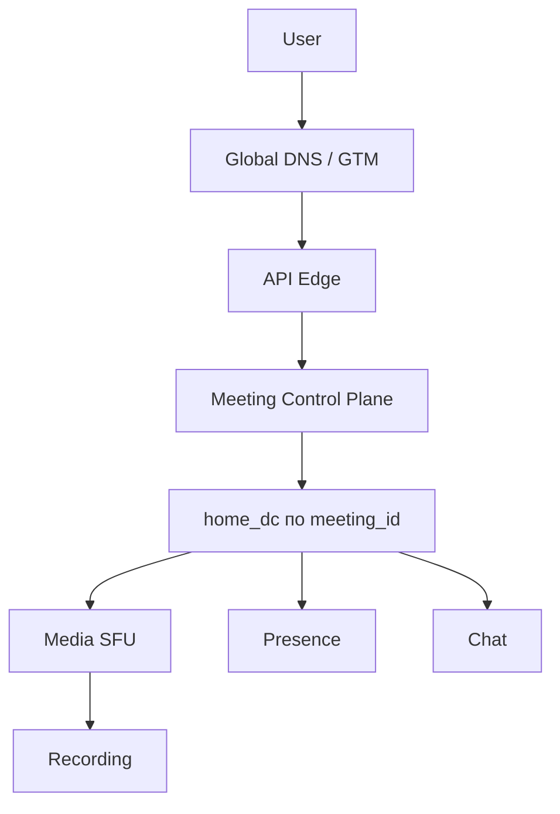
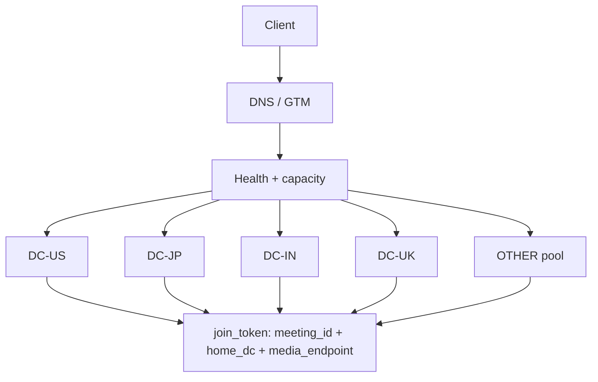
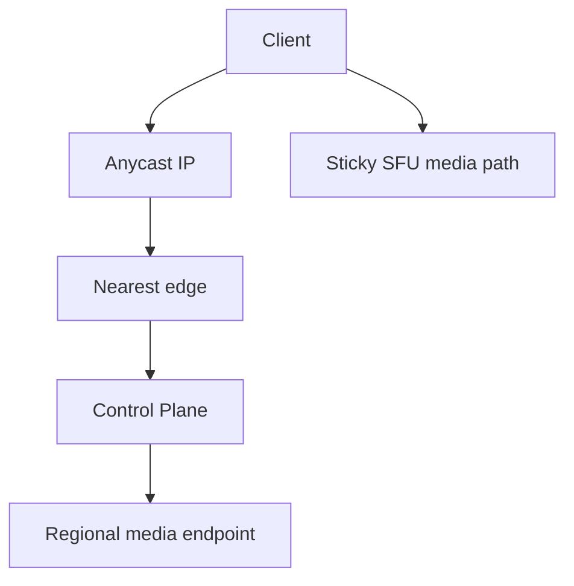
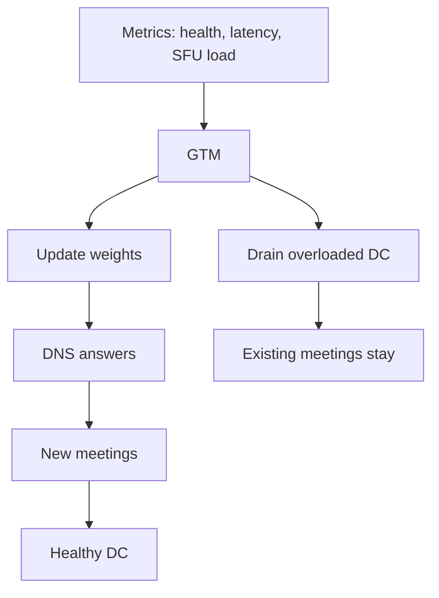
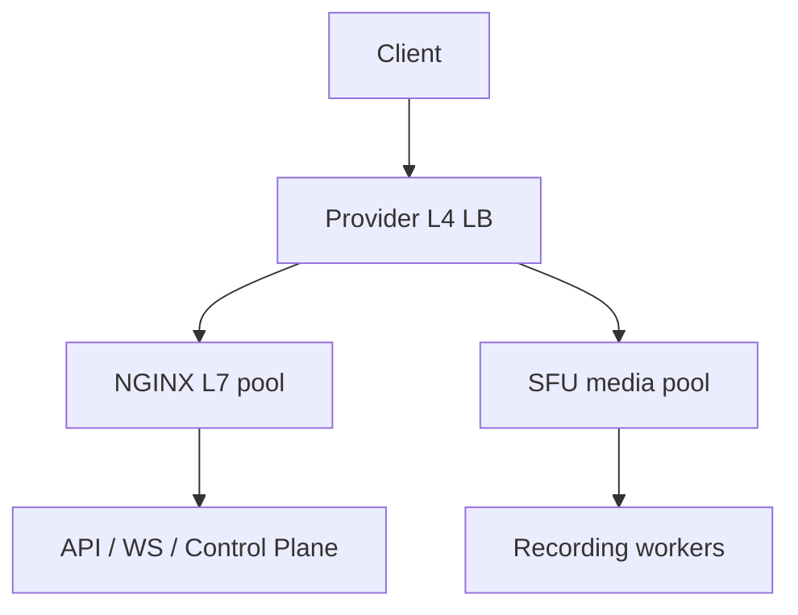
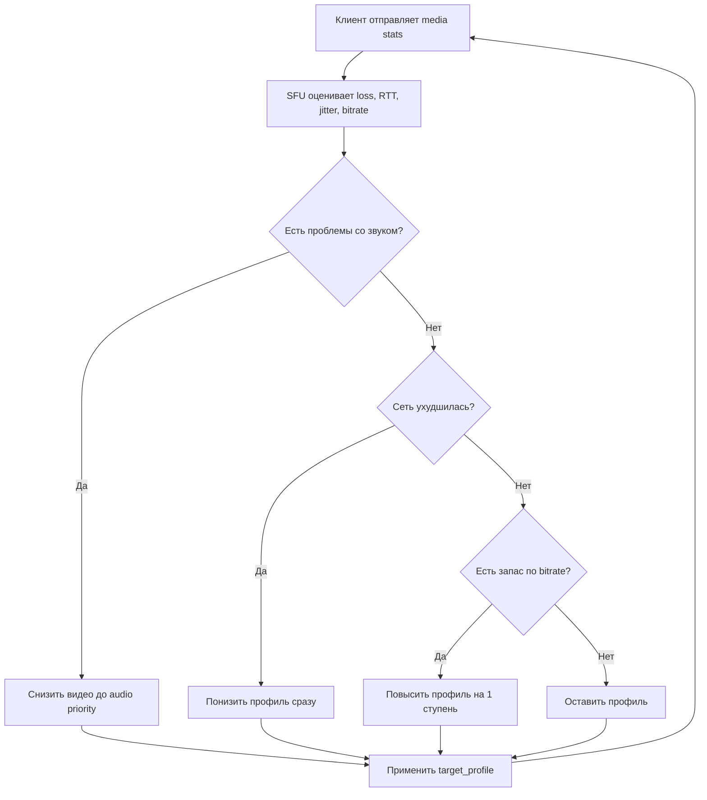
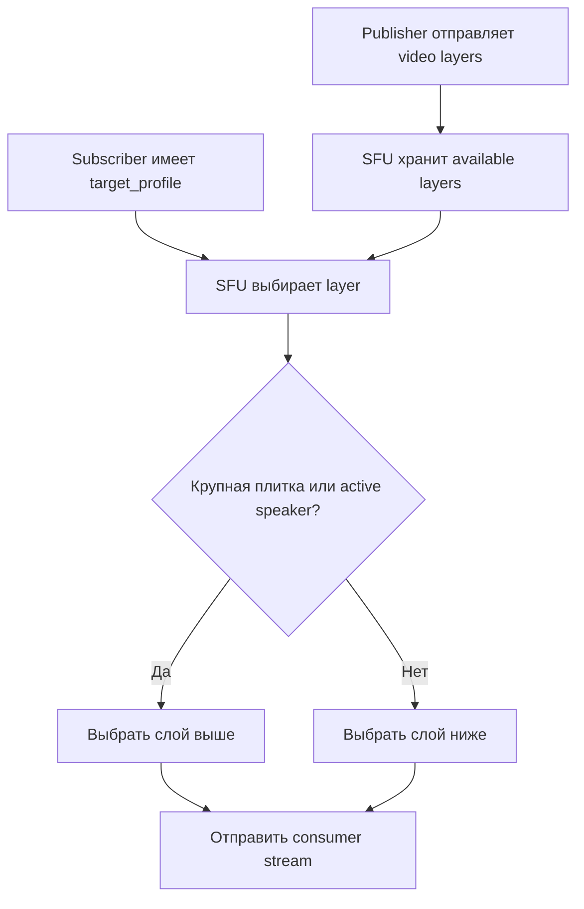
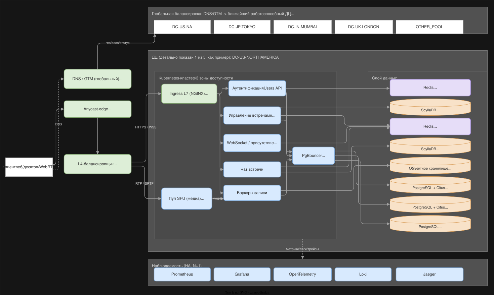
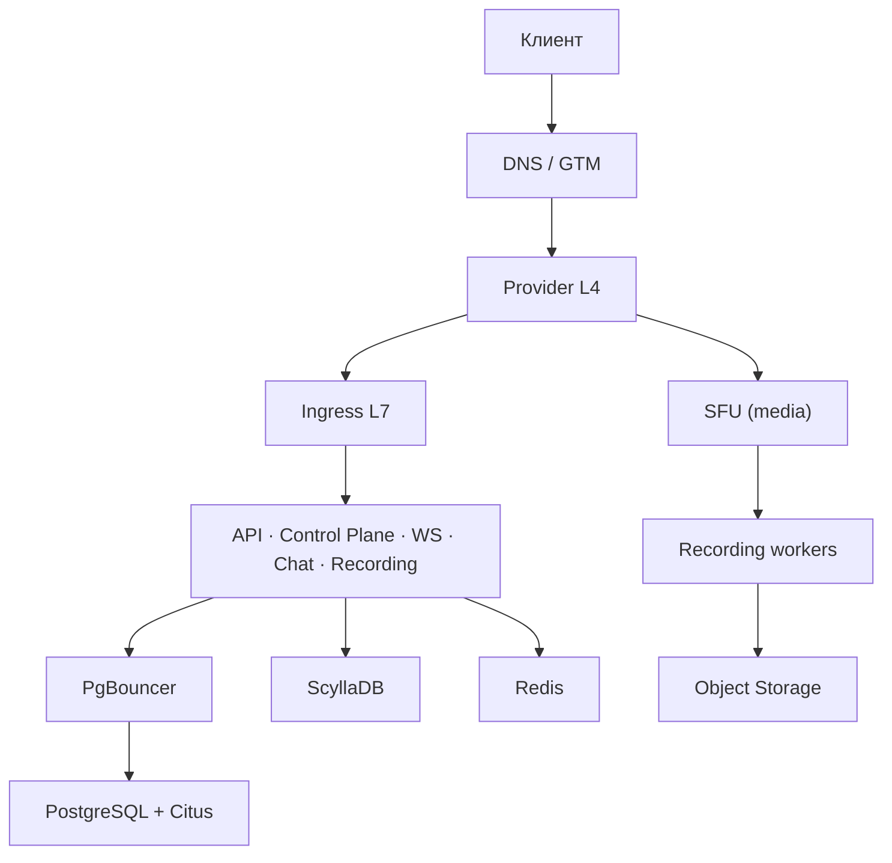

# Проектирование высоконагруженного Zoom-подобного сервиса видеовстреч

## Содержание

- [Основная часть](#основная-часть)
  - [1. Тема и целевая аудитория](#1-тема-и-целевая-аудитория)
    - [1.1. Тип сервиса](#11-тип-сервиса)
    - [1.2. Рыночная ниша и реальные аналоги](#12-рыночная-ниша-и-реальные-аналоги)
    - [1.3. Функционал MVP](#13-функционал-mvp)
    - [1.4. Ключевые продуктовые решения](#14-ключевые-продуктовые-решения)
    - [1.5. Целевая аудитория](#15-целевая-аудитория)
  - [2. Расчёт нагрузки](#2-расчёт-нагрузки)
    - [2.1. Исходные метрики и методика расчёта](#21-исходные-метрики-и-методика-расчёта)
    - [2.2. Продуктовая оценка видеовстреч](#22-продуктовая-оценка-видеовстреч)
    - [2.3. Хранилище пользователя и техническое хранение](#23-хранилище-пользователя-и-техническое-хранение)
    - [2.4. Сетевой трафик и RPS](#24-сетевой-трафик-и-rps)
  - [3. Глобальная балансировка нагрузки](#3-глобальная-балансировка-нагрузки)
    - [3.1. Функциональное разбиение по доменам](#31-функциональное-разбиение-по-доменам)
    - [3.2. Выбор и расположение дата-центров](#32-выбор-и-расположение-дата-центров)
    - [3.3. Распределение нагрузки по дата-центрам](#33-распределение-нагрузки-по-дата-центрам)
    - [3.4. Схема DNS-балансировки](#34-схема-dns-балансировки)
    - [3.5. Схема Anycast-балансировки](#35-схема-anycast-балансировки)
    - [3.6. Регулировка трафика между дата-центрами](#36-регулировка-трафика-между-дата-центрами)
    - [3.7. Вывод по глобальной балансировке](#37-вывод-по-глобальной-балансировке)
  - [4. Локальная балансировка нагрузки](#4-локальная-балансировка-нагрузки)
    - [4.1. Границы локальной балансировки](#41-границы-локальной-балансировки)
    - [4.2. Схема локальной балансировки](#42-схема-локальной-балансировки)
    - [4.3. Механизмы резервирования](#43-механизмы-резервирования)
    - [4.4. Ограничители для расчёта](#44-ограничители-для-расчёта)
    - [4.5. Расчёт количества L7-балансировщиков](#45-расчёт-количества-l7-балансировщиков)
    - [4.6. Итоговое количество балансировщиков](#46-итоговое-количество-балансировщиков)
  - [5. Логическая схема БД](#5-логическая-схема-бд)
    - [5.1. Список логических таблиц](#51-список-логических-таблиц)
    - [5.2. Размеры данных и QPS](#52-размеры-данных-и-qps)
    - [5.3. Требования к консистентности](#53-требования-к-консистентности)
    - [5.4. Распределение нагрузки по ключам](#54-распределение-нагрузки-по-ключам)
  - [6. Физическая схема БД](#6-физическая-схема-бд)
    - [6.1. Физическая схема](#61-физическая-схема)
    - [6.2. Где хранятся данные](#62-где-хранятся-данные)
    - [6.3. Выбор СУБД по таблицам](#63-выбор-субд-по-таблицам)
    - [6.4. Индексы](#64-индексы)
    - [6.5. Шардирование](#65-шардирование)
    - [6.6. Нагрузка на строки](#66-нагрузка-на-строки)
    - [6.7. API → запрос → БД](#67-api--запрос--бд)
    - [6.8. Кеш](#68-кеш)
    - [6.9. Денормализация и отказ от JOIN](#69-денормализация-и-отказ-от-join)
    - [6.10. Клиентские библиотеки](#610-клиентские-библиотеки)
  - [7. Алгоритмы](#7-алгоритмы)
    - [7.1. Список алгоритмов](#71-список-алгоритмов)
    - [7.2. Adaptive Bitrate](#72-adaptive-bitrate)
    - [7.3. Выбор SFU-слоя видео](#73-выбор-sfu-слоя-видео)
  - [8. Технологии](#8-технологии)
    - [8.1. Языки](#81-языки)
    - [8.2. Сводная таблица технологий](#82-сводная-таблица-технологий)
  - [9. Обеспечение надёжности](#9-обеспечение-надёжности)
  - [10. Схема проекта](#10-схема-проекта)
    - [10.1. Общая схема взаимодействия](#101-общая-схема-взаимодействия)
    - [10.2. Как читать схему](#102-как-читать-схему)
    - [10.3. Потоки данных](#103-потоки-данных)
    - [10.4. Балансировка: внешняя и внутренняя](#104-балансировка-внешняя-и-внутренняя)
    - [10.5. Вывод](#105-вывод)
  - [11. Список серверов](#11-список-серверов)
    - [11.1. Начальные нормативы для расчёта ресурсов](#111-начальные-нормативы-для-расчёта-ресурсов)
    - [11.2. Расчёт ресурсов по сервисам](#112-расчёт-ресурсов-по-сервисам)
    - [11.3. Итоговая таблица серверов](#113-итоговая-таблица-серверов)
    - [11.4. Оценка стоимости инфраструктуры](#114-оценка-стоимости-инфраструктуры)
- [Список источников](#список-источников)

## Основная часть

---

### 1. Тема и целевая аудитория

#### 1.1. Тип сервиса

| Параметр            | Значение                                                                                                   |
| ------------------- | ---------------------------------------------------------------------------------------------------------- |
| Учебное название    | **MeetFlow**                                                                                               |
| Тип сервиса         | Zoom-подобный сервис видеовстреч                                                                           |
| Основной сценарий   | Групповая онлайн-встреча с аудио, видео, демонстрацией экрана, чатом и записью                             |
| Целевые страны      | США, Европа, Россия, Япония                                                                                |
| Реальные аналоги    | Zoom, Microsoft Teams, Google Meet                                                                         |
| Масштаб для расчёта | `MF_MAU = 320 млн MAU`, `MF_DAU = 115 млн DAU`, `MF_DMP = 300 млн участий во встречах в день` [^1][^2][^3] |

#### 1.2. Рыночная ниша и реальные аналоги

| Аналог | Метрика | Что подтверждает |
| ------ | ------- | ---------------- |
| Microsoft Teams | 320 млн monthly active users, раскрыто в FY24 Q1 [^1] | Массовый размер аудитории коммуникационного сервиса |
| Microsoft Teams | 115 млн daily active users, октябрь 2020 [^2] | Нижнюю публичную границу daily-аудитории для расчёта |
| Zoom | 300 млн daily meeting participants, апрель 2020; это участники встреч, а не unique users [^3] | Массовую ежедневную нагрузку именно на видеовстречи |
| Zoom | Средняя встреча — 54 минуты и 10 участников, данные за 15.11.2020–15.11.2021 [^4] | Базу для продуктовой оценки видеозвонков |
| Zoom | $4.8688 млрд выручки за FY2026 и 4 468 клиентов с TTM-выручкой больше $100 000 [^10] | Актуальность ниши на 2026 год |

#### 1.3. Функционал MVP

| № | Функция MVP | Кратко | Метрика для расчёта |
| -: | ----------- | ------ | ------------------- |
| 1 | Создание встречи | Пользователь создаёт мгновенную или запланированную встречу | `MF_MEETINGS_DAY`, `POST /meetings` |
| 2 | Подключение к встрече | Участник входит по ссылке или приглашению | `MF_DMP`, `POST /meetings/{id}/join` |
| 3 | Групповая аудио- и видеосвязь | Участники общаются в 720p group video | `MF_VIDEO_UP_MBPS`, `MF_VIDEO_DOWN_MBPS`, `MF_AUDIO_MBPS` |
| 4 | Демонстрация экрана | Участник показывает экран | `MF_SCREEN_MBPS_MAX` |
| 5 | Чат во время встречи | Участники отправляют текстовые сообщения | `MF_CHAT_MSG_LIMIT` |
| 6 | Облачная запись | Организатор включает запись встречи | `MF_RECORD_QUOTA_GB`, `MF_RECORDING_SIZE_GB` |

#### 1.4. Ключевые продуктовые решения

| Решение | Значение для MVP | Что считается дальше |
| ------- | ---------------- | -------------------- |
| Расчёт ведётся от групповой встречи | Средняя встреча: `MF_MEET_SIZE = 10` участников | Количество встреч в сутки |
| Базовый профиль качества | 720p group video по официальным требованиям Zoom [^5] | Видео-трафик upload/download |
| Запись встречи включается в облако | Cloud recording сохраняет видео, аудио и текст чата [^7] | Хранилище записей |
| Хранилище записей ограничено квотой | Для Pro/Business у Zoom — 10 GB на licensed user [^8] | Верхняя граница object storage |
| Частота чата не выдумывается | Есть лимит сообщения, но нет публичной частоты сообщений на пользователя [^6] | Для чата оставлена формула без подстановки |

#### 1.5. Целевая аудитория

| Параметр | Значение |
| -------- | -------: |
| География | Глобальный рынок; Zoom использовался почти в 200 странах и территориях [^4] |
| Месячная аудитория | `MF_MAU = 320 000 000` пользователей/месяц |
| Дневная аудитория | `MF_DAU = 115 000 000` пользователей/день |
| Участий во встречах в день | `MF_DMP = 300 000 000` участий/день |
| Средний размер встречи | `MF_MEET_SIZE = 10` участников |
| Средняя длительность встречи | `MF_MEET_LEN_MIN = 54` минуты |

---

### 2. Расчёт нагрузки

#### 2.1. Исходные метрики и методика расчёта

| Название | Описание (бывшее значение) | Источник / расчёт |
| -------- | -------------------------- | ----------------- |
| `MF_MAU` | 320 000 000 monthly active users; публичное значение Microsoft Teams, FY24 Q1 / 2023 | Берётся как целевой месячный масштаб аналога; без пересчёта на 2026, потому что более новой публичной MAU-метрики Teams в открытых источниках не найдено [^1] |
| `MF_DAU` | 115 000 000 daily active users; публичное значение Microsoft Teams, октябрь 2020 | Берётся как консервативная daily-аудитория аналога; это не статистика Zoom и не результат экстраполяции [^2] |
| `MF_DMP` | 300 000 000 daily meeting participants; публичное значение Zoom, апрель 2020 | Используется для нагрузки на видеовстречи; это участники встреч, один пользователь может считаться несколько раз [^3] |
| `MF_MEET_SIZE` | 10 участников в средней Zoom-встрече; данные за 15.11.2020–15.11.2021 | Используется для расчёта `MF_MEETINGS_DAY = MF_DMP / MF_MEET_SIZE` [^4] |
| `MF_MEET_LEN_MIN` | 54 минуты — средняя длительность Zoom-встречи; данные за 15.11.2020–15.11.2021 | Используется для расчёта participant-minutes [^4] |
| `MF_VIDEO_UP_MBPS` | 2.6 Mbps на участника для 720p group video upload | Официальные требования Zoom к bandwidth [^5] |
| `MF_VIDEO_DOWN_MBPS` | 1.8 Mbps на участника для 720p group video download | Официальные требования Zoom к bandwidth [^5] |
| `MF_AUDIO_MBPS` | 0.08 Mbps на участника для VoIP audio | Верхняя граница диапазона 60–80 kbps из требований Zoom [^5] |
| `MF_SCREEN_MBPS_MAX` | 0.15 Mbps на участника для screen sharing upper-bound | Верхняя граница диапазона 50–150 kbps из требований Zoom [^5] |
| `MF_CHAT_MSG_LIMIT` | 4 000 символов на одно chat-сообщение | Лимит Zoom Team Chat; частота сообщений в открытых источниках не подставляется [^6] |
| `MF_RECORD_QUOTA_GB` | 10 GB cloud recording storage на licensed user | Квота Zoom для Pro/Business [^8] |
| `MF_HEARTBEAT_SEC` | 25 секунд между heartbeat-событиями | Дефолтный `pingInterval = 25000 ms` в Socket.IO [^9] |
| `MF_K_PEAK` | 3 | Проектный коэффициент суточного пика: используется одинаково для RPS и bandwidth |

Текущая актуальность ниши проверяется не устаревшими usage-числами, а финансовой метрикой: Zoom в FY2026 показал $4.8688 млрд выручки и 4 468 крупных клиентов с TTM-выручкой больше $100 000 [^10]. Старые usage-метрики используются только там, где они прямо подписаны по году и где показана формула расчёта.

#### 2.2. Продуктовая оценка видеовстреч

| Название | Расчёт | Значение |
| -------- | ------ | -------: |
| `MF_MEETINGS_DAY` | `MF_DMP / MF_MEET_SIZE` = `300 000 000 / 10` | **30 000 000 встреч/сутки** |
| `MF_JOINS_PER_DAU_DAY` | `MF_DMP / MF_DAU` = `300 000 000 / 115 000 000` | **2.61 подключения/DAU/день** |
| `MF_CREATED_MEETINGS_PER_DAU_DAY` | `MF_MEETINGS_DAY / MF_DAU` = `30 000 000 / 115 000 000` | **0.26 созданных встреч/DAU/день** |
| `MF_PARTICIPANT_MIN_DAY` | `MF_DMP * MF_MEET_LEN_MIN` = `300 000 000 * 54` | **16 200 000 000 participant-minutes/сутки** |
| `MF_AVG_ONLINE_PARTICIPANTS` | `MF_PARTICIPANT_MIN_DAY / 1440` | **11 250 000 участников online в среднем** |
| `MF_PEAK_ONLINE_PARTICIPANTS` | `MF_AVG_ONLINE_PARTICIPANTS * MF_K_PEAK` | **33 750 000 участников online в пик** |
| `MF_HEARTBEAT_EVENTS_DAY` | `MF_PARTICIPANT_MIN_DAY * 60 / MF_HEARTBEAT_SEC` | **38 880 000 000 heartbeat-событий/сутки** |

#### 2.3. Хранилище пользователя и техническое хранение

| Блок данных | Название | Расчёт | Общий объём |
| ----------- | -------- | ------ | ----------: |
| Профили пользователей | `MF_USERS_STORAGE_GB` | `MF_MAU * 256 B` | **81.92 GB** |
| Метаданные встреч, 30 дней | `MF_MEETINGS_META_STORAGE_GB` | `MF_MEETINGS_DAY * 30 * 256 B` | **230.4 GB** |
| Участники встреч, 30 дней | `MF_PARTICIPANTS_STORAGE_TB` | `MF_DMP * 30 * 128 B` | **1.152 TB** |
| Активные сессии | `MF_SESSIONS_STORAGE_GB` | `MF_DAU * 128 B` | **14.72 GB** |
| Суммарное техническое хранение без записей | `MF_TECH_STORAGE_TOTAL_TB` | `MF_USERS_STORAGE_GB + MF_MEETINGS_META_STORAGE_GB + MF_PARTICIPANTS_STORAGE_TB + MF_SESSIONS_STORAGE_GB` | **1.48 TB** |
| Квота облачных записей | `MF_RECORDING_QUOTA_EB` | `MF_MAU * MF_RECORD_QUOTA_GB` | **3.2 EB квоты** |
| Размер одной записи | `MF_RECORDING_SIZE_GB` | `(MF_VIDEO_DOWN_MBPS + MF_AUDIO_MBPS) * MF_MEET_LEN_MIN * 60 / 8 / 1000` | **0.761 GB** |
| Worst-case рост записей | `MF_RECORDING_WORST_PB_DAY` | `MF_MEETINGS_DAY * MF_RECORDING_SIZE_GB` | **22.842 PB/сутки** |
| Записи за 30 дней, worst-case | `MF_RECORDING_WORST_PB_30D` | `MF_RECORDING_WORST_PB_DAY * 30` | **685.26 PB за 30 дней** |
| Суммарное хранение, 30 дней | `MF_STORAGE_TOTAL_30D_PB` | `MF_RECORDING_WORST_PB_30D + MF_TECH_STORAGE_TOTAL_TB` | **≈ 685.261 PB** |
| Чат встречи | `MF_CHAT_STORAGE_FORMULA` | `messages_count * avg_message_size` | Считается после появления фактической частоты сообщений |

В итоговый суммарный объём не включается `MF_RECORDING_QUOTA_EB`, потому что это продуктовая квота, а не фактически занятое хранилище. Для sizing object storage используется worst-case 30-дневное хранение записей: `MF_RECORDING_WORST_PB_30D = 685.26 PB`.

#### 2.4. Сетевой трафик и RPS

##### Сетевой трафик

| Тип трафика | Название | Формула суточного объёма | Суточный объём | Средний bandwidth | Пиковый bandwidth |
| ----------- | -------- | ------------------------ | -------------: | ----------------: | ----------------: |
| Video upload | `MF_VIDEO_UP_GB_DAY` | `MF_PARTICIPANT_MIN_DAY * 60 * MF_VIDEO_UP_MBPS / 8 / 1000` | **315 900 000 GB/сутки** | **29 250 Gbps** | **87 750 Gbps** |
| Video download | `MF_VIDEO_DOWN_GB_DAY` | `MF_PARTICIPANT_MIN_DAY * 60 * MF_VIDEO_DOWN_MBPS / 8 / 1000` | **218 700 000 GB/сутки** | **20 250 Gbps** | **60 750 Gbps** |
| Audio VoIP | `MF_AUDIO_GB_DAY` | `MF_PARTICIPANT_MIN_DAY * 60 * MF_AUDIO_MBPS / 8 / 1000` | **9 720 000 GB/сутки** | **900 Gbps** | **2 700 Gbps** |
| Screen sharing upper-bound | `MF_SCREEN_GB_DAY_MAX` | `MF_PARTICIPANT_MIN_DAY * 60 * MF_SCREEN_MBPS_MAX / 8 / 1000` | **18 225 000 GB/сутки** | **1 687.5 Gbps** | **5 062.5 Gbps** |

Расчёт bandwidth в таблице:

```text
avg_bandwidth_Gbps  = MF_AVG_ONLINE_PARTICIPANTS * bitrate_Mbps / 1000
peak_bandwidth_Gbps = avg_bandwidth_Gbps * MF_K_PEAK
```

##### RPS по основным методам

| Метод / событие | Название | Событий в сутки | Средний RPS | Пиковый RPS |
| --------------- | -------- | --------------: | ----------: | ----------: |
| `POST /meetings` | `MF_CREATE_MEETING_RPS` | `MF_MEETINGS_DAY` = 30 000 000 | **347** | **1 042** |
| `POST /meetings/{id}/join` | `MF_JOIN_RPS` | `MF_DMP` = 300 000 000 | **3 472** | **10 417** |
| `POST /meetings/{id}/leave` | `MF_LEAVE_RPS` | `MF_DMP` = 300 000 000 | **3 472** | **10 417** |
| `WS /presence/heartbeat` | `MF_HEARTBEAT_RPS` | `MF_HEARTBEAT_EVENTS_DAY` = 38 880 000 000 | **450 000** | **1 350 000** |
| `POST /recordings/metadata` | `MF_RECORDING_META_RPS` | до `MF_MEETINGS_DAY` = 30 000 000 | **до 347** | **до 1 042** |
| `POST /meeting-chat/messages` | `MF_CHAT_RPS_FORMULA` | `MF_DAU * chat_messages_per_DAU_day` | формула | формула |

Формула для RPS:

```text
avg_RPS  = events_per_day / 86400
peak_RPS = avg_RPS * MF_K_PEAK
```


---

### 3. Глобальная балансировка нагрузки

#### 3.1. Функциональное разбиение по доменам

| Домен | Основная нагрузка | Как балансируем |
| ----- | ----------------- | --------------- |
| `Auth / Users` | Логин, профиль, токены | Любой здоровый ДЦ |
| `Meeting Control Plane` | `POST /meetings`, `join`, `leave` | Ближайший ДЦ, встрече выдаётся `home_dc` |
| `Media Plane / SFU` | Видео, аудио, screen sharing | Только ближайший/разрешённый media-ДЦ |
| `Presence / Heartbeat` | `WS /presence/heartbeat` | В том же ДЦ, что и встреча |
| `Meeting Chat` | Сообщения внутри встречи | В `home_dc`, репликация асинхронно |
| `Recording` | Запись встречи | В `home_dc`, object storage реплицируется отдельно |


```mermaid
flowchart TD
    U["User"] --> DNS["Global DNS / GTM"]
    DNS --> API["API Edge"]
    API --> CP["Meeting Control Plane"]
    CP --> HOME["home_dc по meeting_id"]
    HOME --> SFU["Media SFU"]
    SFU --> REC["Recording"]
    HOME --> PRES["Presence"]
    HOME --> CHAT["Chat"]
```

#### 3.2. Расположение ДЦ по статистике использования

Для численного распределения берём: U.S. — 40.73%, Japan — 5%, India — 4.35%, UK — 3.72%, Canada — 3.69%, Other — 42.5% [^12].

`Other` не дробится по странам, потому что в источнике нет детализации. Поэтому для расчёта он оставлен как отдельный `OTHER_REGIONAL_POOL`.

| Страна / группа |     Доля | Логический ДЦ / пул   | Почему так                                                 |
| --------------- | -------: | --------------------- | ---------------------------------------------------------- |
| U.S.            |   40.73% | `DC-US-NORTHAMERICA`  | Самая большая доля пользователей                           |
| Canada          |    3.69% | `DC-US-NORTHAMERICA`  | Близко к североамериканскому ДЦ                            |
| Japan           |    5.00% | `DC-JP-TOKYO`         | Отдельный ДЦ снижает media RTT в Японии                    |
| India           |    4.35% | `DC-IN-MUMBAI`        | Отдельный ДЦ нужен из-за удалённости от США/Европы         |
| UK              |    3.72% | `DC-UK-LONDON`        | Низкая задержка для UK и близкий вход в Европу             |
| Other           |   42.51% | `OTHER_REGIONAL_POOL` | Остальные страны направляются по geo/latency routing       |
| **Итого**       | **100%** | —                     | `Other` увеличен на 0.01 п.п. из-за округления в источнике |

Zoom как реальный аналог позволяет платным аккаунтам выбирать дата-центры, которые будут обрабатывать real-time video/audio/shared content meeting traffic [^13]. Поэтому для MeetFlow тоже разделяем **control-plane** и **media-plane**: API можно балансировать шире, а медиа — только в разрешённый/ближайший регион.

| ДЦ / пул | Доля нагрузки | На какие продуктовые метрики влияет |
| -------- | ------------: | ----------------------------------- |
| `DC-US-NORTHAMERICA` | 44.42% | `join latency`, media RTT, стабильность видео для США/Канады |
| `DC-JP-TOKYO` | 5.00% | media RTT для Японии, меньше packet loss на видео |
| `DC-IN-MUMBAI` | 4.35% | latency для Индии, стабильность screen sharing |
| `DC-UK-LONDON` | 3.72% | latency для UK, быстрый вход в европейский сегмент |
| `OTHER_REGIONAL_POOL` | 42.51% | глобальный fallback; точная разбивка появится после real GEO analytics |

#### 3.3. Распределение нагрузки по ДЦ

Формула:

```text
dc_metric = global_metric * dc_share
```

##### Продуктовая нагрузка

| ДЦ / пул | Доля | DAU | Участий/сутки | Встреч/сутки | Peak online |
| -------- | ---: | --: | ------------: | -----------: | ----------: |
| `DC-US-NORTHAMERICA` | 44.42% | **51 083 000** | **133 260 000** | **13 326 000** | **14 991 750** |
| `DC-JP-TOKYO` | 5.00% | **5 750 000** | **15 000 000** | **1 500 000** | **1 687 500** |
| `DC-IN-MUMBAI` | 4.35% | **5 002 500** | **13 050 000** | **1 305 000** | **1 468 125** |
| `DC-UK-LONDON` | 3.72% | **4 278 000** | **11 160 000** | **1 116 000** | **1 255 500** |
| `OTHER_REGIONAL_POOL` | 42.51% | **48 886 500** | **127 530 000** | **12 753 000** | **14 347 125** |
| **Итого** | **100%** | **115 000 000** | **300 000 000** | **30 000 000** | **33 750 000** |

##### Пиковый RPS

| ДЦ / пул | `POST /meetings` | `POST /join` | `POST /leave` | `WS /heartbeat` | `POST /recordings/metadata` |
| -------- | ---------------: | -----------: | ------------: | ---------------: | ---------------------------: |
| `DC-US-NORTHAMERICA` | **463** | **4 627** | **4 627** | **599 670** | **463** |
| `DC-JP-TOKYO` | **52** | **521** | **521** | **67 500** | **52** |
| `DC-IN-MUMBAI` | **45** | **453** | **453** | **58 725** | **45** |
| `DC-UK-LONDON` | **39** | **388** | **388** | **50 220** | **39** |
| `OTHER_REGIONAL_POOL` | **443** | **4 428** | **4 428** | **573 885** | **443** |
| **Итого** | **1 042** | **10 417** | **10 417** | **1 350 000** | **1 042** |

##### Пиковый media bandwidth

| ДЦ / пул | Video upload | Video download | Audio | Screen sharing | Суммарно |
| -------- | -----------: | -------------: | ----: | -------------: | -------: |
| `DC-US-NORTHAMERICA` | **38 978.6 Gbps** | **26 985.2 Gbps** | **1 199.3 Gbps** | **2 248.8 Gbps** | **69 411.8 Gbps** |
| `DC-JP-TOKYO` | **4 387.5 Gbps** | **3 037.5 Gbps** | **135.0 Gbps** | **253.1 Gbps** | **7 813.1 Gbps** |
| `DC-IN-MUMBAI` | **3 817.1 Gbps** | **2 642.6 Gbps** | **117.4 Gbps** | **220.2 Gbps** | **6 797.4 Gbps** |
| `DC-UK-LONDON` | **3 264.3 Gbps** | **2 259.9 Gbps** | **100.4 Gbps** | **188.3 Gbps** | **5 813.0 Gbps** |
| `OTHER_REGIONAL_POOL` | **37 302.5 Gbps** | **25 824.8 Gbps** | **1 147.8 Gbps** | **2 152.1 Gbps** | **66 427.2 Gbps** |
| **Итого** | **87 750.0 Gbps** | **60 750.0 Gbps** | **2 700.0 Gbps** | **5 062.5 Gbps** | **156 262.5 Gbps** |

##### Записи встреч

| ДЦ / пул | Worst-case запись/сутки | Worst-case запись за 30 дней |
| -------- | ----------------------: | ---------------------------: |
| `DC-US-NORTHAMERICA` | **10.146 PB/сутки** | **304.392 PB** |
| `DC-JP-TOKYO` | **1.142 PB/сутки** | **34.263 PB** |
| `DC-IN-MUMBAI` | **0.994 PB/сутки** | **29.809 PB** |
| `DC-UK-LONDON` | **0.850 PB/сутки** | **25.492 PB** |
| `OTHER_REGIONAL_POOL` | **9.710 PB/сутки** | **291.304 PB** |
| **Итого** | **22.842 PB/сутки** | **685.260 PB** |

#### 3.4. DNS-балансировка

DNS используется для первого выбора региона. Latency-based routing выбирает регион с меньшей задержкой среди доступных регионов [^15]. Geo/traffic steering нужен, чтобы учитывать страну, health и веса пулов [^16].

| DNS-имя | Что выбирает | Политика |
| ------- | ------------ | -------- |
| `api.meetflow.example` | API edge | latency + health |
| `ws.meetflow.example` | WebSocket edge | geo + session affinity |
| `media.meetflow.example` | media bootstrap | возвращает regional SFU endpoint |
| `recording.meetflow.example` | запись встречи | routing в `home_dc` |


```mermaid
flowchart TD
    C["Client"] --> DNS["DNS / GTM"]
    DNS --> H["Health + capacity"]
    H --> US["DC-US"]
    H --> JP["DC-JP"]
    H --> IN["DC-IN"]
    H --> UK["DC-UK"]
    H --> O["OTHER pool"]
    US --> T["join_token: meeting_id + home_dc + media_endpoint"]
    JP --> T
    IN --> T
    UK --> T
    O --> T
```

#### 3.5. Anycast-балансировка

Anycast используем только для входного front door. Google Cloud описывает глобальные proxy load balancers с одним Anycast IP и backends в разных регионах [^18]. Для media-flow после join нужен конкретный regional endpoint, иначе активная встреча может пострадать при смене маршрута.

| Трафик | Anycast | Почему |
| ------ | ------- | ------ |
| API | Да | Короткие HTTPS-запросы |
| WebSocket bootstrap | Да, до закрепления | Нужен быстрый вход |
| RTP/SRTP media | Нет | Встреча sticky к SFU-региону |
| Recording upload | Нет | Запись идёт в `home_dc` |


```mermaid
flowchart TD
    C["Client"] --> A["Anycast IP"]
    A --> EDGE["Nearest edge"]
    EDGE --> CP["Control Plane"]
    CP --> R["Regional media endpoint"]
    C --> SFU["Sticky SFU media path"]
```

#### 3.6. Регулировка трафика между ДЦ

Регулировка идёт через веса в GTM. Cloudflare Load Balancing использует healthy pools для traffic steering, а monitors регулярно проверяют endpoints и выводят unhealthy pool из ротации [^16][^17].

```text
effective_weight = geo_match * health * capacity_weight * manual_weight
```

| Ситуация | Что делаем |
| -------- | ---------- |
| Норма | Страна пользователя → ближайший healthy ДЦ |
| ДЦ перегружен | Уменьшаем `capacity_weight`, новые встречи уходят в fallback |
| Maintenance | `manual_weight = 0`, старые встречи доживают |
| ДЦ down | `health = 0`, ДЦ убирается из DNS/GTM |
| SFU pool degraded | Новые `meeting_id` не выдаются на этот SFU pool |

| Основной ДЦ / пул | Fallback |
| ----------------- | -------- |
| `DC-US-NORTHAMERICA` | `DC-UK-LONDON`, затем `OTHER_REGIONAL_POOL` |
| `DC-JP-TOKYO` | `OTHER_REGIONAL_POOL`, затем `DC-US-NORTHAMERICA` |
| `DC-IN-MUMBAI` | `OTHER_REGIONAL_POOL`, затем `DC-UK-LONDON` |
| `DC-UK-LONDON` | `OTHER_REGIONAL_POOL`, затем `DC-US-NORTHAMERICA` |
| `OTHER_REGIONAL_POOL` | Ближайший healthy ДЦ по latency |


```mermaid
flowchart TD
    M["Metrics: health, latency, SFU load"] --> GTM["GTM"]
    GTM --> W["Update weights"]
    W --> DNS["DNS answers"]
    DNS --> NEW["New meetings"]
    NEW --> DC["Healthy DC"]
    GTM --> DRAIN["Drain overloaded DC"]
    DRAIN --> OLD["Existing meetings stay"]
```


---

### 4. Локальная балансировка нагрузки

#### 4.1. Границы локальной балансировки

| Поток | Где балансируется | В расчёте NGINX L7 |
| ----- | ----------------- | ----------------- |
| HTTPS API | Provider L4 → NGINX L7 | Да |
| WSS / heartbeat | Provider L4 → NGINX L7 | Да |
| RTP/SRTP media | Provider L4 → SFU pool | Нет |
| Recording metadata | Provider L4 → NGINX L7 | Да |
| Recording media upload | Provider L4 → object storage / recording workers | Нет |

#### 4.2. Схема локальной балансировки


```mermaid
flowchart TD
    U["Client"] --> L4["Provider L4 LB"]
    L4 --> L7["NGINX L7 pool"]
    L7 --> API["API / WS / Control Plane"]
    L4 --> SFU["SFU media pool"]
    SFU --> REC["Recording workers"]
```

#### 4.3. Механизмы резервирования

| Уровень | Что делает | Резервирование | Формула |
| ------- | ---------- | -------------- | ------- |
| Provider L4 LB | TCP/UDP вход в ДЦ | Managed HA у провайдера | Не считаем |
| NGINX L7 pool | HTTPS/WSS, SSL Termination, routing | Active-active + health checks | `N+1` |
| NGINX L7 strict HA | Потеря AZ / стойки | Полное дублирование ёмкости | `N*2` |
| SFU media pool | Видео, аудио, screen sharing | Sticky meeting + health checks | `N+1` |

#### 4.4. Ограничители для расчёта

| Ограничитель | Значение | Источник / расчёт |
| ------------ | -------: | ----------------- |
| `LB_SSL_TPS` | **58 811 SSL TPS** | NGINX Ingress Controller, 24 CPU, HT enabled [^19] |
| `LB_NET_GBPS` | **8.8 Gbps** | NGINX Ingress Controller throughput [^19] |
| `LB_HTTPS_CPS` | **10 274 CPS** | NGINX HTTPS CPS, 24 CPU [^20] |
| `MF_L7_REQ_SIZE` | **1 KB** | Базовый размер из NGINX Ingress HTTPS/RPS benchmark [^19] |
| Provider L4 | Внешний `LoadBalancer` | Kubernetes: внешний LB создаётся провайдером, провайдер решает как балансировать [^21] |

#### 4.5. Расчёт количества L7-балансировщиков

```text
MF_L7_PEAK_RPS  = create + join + leave + heartbeat + recording_metadata
MF_L7_PEAK_CPS  = create + join + leave + recording_metadata
MF_L7_PEAK_GBPS = MF_L7_PEAK_RPS * 1 KB * 8 / 1_000_000

N_ssl  = ceil(MF_L7_PEAK_RPS / 58 811)
N_cps  = ceil(MF_L7_PEAK_CPS / 10 274)
N_net  = ceil(MF_L7_PEAK_GBPS / 8.8)
N_base = max(N_ssl, N_cps, N_net)

N+1 = N_base + 1
N*2 = N_base * 2
```

| ДЦ / пул | L7 peak RPS | L7 peak CPS | L7 Gbps |
| -------- | ----------: | -----------: | ------: |
| `DC-US-NORTHAMERICA` | **609 850** | 10 180 | 4.88 |
| `DC-JP-TOKYO` | **68 646** | 1 146 | 0.55 |
| `DC-IN-MUMBAI` | **59 721** | 996 | 0.48 |
| `DC-UK-LONDON` | **51 074** | 854 | 0.41 |
| `OTHER_REGIONAL_POOL` | **583 627** | 9 742 | 4.67 |
| **Сумма по ДЦ** | **1 372 918** | **22 918** | **10.98** |

| ДЦ / пул | `N_ssl` | `N_cps` | `N_net` | `N+1` | `N*2` |
| -------- | ------: | ------: | ------: | ----: | ----: |
| `DC-US-NORTHAMERICA` | 11 | 1 | 1 | **12** | 22 |
| `DC-JP-TOKYO` | 2 | 1 | 1 | **3** | 4 |
| `DC-IN-MUMBAI` | 2 | 1 | 1 | **3** | 4 |
| `DC-UK-LONDON` | 1 | 1 | 1 | **2** | 2 |
| `OTHER_REGIONAL_POOL` | 10 | 1 | 1 | **11** | 20 |
| **Сумма по ДЦ** | **26** | **5** | **5** | **31** | **52** |

#### 4.6. Итоговое количество балансировщиков

| Режим | Количество NGINX L7 | Что закладываем |
| ----- | ------------------: | --------------- |
| Рабочий вариант | **31** | `N+1` по каждому ДЦ/пулу |
| Жёсткое резервирование | **52** | `N*2` по каждому ДЦ/пулу |
| Provider L4 | Не считаем | Отдаётся на сторону провайдера |

| Что ограничивает расчёт | Итог |
| ----------------------- | ---- |
| SSL Termination | Основной ограничитель |
| Пропускная способность сети | Не основной ограничитель для control-plane |
| Media traffic | Не проходит через NGINX L7 |


---

### 5. Логическая схема БД

#### 5.1. Список логических таблиц

Логическая схема не привязана к конкретной СУБД, шардингу и физическим индексам. В схему включены только основные сущности сервиса и связи между ними.

##### Логическая схема
Для получения картинки использовался сервис [dbdiagram](https://dbdiagram.io/) с кодом из [этого файла](resource/logic-database-sql.md) ([интерактивная ссылка на работу](https://dbdiagram.io/d/logic-database-6a3bcd543b9b0de59965ea98)).


##### Группы данных

| Группа | Таблицы | Что хранит |
| ------ | ------- | ---------- |
| Пользователи | `users`, `user_sessions` | Аккаунты и активные сессии |
| Встречи | `meetings`, `meeting_participants`, `meeting_invite_links`, `user_meetings` | Создание, вход, роли, список встреч пользователя |
| Чат | `chat_messages` | Сообщения внутри встречи |
| Файлы | `recordings`, `recording_upload_buffer` | Метаданные записей и временные чанки загрузки |

##### Описание таблиц

| Таблица | Тип данных | Назначение | Ключ | Основные связи |
| ------- | ---------- | ---------- | ---- | -------------- |
| `users` | persistent | Аккаунт пользователя | `id` | Создаёт встречи, пишет чат, имеет сессии |
| `user_sessions` | session state | Авторизованные пользовательские сессии | `session_id` | N:1 к `users` |
| `meetings` | persistent | Основная карточка встречи | `id` | N:1 к `users`, 1:N к участникам, чату и записям |
| `meeting_participants` | persistent | Участники встречи и их состояние | `meeting_id + user_id` | N:1 к `meetings`, N:1 к `users` |
| `meeting_invite_links` | persistent | Ссылки-приглашения во встречу | `id` | N:1 к `meetings`, N:1 к `users` |
| `user_meetings` | read model | Список встреч пользователя | `user_id + meeting_id` | N:1 к `users`, N:1 к `meetings` |
| `chat_messages` | persistent | Сообщения чата встречи | `id` | N:1 к `meetings`, N:1 к `users` |
| `recordings` | persistent / file metadata | Записи встреч и ссылки на файлы | `id` | N:1 к `meetings` |
| `recording_upload_buffer` | upload buffer | Временные чанки записи до финализации | `chunk_id` | N:1 к `recordings` |

#### 5.2. Размеры данных и QPS

##### Допущения для таблиц

| Допущение | Значение | Основание |
| --------- | -------: | --------- |
| Активная сессия | 1 на `DAU` | Упрощённая модель входа |
| Invite link | 1 на встречу | Для MVP достаточно одной ссылки на встречу |
| Файлы записи | Видео, аудио и текст чата | Cloud recording у аналога хранит эти типы данных [^7] |
| Данные по чатам | Частота сообщений не задана | В открытых источниках есть лимит сообщения, но нет частоты сообщений на пользователя [^6] |

##### Таблицы, объём и нагрузка

| Таблица | Строки / окно | Байт / строка | Объём | Read QPS peak | Write QPS peak | Основание |
| ------- | :-----------: | ------------: | ----: | ------------: | -------------: | --------- |
| `users` | 320 000 000 | 256 B | 81.92 GB | 11 459 | formula | Чтение при `join`, запись = регистрации/профиль |
| `user_sessions` | 115 000 000 | 128 B | 14.72 GB | 11 459 | 3 993 | 1 активная сессия на DAU |
| `meetings` | 900 000 000 / 30 дней | 256 B | 230.4 GB | 21 876 | 1 042 | `create`, `join`, `leave`, `recording_metadata` |
| `meeting_participants` | 9 000 000 000 / 30 дней | 128 B | 1.152 TB | 10 417 | 20 834 | `join + leave` |
| `meeting_invite_links` | 900 000 000 / 30 дней | 128 B | 115.2 GB | 10 417 | 1 042 | 1 ссылка на встречу |
| `user_meetings` | 9 000 000 000 / 30 дней | 128 B | 1.152 TB | formula | 20 834 | Быстрый список встреч пользователя |
| `chat_messages` | formula | до 10 KB | formula | formula | formula | Частота чата не задана в открытых источниках; лимит сообщения есть [^6] |
| `recordings` | 900 000 000 / 30 дней | 256 B + file | 230.4 GB metadata + 685.26 PB files | formula | 1 042 | Метаданные + файлы записей |
| `recording_upload_buffer` | formula | `chunk_size` | formula | formula | formula | Буфер чанков до сборки итогового файла |

#### 5.3. Требования к консистентности

| Таблица | Консистентность | Почему |
| ------- | --------------- | ------ |
| `users` | Strong | Нельзя авторизовать несуществующего пользователя |
| `user_sessions` | Strong | Ошибка сессии ломает вход во встречу |
| `meetings` | Strong в `home_dc` | `join` должен видеть актуальный статус встречи |
| `meeting_participants` | Strong в `home_dc` | Нельзя дважды добавить одного участника |
| `meeting_invite_links` | Strong | Токен должен быть однозначно валиден или отозван |
| `user_meetings` | Eventual | Список встреч может обновиться с небольшой задержкой |
| `chat_messages` | Strong append внутри `meeting_id` | Внутри встречи важен порядок сообщений |
| `recordings` | Strong metadata + immutable file | UI должен видеть корректный статус записи |
| `recording_upload_buffer` | At-least-once + checksum | Чанк можно перезалить, итоговый файл проверяется |

#### 5.4. Распределение нагрузки по ключам

| Ключ | Где используется | Распределение | Риск hot key | Что делаем логически |
| ---- | ---------------- | ------------- | ------------ | -------------------- |
| `user_id` | `users`, `user_sessions`, `user_meetings` | Почти равномерно | Низкий | Храним пользовательские данные отдельно от встреч |
| `meeting_id` | `meetings`, `participants`, `chat`, `recordings` | Неравномерно | Высокий на больших встречах | Встреча закрепляется за `home_dc` |
| `meeting_id + user_id` | `meeting_participants`, `user_meetings` | Равномернее, чем один `meeting_id` | Средний | Участники пишутся отдельными строками |
| `session_id` | `user_sessions` | Равномерно | Низкий | Сессия ищется по прямому ключу |
| `token` | `meeting_invite_links` | Равномерно | Низкий | Уникальный токен приглашения |
| `message_id` | `chat_messages` | Равномерно | Низкий | Порядок задаётся внутри `meeting_id` |
| `recording_id` | `recordings`, `recording_upload_buffer` | По созданным записям | Средний | Файл после финализации не изменяется |
| `storage_url` | `recordings` | Может перекоситься по ДЦ/дате | Средний | Путь строится как `home_dc/date/hash(recording_id)` |

---

### 6. Физическая схема БД

#### 6.1. Физическая схема БД

Для получения картинки использовался сервис [dbdiagram](https://dbdiagram.io/) с кодом из [этого файла](resource/physical-database-sql.md) ([интерактивная ссылка на работу](https://dbdiagram.io/d/6a3beef2d0074fe75d15ee2c)).


#### 6.2. Где хранятся данные

| Таблица | Где хранится | Что хранится физически | Главный ключ доступа |
| ------- | ------------ | ---------------------- | -------------------- |
| `users` | PostgreSQL, `auth_pg` | Аккаунты пользователей | `id`, `email` |
| `user_sessions` | Redis Cluster, `session_redis` | Активные сессии с TTL | `session_id` |
| `meetings` | PostgreSQL + Citus, `meeting_pg` | Метаданные встреч | `id = meeting_id` |
| `meeting_participants` | ScyllaDB, `meeting_scylla` | Участники и состояние входа | `meeting_id + bucket + user_id` |
| `meeting_invite_links` | PostgreSQL + Citus, `meeting_pg` | Токены приглашений | `token_hash`, `token` |
| `user_meetings` | ScyllaDB, `meeting_scylla` | Список последних встреч пользователя | `user_id + scheduled_start` |
| `meetings_runtime` | Redis Cluster, `runtime_redis` | Онлайн-состояние встречи | `meeting_id` |
| `chat_messages` | ScyllaDB, `chat_scylla` | Append-only лог сообщений | `meeting_id + bucket + message_seq` |
| `recordings` | PostgreSQL + Citus, `recording_pg` | Метаданные записей | `meeting_id`, `id` |
| `recording_upload_buffer` | S3-compatible Object Storage + Redis TTL | Временные чанки записи | `recording_id + chunk_number` |

#### 6.3. Выбор СУБД по таблицам

| Таблица | СУБД | Почему так |
| ------- | ---- | ---------- |
| `users` | PostgreSQL | Нужны транзакции, уникальный `email`, индексы |
| `user_sessions` | Redis Cluster | TTL и быстрый lookup сессии |
| `meetings` | PostgreSQL + Citus | SQL-метаданные + шардирование по `meeting_id` |
| `meeting_participants` | ScyllaDB | Много записей `join/leave`, JOIN не нужен |
| `meeting_invite_links` | PostgreSQL + Citus | Точечный lookup по токену и TTL-индекс |
| `user_meetings` | ScyllaDB | Top-100 встреч пользователя без JOIN |
| `meetings_runtime` | Redis Cluster | `1 350 000` heartbeat RPS в пике |
| `chat_messages` | ScyllaDB | Append-only лог, чтение диапазона по `message_seq` |
| `recordings` | PostgreSQL + Citus | Статусы и метаданные записей |
| `recording_upload_buffer` | S3-compatible Object Storage | Чанки и большие файлы не хранятся в SQL |

#### 6.4. Индексы

| Таблица | Индекс | Для какого запроса |
| ------- | ------ | ------------------ |
| `users` | `PK(id)` | Получение пользователя по `user_id` |
| `users` | `UNIQUE(email)` | Логин и проверка дубля |
| `users` | `INDEX(created_at)` | Админские выборки по дате |
| `user_sessions` | `KEY session:{session_id}` | Проверка сессии |
| `user_sessions` | `TTL(expires_at)` | Автоудаление сессий |
| `meetings` | `PK(id)` | `join`, `leave`, `recording_metadata` |
| `meetings` | `INDEX(owner_id, scheduled_start)` | Список встреч владельца |
| `meetings` | `INDEX(home_dc, status)` | Выбор активных встреч в ДЦ |
| `meeting_participants` | `PK(meeting_id, bucket, user_id)` | Вход/выход участника |
| `meeting_participants` | `INDEX(user_id, last_joined_at)` | История участника |
| `meeting_invite_links` | `UNIQUE(token)` | Вход по ссылке |
| `meeting_invite_links` | `INDEX(token_hash)` | Выбор шарда по токену |
| `meeting_invite_links` | `INDEX(expires_at)` | Удаление истёкших ссылок |
| `user_meetings` | `PK(user_id, scheduled_start, meeting_id)` | Top-100 встреч пользователя |
| `meetings_runtime` | `KEY runtime:{meeting_id}` | Heartbeat и счётчики |
| `chat_messages` | `PK(meeting_id, bucket, message_seq)` | Чтение сообщений по порядку |
| `chat_messages` | `UNIQUE(id)` | Идемпотентная запись сообщения |
| `recordings` | `PK(id)` | Карточка записи |
| `recordings` | `INDEX(meeting_id, created_at)` | Список записей встречи |
| `recordings` | `INDEX(status, created_at)` | Очередь обработки |
| `recording_upload_buffer` | `UNIQUE(recording_id, chunk_number)` | Идемпотентная загрузка чанка |
| `recording_upload_buffer` | `TTL(expires_at)` | Удаление временных чанков |

Индекс в шардированной таблице работает внутри шарда. Поэтому запрос должен сначала попадать в правильный шард по `meeting_id`, `user_id` или `token_hash`.

#### 6.5. Шардирование

| Таблица | Что шардируем | Ключ шардинга | Почему |
| ------- | ------------- | ------------- | ------ |
| `users` | Не шардируем на MVP | `id` как partition key | `81.92 GB`, запись низкая |
| `user_sessions` | Да | `session_id` | `115 млн` активных сессий |
| `meetings` | Да | `meeting_id` | `900 млн` строк за 30 дней |
| `meeting_participants` | Да | `meeting_id + bucket` | `9 млрд` строк за 30 дней |
| `meeting_invite_links` | Да | `token_hash` | `join` начинается с токена |
| `user_meetings` | Да | `user_id` | Пользователь читает свой сплошной список |
| `meetings_runtime` | Да | `meeting_id` | `1.35 млн` heartbeat RPS |
| `chat_messages` | Да | `meeting_id + bucket` | Чат читается по встрече и диапазону `seq` |
| `recordings` | Да | `meeting_id` | Записи читаются по встрече |
| `recording_upload_buffer` | Да | `recording_id` | Чанки собираются в одну запись |

| Правило | Как применено |
| ------- | ------------- |
| Репликация масштабирует чтение | Для чтения можно использовать read-replica |
| Репликация не масштабирует запись | Запись масштабируется шардингом |
| JOIN на больших RPS не делаем | Hot-path разбит на point queries |
| Таблицы в разных СУБД не JOIN-ятся | Связи логические, не физические FK |
| Top-100 списка пользователя | Шард по `user_id`, чтение без fan-out |
| Чат встречи | `message_seq integer`, чтение от `last_seen_seq` до `head_seq` |

#### 6.6. Нагрузка на строки

| API / событие | Peak RPS | Что трогаем | Строк / ключей на запрос | Lines per second |
| ------------- | -------: | ----------- | ------------------------: | ---------------: |
| `POST /meetings` | **1 042** | `meetings`, `meeting_invite_links`, `user_meetings`, `meetings_runtime` | 4 | **4 168** |
| `POST /meetings/{id}/join` | **10 417** | `user_sessions`, `meeting_invite_links`, `meetings`, `meeting_participants`, `user_meetings`, `meetings_runtime` | 6 | **62 502** |
| `POST /meetings/{id}/leave` | **10 417** | `meeting_participants`, `user_meetings`, `meetings_runtime` | 3 | **31 251** |
| `WS /presence/heartbeat` | **1 350 000** | `user_sessions`, `meetings_runtime` | 2 | **2 700 000** |
| `POST /meeting-chat/messages` | **52 083** | `chat_seq:{meeting_id}`, `chat_messages` | 2 | **104 166** |
| `GET /users/{id}/meetings?limit=100` | **11 979** | `user_meetings` | 100 | **1 197 900** |
| `POST /recordings/metadata` | **1 042** | `recordings`, `meetings` | 2 | **2 084** |

Допущение для чата: `5` сообщений на одно участие во встрече. Тогда `300 млн * 5 = 1.5 млрд` сообщений/сутки, peak RPS = `52 083`.

#### 6.7. API -> запрос -> БД

| API | Запрос к БД | Где выполняется | Индекс |
| --- | ----------- | --------------- | ------ |
| `POST /meetings` | `INSERT INTO meetings ...` | PostgreSQL + Citus | `PK(id)` |
| `POST /meetings` | `INSERT INTO meeting_invite_links ...` | PostgreSQL + Citus | `UNIQUE(token)` |
| `POST /meetings` | `HSET runtime:{meeting_id} ...` | Redis Cluster | `meeting_id` |
| `POST /meetings/{id}/join` | `GET session:{session_id}` | Redis Cluster | `session_id` |
| `POST /meetings/{id}/join` | `SELECT meeting_id FROM meeting_invite_links WHERE token = ?` | PostgreSQL + Citus | `UNIQUE(token)` |
| `POST /meetings/{id}/join` | `SELECT id, status, home_dc FROM meetings WHERE id = ?` | PostgreSQL + Citus | `PK(id)` |
| `POST /meetings/{id}/join` | `INSERT INTO meeting_participants ...` | ScyllaDB | `meeting_id, bucket, user_id` |
| `POST /meetings/{id}/join` | `INSERT INTO user_meetings ...` | ScyllaDB | `user_id, scheduled_start` |
| `POST /meetings/{id}/leave` | `UPDATE meeting_participants SET ...` | ScyllaDB | `meeting_id, bucket, user_id` |
| `WS /presence/heartbeat` | `HSET runtime:{meeting_id} updated_at ...` | Redis Cluster | `meeting_id` |
| `POST /meeting-chat/messages` | `INCR chat_seq:{meeting_id}` | Redis Cluster | `meeting_id` |
| `POST /meeting-chat/messages` | `INSERT INTO chat_messages ...` | ScyllaDB | `meeting_id, bucket, message_seq` |
| `GET /meeting-chat/messages?after_seq=N` | `SELECT ... WHERE meeting_id=? AND bucket=? AND message_seq>? LIMIT 100` | ScyllaDB | `meeting_id, bucket, message_seq` |
| `GET /users/{id}/meetings?limit=100` | `SELECT ... WHERE user_id=? LIMIT 100` | ScyllaDB | `user_id, scheduled_start` |
| `POST /recordings/metadata` | `INSERT INTO recordings ...` | PostgreSQL + Citus | `meeting_id, created_at` |
| `PUT /recordings/{id}/chunks/{n}` | `PUT object storage_key` | S3-compatible storage | `recording_id, chunk_number` |

#### 6.8. Кеш

| Кеш | Raw size | Peak ops | Cache heat | Решение |
| --- | -------: | -------: | ---------- | ------- |
| `meetings_runtime` | **1.73 GB** | **1 370 834 ops/s** | Очень высокий | Обязательно Redis |
| `user_sessions` | **14.72 GB** | **11 459 ops/s** | Высокий | Обязательно Redis |
| `active_invite_tokens` | **3.84 GB** | **10 417 ops/s** | Высокий только на join | Можно Redis + PostgreSQL как source of truth |
| `user_meetings_top100` | **1.472 TB** для всех DAU | **1 197 900 rows/s** | Большой объём | Не кешировать полностью, хранить read model в ScyllaDB |
| `chat_last100` | **337.5 GB** raw | зависит от активных встреч | Средний | In-memory room buffer, не общий Redis |

| Формула | Значение |
| ------- | -------- |
| `meetings_runtime` | `3 375 000 active meetings * 512 B = 1.73 GB` |
| `active_invite_tokens` | `30 000 000 meetings/day * 128 B = 3.84 GB` |
| `user_meetings_top100` | `115 000 000 DAU * 100 * 128 B = 1.472 TB` |
| `chat_last100` | `3 375 000 active meetings * 100 * 1 KB = 337.5 GB` |

#### 6.9. Денормализация и отказ от JOIN

| Денормализация | Где хранится | Зачем |
| -------------- | ------------ | ----- |
| `topic`, `scheduled_start`, `status`, `role` в `user_meetings` | ScyllaDB | Список встреч пользователя без JOIN с `meetings` |
| `participants_online_count` в `meetings_runtime` | Redis | Не считать `COUNT(*)` по участникам |
| `home_dc` в `meetings` | PostgreSQL + Citus | Быстро направлять meeting traffic |
| `storage_bucket`, `storage_key` в `recordings` | PostgreSQL + Citus | UI получает ссылку без обхода object storage |
| `message_seq` в `chat_messages` | ScyllaDB | Клиент читает лог от `last_seen_seq` до `head_seq` |

| Сценарий | Физическая проекция | Ключ чтения | JOIN в hot-path |
| -------- | ------------------- | ----------- | ---------------- |
| Top-100 актуальных встреч пользователя | `user_meetings` | `user_id` | Нет |
| События конкретной встречи | `meetings`, `meeting_participants`, `chat_messages` | `meeting_id` | Нет |
| Доступ пользователя к своим встречам | `user_meetings` | `user_id` | Нет |
| Доступ встречи к участникам | `meeting_participants` | `meeting_id + bucket` | Нет |
| Чтение новых сообщений | `chat_messages` | `meeting_id + bucket + message_seq` | Нет |

#### 6.10. Клиентские библиотеки

| Хранилище | C++-клиент | Есть ли для C++ | Источник |
| --------- | ---------- | --------------- | -------- |
| PostgreSQL | `libpqxx`, `libpq` | Да | `libpqxx` — C++ API, `libpq` — C API PostgreSQL [^35][^36] |
| PostgreSQL + Citus | `libpqxx` через PostgreSQL protocol | Да | Citus работает как расширение PostgreSQL [^29] |
| Redis Cluster | `hiredis`, `redis-plus-plus` | Да | `hiredis` — официальный C-клиент, `redis-plus-plus` — C++ wrapper [^37][^38] |
| ScyllaDB | ScyllaDB C/C++ Driver / Cassandra CQL driver | Да | ScyllaDB поддерживает CQL-драйверы [^34] |
| S3-compatible storage | AWS SDK for C++ | Да | Есть официальный AWS SDK for C++ [^39] |
| PgBouncer | PostgreSQL protocol | Да | Для приложения это обычный PostgreSQL endpoint [^32] |


---


### 7. Алгоритмы

В раздел включены только алгоритмы, которые влияют на нагрузку, БД, media plane и взаимодействие сервисов.

#### 7.1. Список алгоритмов

| Алгоритм                      | Где используется           | Коротко                                         | На что влияет                          |
| ----------------------------- | -------------------------- | ----------------------------------------------- | -------------------------------------- |
| Adaptive Bitrate              | Media Plane / SFU          | меняем качество под сеть участника              | bandwidth, CPU клиента, SFU-routing    |
| Выбор SFU-слоя видео          | SFU                        | подписчику отдаётся нужный слой 1080p/720p/480p | исходящий трафик SFU                   |

#### 7.2. Adaptive Bitrate

| Параметр | Значение |
| -------- | -------- |
| Блок | `Media Plane / SFU` |
| Задача | Подобрать качество видео под текущую сеть участника |
| Вход | `packet_loss`, `RTT`, `jitter`, `available_bitrate`, `frames_dropped`, `audio_quality` |
| Ограничение | Звук важнее видео; понижение быстрое, повышение плавное |
| Результат | `target_profile = 1080p / 720p / 480p / audio_only` |

Метрики берутся из WebRTC stats API, для congestion control используются RTCP feedback-метрики по потерям и времени доставки пакетов [^40][^41]. Базовый профиль 720p опирается на bandwidth-оценку Zoom [^5].

| Альтернатива | Минус | Решение |
| ------------ | ----- | ------- |
| Всегда 720p | При плохой сети звонок рвётся | Не подходит |
| Только клиент решает качество | SFU хуже управляет исходящим трафиком | Не выбираем |
| Server-guided ABR | SFU видит подписчиков и управляет слоями | **Выбрано** |

Алгоритм:

1. Клиент раз в `1 сек` отправляет media stats.
2. SFU считает состояние сети: потери, RTT, jitter, доступная полоса.
3. Если сеть плохая — профиль снижается сразу.
4. Если сеть стабильна — профиль повышается на одну ступень.
5. Если страдает audio — video снижается первым.
6. Новый профиль применяется к подписке участника.

| Структура | Где | Поля |
| --------- | --- | ---- |
| `participant_network_stats` | memory / metrics pipeline | `meeting_id`, `user_id`, `loss`, `rtt`, `jitter`, `bitrate` |
| `participant_media_profile` | SFU memory | `meeting_id`, `user_id`, `target_profile`, `updated_at` |
| `meetings_runtime` | Redis Cluster | `meeting_id`, `active_profile_count`, `audio_degraded_count` |


```mermaid
flowchart TD
    A[Клиент отправляет media stats] --> B[SFU оценивает loss, RTT, jitter, bitrate]
    B --> C{Есть проблемы со звуком?}
    C -- Да --> D[Снизить видео до audio priority]
    C -- Нет --> E{Сеть ухудшилась?}
    E -- Да --> F[Понизить профиль сразу]
    E -- Нет --> G{Есть запас по bitrate?}
    G -- Да --> H[Повысить профиль на 1 ступень]
    G -- Нет --> I[Оставить профиль]
    D --> J[Применить target_profile]
    F --> J
    H --> J
    I --> J
    J --> A
```

| Влияние | Что меняется |
| ------- | ------------ |
| БД | Постоянные таблицы не меняются |
| Redis | В `meetings_runtime` можно хранить агрегаты качества |
| SFU | Нужна per-participant media state |
| Нагрузка | Снижается video download при плохой сети |

---

#### 7.3. Выбор SFU-слоя видео

| Параметр | Значение |
| -------- | -------- |
| Блок | `Media Plane / SFU` |
| Задача | Не транскодировать видео, а выбирать готовый слой |
| Вход | `target_profile`, `viewport`, `active_speaker`, доступные encodings |
| Ограничение | SFU не должен превращаться в MCU с высоким CPU |
| Результат | `selected_layer` для каждого подписчика |

SFU-подход выбран потому, что media-сервер маршрутизирует RTP-потоки между участниками, а не смешивает их в один общий поток [^14]. Для нескольких качеств используется simulcast / SVC: отправитель публикует несколько encodings, SFU выбирает нужный слой [^42].

| Альтернатива | Минус | Решение |
| ------------ | ----- | ------- |
| Single stream | Всем отдаётся одно качество | Плохо для слабой сети |
| MCU transcoding | Высокая CPU-нагрузка | Не подходит для highload |
| SFU + simulcast/SVC | Больше upload от говорящего, зато меньше CPU на сервере | **Выбрано** |

Алгоритм:

1. Клиент публикует несколько video layers.
2. SFU хранит список доступных слоёв для producer.
3. Для каждого consumer считается `target_profile`.
4. Активному говорящему и крупной плитке даётся слой выше.
5. Миниатюрам даётся слой ниже.
6. При деградации сети SFU переключает consumer на слой ниже.

| Структура | Где | Поля |
| --------- | --- | ---- |
| `producer_layers` | SFU memory | `producer_id`, `rid`, `width`, `height`, `max_bitrate` |
| `consumer_subscription` | SFU memory | `consumer_id`, `producer_id`, `selected_layer` |
| `participant_media_profile` | SFU memory | `user_id`, `target_profile`, `reason` |


```mermaid
flowchart TD
    A[Publisher отправляет video layers] --> B[SFU хранит available layers]
    C[Subscriber имеет target_profile] --> D[SFU выбирает layer]
    B --> D
    D --> E{Крупная плитка или active speaker?}
    E -- Да --> F[Выбрать слой выше]
    E -- Нет --> G[Выбрать слой ниже]
    F --> H[Отправить consumer stream]
    G --> H
```

| Влияние | Что меняется |
| ------- | ------------ |
| БД | Не требуется новая persistent-таблица |
| SFU | Нужна таблица подписок `consumer -> producer -> layer` |
| Сеть | Снижается исходящий трафик SFU |
| CPU | Нет постоянного transcoding на сервере |

---
### 8. Технологии

В раздел включены технологии, которые нужны для API, media plane, БД, деплоя и наблюдаемости.

#### 8.1. Языки

| Язык / стандарт | Где используется                               | Мотивационная часть                                                                      |
| --------------- | ---------------------------------------------- | ---------------------------------------------------------------------------------------- |
| `C++23`         | Backend, control-plane, SFU, recording workers | Основной язык: высокая производительность, строгая типизация, современный стандарт [^47] |
| `TypeScript`    | Web-клиент и админка                           | Типизированный frontend, удобно работать с WebRTC API [^48]                              |
| `SQL`           | PostgreSQL / Citus                             | Транзакционные метаданные, индексы, миграции [^25][^26]                                  |
| `CQL`           | ScyllaDB                                       | Запросы по partition key для чата и участников [^62]                                     |

#### 8.2. Сводная таблица технологий

| Технология | Область применения | Мотивационная часть |
| ---------- | ------------------ | ------------------- |
| `C++23` | Основной backend | Низкая latency, контроль памяти, удобен для media/control-plane [^47] |
| `CMake` | Сборка C++ сервисов | Target-based сборка, удобно делить сервисы и библиотеки [^49] |
| `Conan 2` | C++ зависимости | Фиксирует версии библиотек, упрощает сборку на разных окружениях [^50] |
| `Boost.Asio / Boost.Beast` | HTTP / WSS / async networking | Асинхронная сеть в C++ без лишнего runtime [^51] |
| `gRPC + Protobuf` | Внутренние RPC между сервисами | Строгие контракты, генерация C++ client/server кода [^52] |
| `OpenSSL` | TLS / mTLS | Шифрование HTTPS/WSS и внутренних соединений [^61] |
| `WebRTC` | Аудио, видео, screen sharing | Базовый стек real-time media, RTCP feedback и media stats [^40][^41] |
| `SFU` | Media Plane | Маршрутизация потоков без смешивания видео, поддержка simulcast/SVC [^14][^42] |
| `NGINX L7` | HTTPS/WSS edge | SSL Termination, L7 routing, балансировка API [^19][^20] |
| `Kubernetes` | Оркестрация сервисов | Deployment, scaling, Service discovery, self-healing [^54] |
| `Docker / OCI` | Упаковка сервисов | Один образ для dev/stage/prod, проще CI/CD [^53] |
| `Helm` | Деплой в Kubernetes | Версионируемые шаблоны для сервисов и конфигов [^55] |
| `PostgreSQL` | `users`, `meetings`, `recordings` metadata | Транзакции, индексы, strong consistency [^25][^26] |
| `Citus` | Шардирование PostgreSQL | Распределение таблиц по `meeting_id` / `token_hash` [^29] |
| `PgBouncer` | Пул соединений PostgreSQL | Меньше постоянных соединений к PostgreSQL [^32] |
| `Redis Cluster` | `sessions`, `meetings_runtime`, counters | TTL, hot state, быстрый key-value доступ [^22][^31] |
| `ScyllaDB` | `participants`, `chat_messages`, `user_meetings` | Высокая write-нагрузка, чтение по ключу без JOIN [^33][^34] |
| `S3-compatible Object Storage` | Записи встреч и чанки | Большие immutable-файлы, multipart upload [^23][^46] |
| `AWS SDK for C++` | Доступ к object storage | C++ клиент для S3-compatible API [^39] |
| `Prometheus` | Метрики | Time-series мониторинг и alerting [^56] |
| `Grafana` | Дашборды | Визуализация метрик, логов и traces [^57] |
| `OpenTelemetry` | Instrumentation | Единый сбор traces, metrics, logs [^58] |
| `Loki` | Логи | Централизованное хранение и поиск логов [^59] |
| `Jaeger` | Distributed tracing | Поиск узких мест между микросервисами [^60] |

---

### 9. Обеспечение надёжности

| Компонент системы                 | Что резервируем                    | Способ резервирования                                                              | Формула                      | При отказе                                                                |
| --------------------------------- | ---------------------------------- | ---------------------------------------------------------------------------------- | ---------------------------- | ------------------------------------------------------------------------- |
| `Global DNS / GTM`                | выбор региона                      | health checks + latency/geo routing + веса пулов [^15][^16][^17]                   | `N_regions >= 2`             | новые пользователи уходят в healthy ДЦ                                    |
| `Anycast Edge`                    | входной front door                 | один Anycast IP, несколько edge-точек [^18]                                        | `N_edges >= 2`               | маршрут перестраивается на ближайший доступный edge                       |
| `Provider L4 LB`                  | TCP/UDP вход в ДЦ                  | managed HA у провайдера, Service `LoadBalancer` [^21]                              | provider HA                  | backend-ноды с ошибками исключаются из балансировки                       |
| `NGINX L7 pool`                   | HTTPS/WSS, SSL Termination         | active-active, health checks, запас по SSL TPS [^19][^20]                          | `N+1`, для strict HA — `N*2` | трафик идёт на живые L7-балансировщики                                    |
| `Kubernetes`                      | pods, nodes, deployments           | replicas, reschedule, self-healing [^54][^63]                                      | `replicas >= 2`, `N+1 nodes` | pod пересоздаётся, workload переезжает на живую ноду                      |
| `Auth / Users API`                | логин, профиль, токены             | stateless pods + PostgreSQL HA [^27][^54]                                          | `N+1`                        | запрос повторяется на другой pod                                          |
| `Meeting Control Plane`           | create/join/leave                  | stateless pods + закрепление встречи за `home_dc` [^54]                            | `N+1 per DC`                 | новые запросы идут на живые pods в том же ДЦ                              |
| `WebSocket / Presence`            | heartbeat и online-state           | несколько WS-pods + Redis Cluster для runtime-state [^31][^54]                     | `N+1`                        | клиент переподключается, состояние читается из Redis                      |
| `SFU media pool`                  | audio/video/screen sharing         | sticky meeting + health checks, SFU без смешивания потоков [^14][^42]              | `N+1 per DC`                 | новые встречи не выдаются на плохой SFU, старые доживают                  |
| `Recording workers`               | сборка и финализация записи        | worker pool + retry + multipart upload [^46]                                       | `N+1`                        | незавершённая запись добирается другим worker                             |
| `PostgreSQL auth_pg`              | `users`                            | primary + replica + WAL/PITR [^27][^28]                                            | `1 primary + 1 replica`      | failover на replica, восстановление через WAL                             |
| `PostgreSQL + Citus meeting_pg`   | `meetings`, `meeting_invite_links` | шардирование по `meeting_id`/`token_hash` + реплики [^27][^29][^30]                | `RF=2 или RF=3`              | часть нагрузки уходит на реплики, shard восстанавливается из replica/PITR |
| `PostgreSQL + Citus recording_pg` | metadata записей                   | distributed tables + replica + PITR [^27][^28][^29]                                | `RF=2 или RF=3`              | metadata восстанавливается, файлы остаются в object storage               |
| `PgBouncer`                       | пул соединений PostgreSQL          | несколько PgBouncer-инстансов перед БД [^32]                                       | `N+1`                        | приложение переключается на живой pooler                                  |
| `Redis session_redis`             | `user_sessions`                    | Redis Cluster: shards + replicas [^31]                                             | `3 master + 3 replica min`   | часть сессий может переподключиться к promoted replica                    |
| `Redis runtime_redis`             | `meetings_runtime`, counters       | Redis Cluster + TTL для hot-state [^22][^31]                                       | `3 master + 3 replica min`   | heartbeat-state пересоздаётся клиентами после reconnect                   |
| `ScyllaDB meeting_scylla`         | participants, user meetings        | replication factor + consistency level [^33]                                       | `RF=3`                       | node down не останавливает read/write при доступном quorum                |
| `ScyllaDB chat_scylla`            | `chat_messages`                    | append-only log + replication factor [^33]                                         | `RF=3`                       | сообщения читаются с реплик, запись продолжает работать при отказе ноды   |
| `S3-compatible Object Storage`    | записи встреч и чанки              | multi-part upload, strong consistency, storage replication [^23][^24][^46]         | `>=3 copies`                 | файл остаётся доступен, незавершённые части можно дозагрузить             |
| `Observability stack`             | метрики, логи, traces              | Prometheus/Grafana/OpenTelemetry/Loki/Jaeger в HA-режиме [^56][^57][^58][^59][^60] | `N+1 collectors`             | сервис работает, но алерты/дашборды деградируют                           |

---

### 10. Схема проекта

#### 10.1. Общая схема взаимодействия




#### 10.2. Как читать схему

| Цвет | Что это | Компоненты |
| ---- | ------- | ---------- |
| Зелёный | Сеть и балансировка | `Global DNS / GTM`, `Anycast Edge`, `Provider L4 LB`, `Ingress L7` |
| Синий | Сервисы приложения (stateless, C++23) | `Auth/Users API`, `Meeting Control Plane`, `WebSocket/Presence`, `Meeting Chat`, `Recording workers`, `SFU`, `PgBouncer` |
| Оранжевый | Долговременные хранилища | `PostgreSQL`, `PostgreSQL + Citus`, `ScyllaDB`, `Object Storage` |
| Фиолетовый | Кеш и hot-state | `Redis session_redis`, `Redis runtime_redis` |
| Белый | Внешний участник и список ДЦ | `Клиент`, регион-чипы |
| Серая стрелка | Поток данных | направление запроса / данных |

| Уровень         | Назначение                        | Граница балансировки                        |
| --------------- | --------------------------------- | ------------------------------------------- |
| Глобальный      | Выбор ближайшего healthy ДЦ       | внешняя: DNS/GTM, Anycast                   |
| ДЦ / Kubernetes | Приём трафика и stateless-сервисы | внутренняя: Provider L4 -> Ingress L7 / SFU |
| Слой данных     | Хранение и hot-state              | шардинг + репликация, не L7                 |
| Наблюдаемость   | Метрики, логи, traces             | side-stack, HA                              |

#### 10.3. Потоки данных

Все потоки начинаются у клиента и расходятся по доменам. Media-поток (RTP/SRTP) намеренно идёт мимо `Ingress L7` — через `Provider L4` прямо в `SFU`, чтобы не платить за SSL-termination на видеотрафике и держать встречу sticky к одному SFU-региону.

|   № | Поток                         | Путь                                                  | Хранилище                                                               |
| --: | ----------------------------- | ----------------------------------------------------- | ----------------------------------------------------------------------- |
|   1 | Авторизация                   | `Client -> Ingress L7 -> Auth API`                    | `PostgreSQL auth_pg` + `Redis session_redis`                            |
|   2 | Создание / вход во встречу    | `Client ->  Ingress L7 ->  Control Plane → PgBouncer` | `PG+Citus meeting_pg`, `ScyllaDB meeting_scylla`, `Redis runtime_redis` |
|   3 | Presence / heartbeat          | `Client ->  Ingress L7 ->  WebSocket/Presence`        | `Redis runtime_redis`                                                   |
|   4 | Чат встречи                   | `Client ->  Ingress L7 ->  Meeting Chat`              | `Redis` (seq) + `ScyllaDB chat_scylla`                                  |
|   5 | Media: видео / аудио / screen | `Client ->  Provider L4 ->  SFU` (sticky)             | Поток                                                                   |
|   6 | Запись встречи                | `SFU -> Recording workers`                            | `Object Storage` (файлы) + `PG+Citus recording_pg` (метаданные)         |

Упрощённый поток:


```mermaid
flowchart TD
    C["Клиент"] --> DNS["DNS / GTM"]
    DNS --> L4["Provider L4"]
    L4 --> ING["Ingress L7"]
    L4 --> SFU["SFU (media)"]
    ING --> SVC["API · Control Plane · WS · Chat · Recording"]
    SVC --> PGB["PgBouncer"]
    PGB --> PG["PostgreSQL + Citus"]
    SVC --> SC["ScyllaDB"]
    SVC --> RD["Redis"]
    SFU --> REC["Recording workers"]
    REC --> OBJ["Object Storage"]
```

Запись использует multipart upload в object storage, метаданные пишутся отдельно в Citus [^46][^29]. Доступ к PostgreSQL во всех потоках идёт через PgBouncer, чтобы не держать тысячи прямых соединений [^32].

### 11. Список серверов

#### 11.1. Начальные нормативы для расчёта ресурсов

| Компонент                                                               | Норматив / бенчмарк                                                                                      | Как используется                                                                               | Источник         |
| ----------------------------------------------------------------------- | -------------------------------------------------------------------------------------------------------- | ---------------------------------------------------------------------------------------------- | ---------------- |
| `DC-US-NA`, `DC-JP-TOKYO`, `DC-IN-MUMBAI`, `DC-UK-LONDON`, `OTHER_POOL` | Логические пулы из SVG; у Selectel публично доступны 4 страны, 6 регионов, 11 зон доступности и 26 пулов | Названия ДЦ оставлены как в схеме; физическая цена берётся по публичным конфигурациям Selectel | [^64][^65]       |
| `Kubernetes-кластер/3 зоны доступности`                                 | Managed Kubernetes HA: 3 master-ноды                                                                     | Считаем по одному HA-кластеру на логический пул                                                | [^69]            |
| `L4-балансировщик`                                                      | Продвинутый балансировщик с резервированием                                                              | 1 HA-балансировщик на логический пул                                                           | [^67]            |
| `Ingress L7 (NGINX)`                                                    | 58 811 SSL TPS; 10 274 HTTPS CPS; 8.8 Gbps                                                               | Расчёт количества L7-узлов                                                                     | [^19][^20]       |
| `Пул SFU (медиа)`                                                       | 10 Gbps на 1 SFU-узел                                                                                    | Расчёт количества media-серверов по peak bandwidth                                             | [^66][^71]       |
| `Воркеры записи`                                                        | 10 Gbps на 1 recording-узел                                                                              | Расчёт воркеров по peak recording ingest                                                       | [^66][^71]       |
| `Redis session_redis/TTL`                                               | Raw size `14.72 GB`; запас `×4`; RF=2                                                                    | Размер кластера сессий                                                                         | [^31]            |
| `Redis runtime_redis/горячие данные`                                    | Peak `1 350 000 ops/s`; 1 shard ≈ `120 000 ops/s`                                                        | `12 master + 12 replica`                                                                       | [^31]            |
| `ScyllaDB meeting_scylla/RF=3`                                          | `2.304 TB raw`; RF=3                                                                                     | Участники и списки встреч                                                                      | [^33]            |
| `ScyllaDB chat_scylla/RF=3`                                             | `45 TB raw / 30 дней`; RF=3                                                                              | Сообщения чата                                                                                 | [^33]            |
| `Объектное хранилище S3 / ≥3 копий`                                     | `685.26 PB / 30 дней`; `0.81 ₽/GB/мес`                                                                   | Стоимость записей встреч                                                                       | [^70]            |
| `Cloud Server custom flavor`                                            | `1 vCPU = 668.35 ₽/мес`; `1 GB RAM = 243.04 ₽/мес`; `1 GB SSD = 9.53 ₽/мес`                              | Цена кастомных app-узлов                                                                       | [^67][^68]       |
| `EL11-SSD-10GE`                                                         | 6 ядер, 32 GB RAM, 2×480 GB SSD, 10GE, 14 000 ₽/мес                                                      | SFU и recording workers                                                                        | [^66]            |
| `CL34-NVMe`                                                             | 14 ядер, 64 GB RAM, 2×1 TB NVMe, 13 600 ₽/мес                                                            | app pool, Redis runtime, observability                                                         | [^66]            |
| `CL62R-NVMe`                                                            | 8 ядер, 128 GB RAM, 2×1 TB NVMe, 20 900 ₽/мес                                                            | Redis session pool                                                                             | [^66]            |
| `BL18-NVMe`                                                             | 16 ядер, 128 GB RAM, NVMe, 34 900 ₽/мес                                                                  | PostgreSQL/Citus и Scylla meeting                                                              | [^66]            |
| `Selectel PL70-NVMe-10GE`                                               | 32 ядра, 256 GB RAM, NVMe, 10GE, 88 600 ₽/мес                                                            | Scylla chat                                                                                    | [^66]            |
| Актуальность цен                                                        | Прайс Selectel открыт 24.06.2026; с 01.07.2026 заявлено изменение части цен                              | В README зафиксирована оценка на дату расчёта                                                  | [^67]            |

#### 11.2. Расчёт ресурсов по сервисам

| Сервис                                       | Пиковая нагрузка                            | Расчёт                                      | Итоговые ресурсы                        | Источник         |
| -------------------------------------------- | ------------------------------------------- | ------------------------------------------- | --------------------------------------- | ---------------- |
| `DNS / GTM (глобальный)`                     | 5 логических пулов                          | Managed-сервис; серверы не выделяются       | 0 серверов                              | [^64][^65]       |
| `Anycast-edge`                               | API/WSS front door                          | Managed-сетевой слой; серверы не выделяются | 0 серверов                              | [^64][^65]       |
| `L4-балансировщик`                           | 5 логических пулов                          | `1 HA LB * 5`                               | 5 managed LB                            | [^67]            |
| `Ingress L7 (NGINX)`                         | `1 372 918 RPS`, `22 918 CPS`, `10.98 Gbps` | `N+1` по ДЦ из пункта 4.6                   | 31 pod × `24 CPU / 32 GB`               | [^19][^20]       |
| `Пул SFU (медиа)`                            | `156 262.5 Gbps`                            | `ceil(156 262.5 / 10) + N+1 по пулам`       | 15 632 сервера × `6 CPU / 32 GB / 10GE` | [^66][^71]       |
| `Аутентификация Users API`                   | `11 459 read QPS peak`                      | `ceil(11 459 / 1 000) + запас`              | 15 pod × `4 CPU / 8 GB`                 | расчёт по п. 5.2 |
| `Управление встречами`                       | `22 918 peak events/s`                      | `ceil(22 918 / 1 500) + запас`              | 20 pod × `4 CPU / 8 GB`                 | расчёт по п. 2.4 |
| `WebSocket / присутствие`                    | `1 350 000 heartbeat RPS`                   | `ceil(1 350 000 / 50 000) + запас`          | 35 pod × `4 CPU / 8 GB`                 | расчёт по п. 2.4 |
| `Чат встречи`                                | `52 083 msg/s peak`                         | `ceil(52 083 / 5 000) + запас`              | 14 pod × `4 CPU / 8 GB`                 | расчёт по п. 6.6 |
| `Воркеры записи`                             | `6 346 Gbps peak ingest`                    | `ceil(6 346 / 10) + запас`                  | 640 pod × `6 CPU / 32 GB / 10GE`        | [^66][^71]       |
| `PgBouncer`                                  | `users/meeting/recording_pg` connections    | `3 pod * 5 пулов`                           | 15 pod × `2 CPU / 2 GB`                 | [^32]            |
| `Redis session_redis/TTL`                    | `115 млн` активных сессий                   | `14.72 GB raw * 4 * RF2`                    | 6 узлов × `8 CPU / 128 GB`              | [^31]            |
| `Redis runtime_redis/горячие данные`         | `1 350 000 ops/s`                           | `12 master + 12 replica`                    | 24 узла × `14 CPU / 64 GB`              | [^31]            |
| `ScyllaDB meeting_scylla/RF=3`               | `2.304 TB raw`, `≈41 668 write/s`           | `2.304 TB * RF3 + запас`                    | 30 узлов × `16 CPU / 128 GB`            | [^33]            |
| `ScyllaDB chat_scylla/RF=3`                  | `45 TB raw / 30 дней`                       | `45 TB * RF3 + запас`                       | 150 узлов × `32 CPU / 256 GB / 10GE`    | [^33][^66]       |
| `Объектное хранилище S3 / ≥3 копий`          | `685.26 PB / 30 дней`                       | `685 260 000 GB * 0.81 ₽`                   | Managed S3                              | [^70]            |
| `PostgreSQL + Citus recording_pg/метаданные` | `230.4 GB metadata`, `1 042 write/s`        | `6 workers + 3 coordinator/replica`         | 9 узлов × `16 CPU / 128 GB`             | [^27][^29]       |
| `PostgreSQL + Citus meeting_pg/шардинг`      | `345.6 GB metadata`, `≈21 876 read/s`       | `12 workers + 3 coordinator/replica`        | 15 узлов × `16 CPU / 128 GB`            | [^27][^29]       |
| `PostgreSQL auth_pg/primary + реплика`       | `81.92 GB`, `11 459 read/s`                 | `1 primary + 1 replica`                     | 2 узла × `16 CPU / 128 GB`              | [^27]            |
| `Prometheus`                                 | Метрики всех сервисов                       | 5 HA-pod                                    | 5 pod × `8 CPU / 32 GB`                 | [^56]            |
| `Grafana`                                    | Дашборды                                    | 2 HA-pod                                    | 2 pod × `2 CPU / 4 GB`                  | [^57]            |
| `OpenTelemetry`                              | traces/logs/metrics ingest                  | 5 collector-pod                             | 5 pod × `4 CPU / 8 GB`                  | [^58]            |
| `Loki`                                       | Логи                                        | 5 HA-pod                                    | 5 pod × `8 CPU / 32 GB`                 | [^59]            |
| `Jaeger`                                     | Distributed tracing                         | 2 HA-pod                                    | 2 pod × `4 CPU / 8 GB`                  | [^60]            |

#### 11.3. Итоговая таблица серверов

| Пул / сервис | Размещение | Конфигурация одного сервера | Кол-во | Итого CPU | Итого RAM | Расчёт сетевых карт | Что размещается | Источник |
| ------------ | ---------- | --------------------------- | -----: | --------: | --------: | ------------------- | --------------- | -------- |
| `Kubernetes-кластер/3 зоны доступности` | 5 логических пулов | Managed Kubernetes HA | 5 | — | — | сеть провайдера | master-ноды Kubernetes | [^69] |
| `L4-балансировщик` | 5 логических пулов | Managed LB advanced HA | 5 | — | — | provider HA | `L4-балансировщик` | [^67] |
| `Ingress L7 (NGINX)` | Kubernetes worker pool | `24 vCPU / 32 GB / 100 GB SSD` | 31 | 744 | 992 GB | `10.98 Gbps / 31 = 0.35 Gbps` на узел | `Ingress L7 (NGINX)` | [^19][^20][^67] |
| `Kubernetes app pool` | Kubernetes worker pool | `CL34-NVMe`: 14 CPU, 64 GB RAM | 36 | 504 | 2 304 GB | 1 Gbps на узел достаточно для control-plane | `Аутентификация Users API`, `Управление встречами`, `WebSocket / присутствие`, `Чат встречи`, `PgBouncer` | [^66] |
| `Пул SFU (медиа)` | media pool | `EL11-SSD-10GE`: 6 CPU, 32 GB RAM, 10GE | 15 632 | 93 792 | 500 224 GB | `15 632 * 10 = 156 320 Gbps` | `Пул SFU (медиа)` | [^66][^71] |
| `Воркеры записи` | recording pool | `EL11-SSD-10GE`: 6 CPU, 32 GB RAM, 10GE | 640 | 3 840 | 20 480 GB | `640 * 10 = 6 400 Gbps` | `Воркеры записи` | [^66][^71] |
| `Redis session_redis/TTL` | data pool | `CL62R-NVMe`: 8 CPU, 128 GB RAM | 6 | 48 | 768 GB | 1 Gbps на узел | `Redis session_redis/TTL` | [^31][^66] |
| `Redis runtime_redis/горячие данные` | data pool | `CL34-NVMe`: 14 CPU, 64 GB RAM | 24 | 336 | 1 536 GB | 1 Gbps на узел | `Redis runtime_redis/горячие данные` | [^31][^66] |
| `PostgreSQL auth_pg/primary + реплика` | data pool | `BL18-NVMe`: 16 CPU, 128 GB RAM | 2 | 32 | 256 GB | 1 Gbps на узел | `PostgreSQL auth_pg/primary + реплика` | [^27][^66] |
| `PostgreSQL + Citus meeting_pg/шардинг` | data pool | `BL18-NVMe`: 16 CPU, 128 GB RAM | 15 | 240 | 1 920 GB | 1 Gbps на узел | `PostgreSQL + Citus meeting_pg/шардинг` | [^27][^29][^66] |
| `PostgreSQL + Citus recording_pg/метаданные` | data pool | `BL18-NVMe`: 16 CPU, 128 GB RAM | 9 | 144 | 1 152 GB | 1 Gbps на узел | `PostgreSQL + Citus recording_pg/метаданные` | [^27][^29][^66] |
| `ScyllaDB meeting_scylla/RF=3` | data pool | `BL18-NVMe`: 16 CPU, 128 GB RAM | 30 | 480 | 3 840 GB | 1 Gbps на узел | `ScyllaDB meeting_scylla/RF=3` | [^33][^66] |
| `ScyllaDB chat_scylla/RF=3` | data pool | `Selectel PL70-NVMe-10GE`: 32 CPU, 256 GB RAM, 10GE | 150 | 4 800 | 38 400 GB | `150 * 10 = 1 500 Gbps` | `ScyllaDB chat_scylla/RF=3` | [^33][^66] |
| `Объектное хранилище S3 / ≥3 копий` | Selectel S3 | Managed S3 | — | — | — | сеть object storage | `Объектное хранилище S3 / ≥3 копий` | [^70] |
| `Наблюдаемость (HA, N+1)` | observability pool | `CL34-NVMe`: 14 CPU, 64 GB RAM | 12 | 168 | 768 GB | 1 Gbps на узел | `Prometheus`, `Grafana`, `OpenTelemetry`, `Loki`, `Jaeger` | [^56][^57][^58][^59][^60][^66] |

#### 11.4. Оценка стоимости инфраструктуры

| Пул / сервис | Кол-во | Требуемая конфигурация из расчёта | Ближайшая публичная конфигурация Selectel | Цена за 1 узел / мес. | Итого / мес. | Комментарий |
| ------------ | -----: | --------------------------------- | ----------------------------------------- | --------------------: | -----------: | ----------- |
| `Kubernetes-кластер/3 зоны доступности` | 5 | HA master-ноды | Managed Kubernetes HA, 3 master-ноды | 15 532.36 ₽ | 77 661.80 ₽ | По 1 HA-кластеру на логический пул [^69] |
| `L4-балансировщик` | 5 | HA L4/L7 вход | Балансировщик «Продвинутый с резервированием» | 3 944.59 ₽ | 19 722.95 ₽ | По 1 LB на логический пул [^67] |
| `Ingress L7 (NGINX)` | 31 | `24 vCPU / 32 GB / 100 GB SSD` | Cloud Server custom flavor | 24 770.68 ₽ | 767 891.08 ₽ | `24*668.35 + 32*243.04 + 100*9.53` [^67] |
| `Kubernetes app pool` | 36 | `≈504 CPU / 2.3 TB RAM` | `CL34-NVMe` | 13 600 ₽ | 489 600 ₽ | API, WS, chat, PgBouncer [^66] |
| `Пул SFU (медиа)` | 15 632 | `156 262.5 Gbps` | `EL11-SSD-10GE` | 14 000 ₽ / $175 | 218 848 000 ₽ | Внешние логические пулы пересчитаны по `$1=80 ₽` [^66] |
| `Воркеры записи` | 640 | `6 346 Gbps ingest` | `EL11-SSD-10GE` | 14 000 ₽ / $175 | 8 960 000 ₽ | Внешние логические пулы пересчитаны по `$1=80 ₽` [^66] |
| `Redis session_redis/TTL` | 6 | `RF2`, запас по RAM | `CL62R-NVMe` | 20 900 ₽ | 125 400 ₽ | 6 узлов под сессии [^66] |
| `Redis runtime_redis/горячие данные` | 24 | `12 master + 12 replica` | `CL34-NVMe` | 13 600 ₽ | 326 400 ₽ | Узкое место — ops/s [^31][^66] |
| `PostgreSQL auth_pg/primary + реплика` | 2 | `primary + replica` | `BL18-NVMe` | 34 900 ₽ | 69 800 ₽ | Профили и auth [^66] |
| `PostgreSQL + Citus meeting_pg/шардинг` | 15 | `12 workers + 3 coordinator/replica` | `BL18-NVMe` | 34 900 ₽ | 523 500 ₽ | Метаданные встреч [^66] |
| `PostgreSQL + Citus recording_pg/метаданные` | 9 | `6 workers + 3 coordinator/replica` | `BL18-NVMe` | 34 900 ₽ | 314 100 ₽ | Метаданные записей [^66] |
| `ScyllaDB meeting_scylla/RF=3` | 30 | `RF=3`, запас по write | `BL18-NVMe` | 34 900 ₽ | 1 047 000 ₽ | Participants + user meetings [^33][^66] |
| `ScyllaDB chat_scylla/RF=3` | 150 | `135 TB replicated` | `Selectel PL70-NVMe-10GE` | 88 600 ₽ | 13 290 000 ₽ | Chat append-only log [^66] |
| `Объектное хранилище S3 / ≥3 копий` | 685 260 000 GB | `685.26 PB / 30 дней` | S3 ледяное хранение | 0.81 ₽/GB | 555 060 600 ₽ | Только хранение, без GET/PUT/egress [^70] |
| `Наблюдаемость (HA, N+1)` | 12 | `Prometheus`, `Grafana`, `OpenTelemetry`, `Loki`, `Jaeger` | `CL34-NVMe` | 13 600 ₽ | 163 200 ₽ | Отдельный observability pool [^66] |
| **Итого** | — | — | — | — | **800 082 875.83 ₽/мес** | **≈ $10 001 035.95/мес при `$1=80 ₽`** |

## Список источников

[^1]: [Microsoft Tech Community — Teams Grows to 320 Million Monthly Active Users](https://techcommunity.microsoft.com/discussions/microsoftteams/teams-grows-to-320-million-monthly-active-users/3964746)

[^2]: [Microsoft 365 Blog — Microsoft Teams reaches 115 million DAU](https://www.microsoft.com/en-us/microsoft-365/blog/2020/10/28/microsoft-teams-reaches-115-million-dau-plus-a-new-daily-collaboration-minutes-metric-for-microsoft-365/)

[^3]: [Reuters — Zoom says it has 300 million daily meeting participants, not users](https://www.reuters.com/article/business/zoom-says-it-has-300-million-daily-meeting-participants-not-users-idUSKBN22C1IE/)

[^4]: [Zoom Blog — Here’s How You Zoomed Over the Past Year](https://www.zoom.com/en/blog/how-you-zoomed-over-the-past-year-2021/)

[^5]: [Zoom Support — Zoom system requirements: Zoom Web App](https://support.zoom.com/hc/en/article?id=zm_kb&sysparm_article=KB0058323)

[^6]: [Zoom Support — Zoom Chat specifications and limitations](https://support.zoom.com/hc/en/article?id=zm_kb&sysparm_article=KB0079326)

[^7]: [Zoom Support — Starting a cloud recording](https://support.zoom.com/hc/en/article?id=zm_kb&sysparm_article=KB0062627)

[^8]: [Zoom Support — Cloud recording storage capacity](https://support.zoom.com/hc/en/article?id=zm_kb&sysparm_article=KB0067670)

[^9]: [Socket.IO Documentation — Server options](https://socket.io/docs/v4/server-options/)

[^10]: [Zoom Investor Relations — Zoom Communications Reports Fourth Quarter and Fiscal Year 2026 Financial Results](https://investors.zoom.us/news-releases/news-release-details/zoom-communications-reports-fourth-quarter-and-fiscal-year-2026)

[^11]: [WebbyCrown — Zoom Users by Country: Insights on Global Adoption and Trends in 2026](https://www.webbycrown.com/zoom-users-by-country/)

[^12]: [WallStreetZen — Zoom Users by Country, source: SimilarWeb](https://www.wallstreetzen.com/stocks/us/nasdaq/zm/statistics)

[^13]: [Zoom Support — Selecting data center for meetings, webinars, whiteboards, notes and docs](https://support.zoom.com/hc/en/article?id=zm_kb&sysparm_article=KB0060026)

[^14]: [mediasoup Documentation — SFU overview](https://mediasoup.org/documentation/overview/)

[^15]: [AWS Route 53 Documentation — Latency-based routing](https://docs.aws.amazon.com/Route53/latest/DeveloperGuide/routing-policy-latency.html)

[^16]: [Cloudflare Docs — Global traffic steering policies](https://developers.cloudflare.com/load-balancing/understand-basics/traffic-steering/steering-policies/)

[^17]: [Cloudflare Docs — Load Balancing monitors](https://developers.cloudflare.com/load-balancing/monitors/)

[^18]: [Google Cloud Documentation — Cloud Load Balancing overview](https://docs.cloud.google.com/load-balancing/docs/load-balancing-overview)

[^19]: [NGINX Community Blog — Testing the Performance of NGINX Ingress Controller for Kubernetes](https://blog.nginx.org/blog/testing-performance-nginx-ingress-controller-kubernetes)

[^20]: [NGINX Community Blog — Testing the Performance of NGINX and NGINX Plus Web Servers](https://blog.nginx.org/blog/testing-the-performance-of-nginx-and-nginx-plus-web-servers)

[^21]: [Kubernetes Documentation — Service type LoadBalancer](https://kubernetes.io/docs/concepts/services-networking/service/#loadbalancer)

[^22]: [Redis Docs — Key expiration](https://redis.io/docs/latest/develop/using-commands/keyspace/)

[^23]: [Amazon S3 — Strong Consistency](https://aws.amazon.com/s3/consistency/)

[^24]: [Google Cloud Storage — Consistency](https://docs.cloud.google.com/storage/docs/consistency)

[^25]: [PostgreSQL Documentation — Multicolumn Indexes](https://www.postgresql.org/docs/current/indexes-multicolumn.html)

[^26]: [PostgreSQL Documentation — Declarative Partitioning](https://www.postgresql.org/docs/current/ddl-partitioning.html)

[^27]: [PostgreSQL Documentation — Replication](https://www.postgresql.org/docs/current/runtime-config-replication.html)

[^28]: [PostgreSQL Documentation — Continuous Archiving and Point-in-Time Recovery](https://www.postgresql.org/docs/current/continuous-archiving.html)

[^29]: [Citus Documentation — Choosing Distribution Column](https://docs.citusdata.com/en/stable/sharding/data_modeling.html)

[^30]: [Citus Documentation — Distributed Tables and Colocation](https://github.com/citusdata/citus)

[^31]: [Redis Documentation — Redis Cluster Specification](https://redis.io/docs/latest/operate/oss_and_stack/reference/cluster-spec/)

[^32]: [PgBouncer Documentation — Features](https://www.pgbouncer.org/features.html)

[^33]: [ScyllaDB Documentation — Fault Tolerance](https://docs.scylladb.com/manual/stable/architecture/architecture-fault-tolerance.html)

[^34]: [ScyllaDB Documentation — C/C++ Driver](https://cpp-driver.docs.scylladb.com/master/)

[^35]: [PostgreSQL Documentation — libpq C Library](https://www.postgresql.org/docs/current/libpq.html)

[^36]: [libpqxx — C++ connector for PostgreSQL](https://pqxx.org/libpqxx/)

[^37]: [Redis Documentation — hiredis guide](https://redis.io/docs/latest/develop/clients/hiredis/)

[^38]: [redis-plus-plus — C++ Redis client](https://github.com/sewenew/redis-plus-plus)

[^39]: [AWS Documentation — AWS SDK for C++](https://docs.aws.amazon.com/sdk-for-cpp/v1/developer-guide/welcome.html)

[^40]: [W3C — Identifiers for WebRTC's Statistics API](https://www.w3.org/TR/webrtc-stats/)

[^41]: [RFC 8888 — RTP Control Protocol Feedback for Congestion Control](https://www.rfc-editor.org/rfc/rfc8888.html)

[^42]: [mediasoup Documentation — RTP Parameters and Capabilities](https://mediasoup.org/documentation/v3/mediasoup/rtp-parameters-and-capabilities/)

[^43]: [mediasoup Documentation — ActiveSpeakerObserver API](https://mediasoup.org/documentation/v3/mediasoup/api/#ActiveSpeakerObserver)

[^44]: [RFC 3550 — RTP: A Transport Protocol for Real-Time Applications](https://datatracker.ietf.org/doc/html/rfc3550)

[^45]: [Stripe Docs — Idempotent requests](https://docs.stripe.com/api/idempotent_requests)

[^46]: [Amazon S3 Documentation — Multipart upload overview](https://docs.aws.amazon.com/AmazonS3/latest/userguide/mpuoverview.html)

[^47]: [cppreference — Compiler support for C++23](https://en.cppreference.com/w/cpp/compiler_support/23)

[^48]: [TypeScript Documentation — The TypeScript Handbook](https://www.typescriptlang.org/docs/handbook/intro.html)

[^49]: [CMake Documentation — cmake-buildsystem(7)](https://cmake.org/cmake/help/latest/manual/cmake-buildsystem.7.html)

[^50]: [Conan Documentation — Conan 2 C/C++ Package Manager](https://docs.conan.io/)

[^51]: [Boost.Beast Documentation — WebSocket](https://www.boost.org/doc/libs/latest/libs/beast/doc/html/beast/using_websocket.html)

[^52]: [gRPC Documentation — C++](https://grpc.io/docs/languages/cpp/)

[^53]: [Docker Docs — Docker overview](https://docs.docker.com/get-started/docker-overview/)

[^54]: [Kubernetes Documentation — Overview](https://kubernetes.io/docs/concepts/overview/)

[^55]: [Helm Documentation — Docs Home](https://helm.sh/docs/)

[^56]: [Prometheus Documentation — Overview](https://prometheus.io/docs/introduction/overview/)

[^57]: [Grafana Documentation — Grafana OSS and Enterprise](https://grafana.com/docs/grafana/latest/)

[^58]: [OpenTelemetry Documentation](https://opentelemetry.io/docs/)

[^59]: [Grafana Loki OSS — Log aggregation system](https://grafana.com/oss/loki/)

[^60]: [Jaeger Documentation — Introduction](https://www.jaegertracing.io/docs/latest/)

[^61]: [OpenSSL Documentation — openssl command summary](https://docs.openssl.org/3.5/man1/openssl/)

[^62]: [ScyllaDB Documentation — CQL Reference](https://docs.scylladb.com/manual/stable/cql/)

[^63]: [Kubernetes Documentation — Self-Healing](https://kubernetes.io/docs/concepts/architecture/self-healing/)

[^64]: [Selectel Documentation — Локации: страны, регионы, зоны доступности, пулы и адреса дата-центров](https://docs.selectel.ru/infrastructure/locations/)

[^65]: [Selectel Documentation — Availability Matrix](https://docs.selectel.ru/en/infrastructure/availability-matrix/)

[^66]: [Selectel — Тарифы и цены на услуги: выделенные серверы](https://selectel.ru/prices/)

[^67]: [Selectel — Тарифы и цены на услуги: облачные серверы и балансировщики](https://selectel.ru/prices/)

[^68]: [Selectel Documentation — Cloud Server Configurations](https://docs.selectel.ru/en/cloud-servers/create/configurations/)

[^69]: [Selectel — Тарифы и цены на услуги: Managed Kubernetes](https://selectel.ru/prices/)

[^70]: [Selectel — Тарифы и цены на услуги: S3](https://selectel.ru/prices/)

[^71]: [Selectel Documentation — Dedicated server traffic consumption model](https://docs.selectel.ru/en/dedicated/networks/traffic-plans/)
