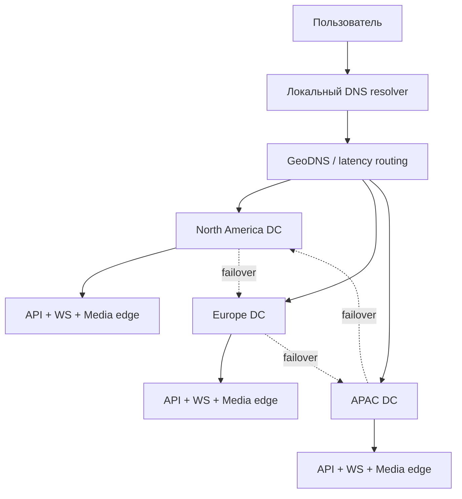
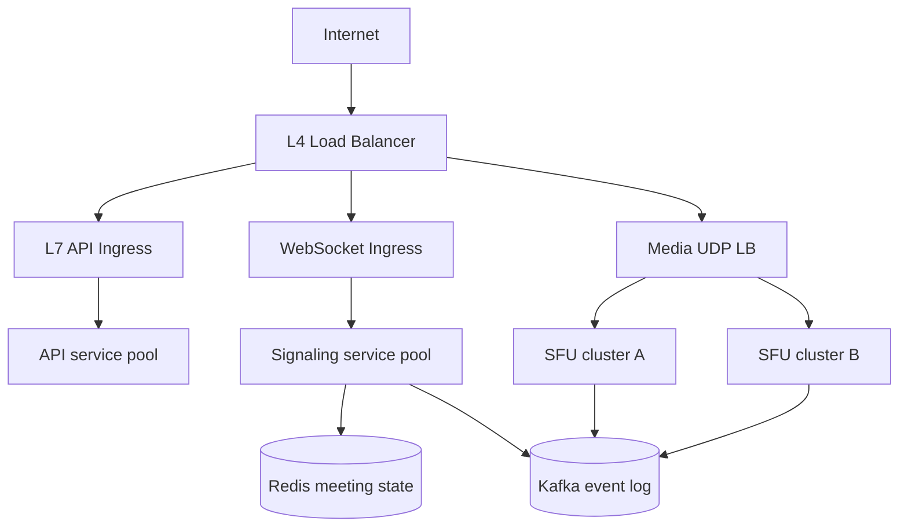
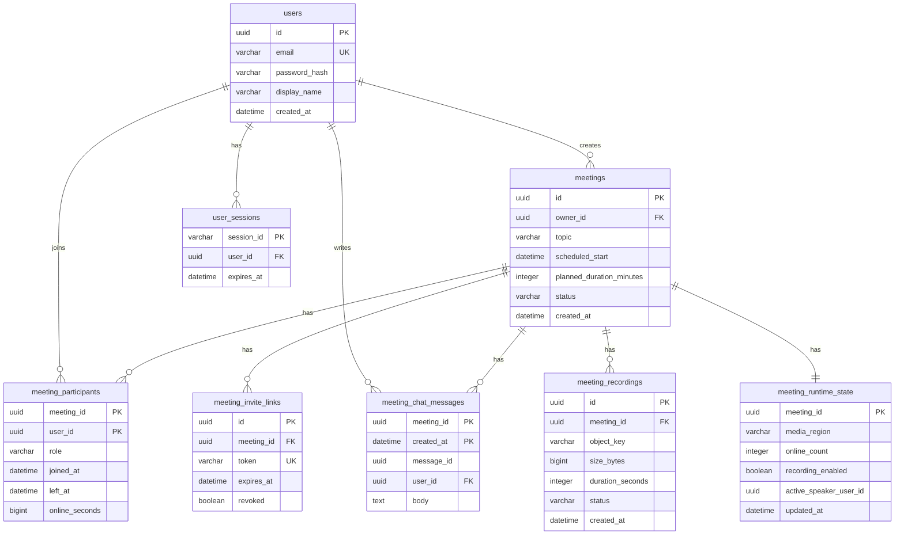
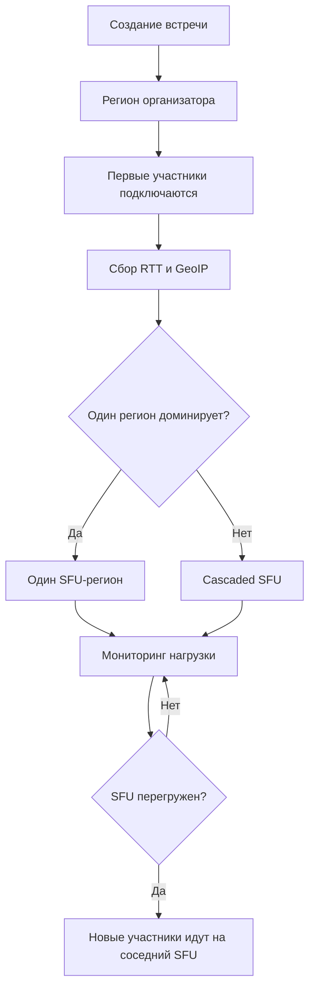
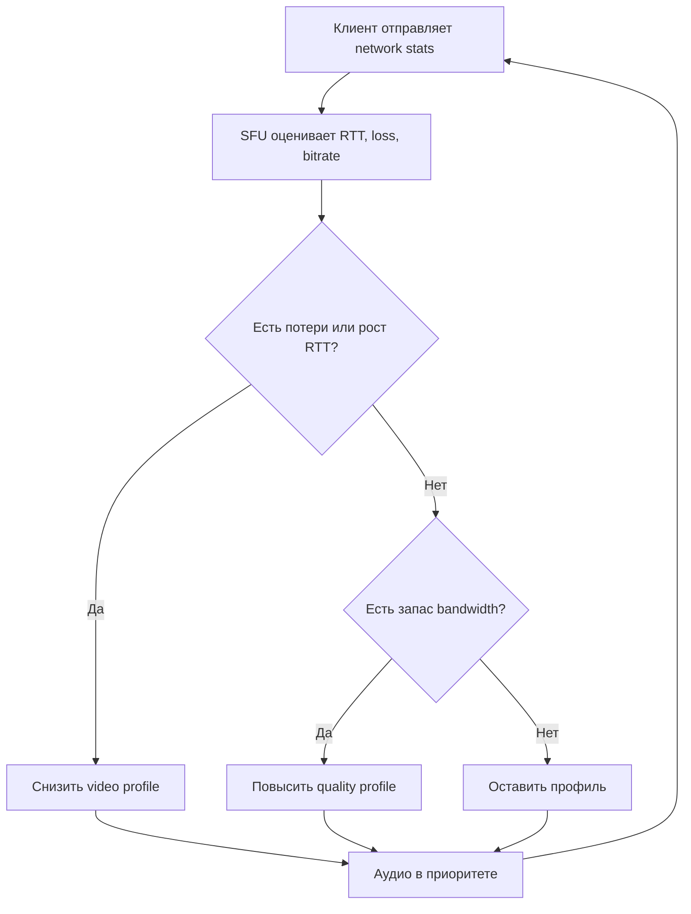
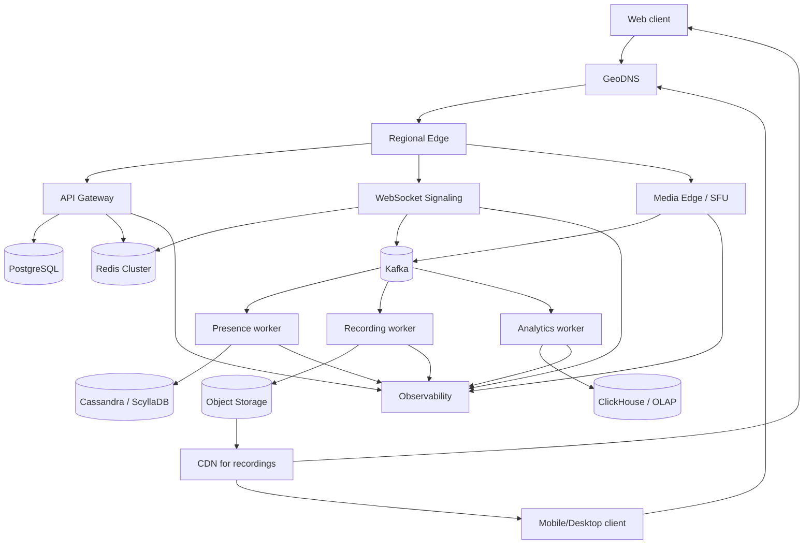

# Проектирование высоконагруженного Zoom-подобного сервиса видеовстреч

## Содержание

- [Важное правило по источникам и расчётам](#важное-правило-по-источникам-и-расчётам)
- [Основная часть](#основная-часть)
  - [1. Тема и целевая аудитория](#1-тема-и-целевая-аудитория)
    - [1.1. Тип сервиса](#11-тип-сервиса)
    - [1.2. Рыночная ниша и реальные аналоги](#12-рыночная-ниша-и-реальные-аналоги)
    - [1.3. Функционал MVP](#13-функционал-mvp)
    - [1.4. Ключевые продуктовые решения](#14-ключевые-продуктовые-решения)
    - [1.5. Целевая аудитория](#15-целевая-аудитория)
  - [2. Расчёт нагрузки](#2-расчёт-нагрузки)
    - [2.1. Исходные данные из открытых источников](#21-исходные-данные-из-открытых-источников)
    - [2.2. Допущения, которые не являются внешней статистикой](#22-допущения-которые-не-являются-внешней-статистикой)
    - [2.3. Продуктовые метрики](#23-продуктовые-метрики)
    - [2.4. Среднее количество действий пользователя в день](#24-среднее-количество-действий-пользователя-в-день)
    - [2.5. Размер хранилища пользователя](#25-размер-хранилища-пользователя)
    - [2.6. Технические метрики хранения](#26-технические-метрики-хранения)
    - [2.7. Сетевой трафик](#27-сетевой-трафик)
    - [2.8. RPS по основным методам](#28-rps-по-основным-методам)
  - [3. Глобальная балансировка нагрузки](#3-глобальная-балансировка-нагрузки)
  - [4. Локальная балансировка нагрузки](#4-локальная-балансировка-нагрузки)
  - [5. Логическая схема БД](#5-логическая-схема-бд)
  - [6. Физическая схема БД](#6-физическая-схема-бд)
  - [7. Алгоритмы](#7-алгоритмы)
  - [8. Технологии](#8-технологии)
  - [9. Обеспечение надёжности](#9-обеспечение-надёжности)
  - [10. Схема проекта](#10-схема-проекта)
  - [11. Список серверов](#11-список-серверов)
- [Список источников](#список-источников)

---

## Важное правило по источникам и расчётам

В работе не используется `similarweb.com` как первоисточник.

Публичные сервисы видеоконференций почти не раскрывают внутренние продуктовые метрики уровня «сколько сообщений в чате отправляет пользователь в день» или «какая доля встреч записывается». Поэтому в записке используется три типа значений:

| Тип значения | Как помечается в работе | Пример |
| ------------ | ----------------------- | ------ |
| Публичная метрика из источника | «Источник» в таблице | `300 млн daily meeting participants` у Zoom [1], [2] |
| Производная метрика | «Расчёт по формуле» | `30 млн встреч/сутки = 300 млн участий / 10 участников` |
| Инженерный коэффициент проектирования | «Проектное допущение» | `k_peak = 3` для расчёта пикового окна |

Принцип работы с метриками: **если значение является фактом о рынке или реальном сервисе, оно обязательно ссылается на источник; если значение является расчётным, в таблице указана формула; если публичного источника нет, значение не выдаётся за внешний факт**.

---

## Основная часть

---

### 1. Тема и целевая аудитория

#### 1.1. Тип сервиса

Проектируется высоконагруженный сервис видеоконференций — Zoom-подобная платформа для онлайн-встреч, групповых видеозвонков, демонстрации экрана, чата внутри встречи и облачной записи.

Учебное название сервиса: **MeetFlow**.

Сервис относится к классу real-time communication / video conferencing. Его архитектура нетривиальна, потому что основная нагрузка связана не только с обычными HTTP-запросами, но и с долгоживущими соединениями, медиатрафиком, сигналингом, синхронизацией состояния встречи, записью медиа и хранением больших бинарных объектов.

#### 1.2. Рыночная ниша и реальные аналоги

Ниша подтверждается существованием крупных реальных аналогов:

| Аналог | Подтверждение масштаба | Почему релевантен |
| ------ | ---------------------- | ----------------- |
| Zoom | 300 млн daily meeting participants в период пикового публичного раскрытия; важно, что это именно участники встреч, а не unique DAU [1], [2] | Ближайший аналог по продуктовой модели видеовстреч |
| Microsoft Teams | 75 млн daily active users и 200 млн meeting participants в отдельный день в апреле 2020 года [1] | Аналог с корпоративной аудиторией и массовыми видеовстречами |
| Microsoft Teams | 320 млн monthly active users, раскрытые Microsoft в FY24 Q1 и пересказанные профильным сообществом Microsoft Tech Community [12] | Подтверждает, что месячная аудитория коммуникационного сервиса может быть сотни миллионов пользователей |
| Zoom | $4.8688 млрд выручки за FY2026 и 4 468 клиентов с выручкой более $100 000 за trailing 12 months [8] | Подтверждает платёжеспособность ниши и корпоративный спрос |

Вывод: сервис видеоконференций имеет подтверждённую рыночную нишу, а целевая аудитория может существенно превышать минимальное требование в 1 млн активных пользователей в день.

#### 1.3. Функционал MVP

Для MVP выбирается не весь «офисный комбайн», а ключевая часть Zoom-подобного сервиса — проведение групповых видеовстреч.

1. **Создание встречи**  
   Пользователь может создать мгновенную или запланированную встречу, получить ссылку-приглашение и настройки доступа.

2. **Подключение к встрече**  
   Участник входит по ссылке, проходит проверку доступа, попадает в комнату ожидания или сразу подключается к встрече.

3. **Групповая аудио- и видеосвязь**  
   Сервис поддерживает групповые звонки со средней встречей около 10 участников, что соответствует публичной статистике Zoom за 2021 год [3].

4. **Демонстрация экрана**  
   Участник может включить screen sharing. Для расчёта используется официальный диапазон пропускной способности Zoom для screen sharing [4].

5. **Чат во время встречи**  
   Участники могут отправлять текстовые сообщения. Для ограничения размера сообщения используется публичное ограничение Zoom Chat — 4 000 символов на одно сообщение [5].

6. **Облачная запись встречи**  
   Организатор может включить запись. Zoom описывает cloud recording как запись видео, аудио и текста чата в облако [6].

7. **Базовое управление состоянием встречи**  
   Сервис хранит статусы `created`, `waiting`, `live`, `ended`, а также состояния участников: `joining`, `online`, `muted`, `screen_sharing`, `left`.

#### 1.4. Ключевые продуктовые решения

| Решение | Описание | Архитектурное последствие |
| ------- | -------- | ------------------------- |
| Основной сценарий — групповая встреча | MVP оптимизирован не под 1:1 звонки, а под групповые встречи | Нужны media-серверы / SFU, а не простая peer-to-peer схема |
| Среднее качество для расчёта — 720p group video | Zoom указывает для группового 720p 2.6 Mbps upload и 1.8 Mbps download [4] | Можно оценить медиатрафик через участнико-минуты |
| Серверная история чата внутри встречи | Сообщения чата хранятся на сервере и могут попасть в запись | Нужна отдельная таблица `meeting_chat_messages` |
| Запись хранится в object storage | Видео — большой бинарный объект, метаданные лежат в БД | Нужны S3-compatible storage и асинхронная обработка |
| Состояние встречи хранится отдельно от исторических данных | Текущее состояние должно читаться быстро | Нужны Redis / in-memory state и event log |
| Сигналинг отделён от медиатрафика | Сигналинг — WebSocket/WebRTC events, медиа — RTP/WebRTC | Нужны отдельные входные контуры `ws` и `media` |

#### 1.5. Целевая аудитория

Целевая аудитория выбирается как глобальный рынок пользователей видеоконференций: корпоративные команды, образовательные организации, удалённые сотрудники, организаторы вебинаров, консультаций и онлайн-занятий.

В качестве целевого масштаба берём проверяемые публичные аналоги:

| Метрика | Значение | Тип значения | Основание |
| ------- | -------: | ------------ | --------- |
| Местоположение аудитории | глобальный рынок | публичная метрика | Zoom использовался почти в 200 странах и территориях [3] |
| MAU | **320 000 000 пользователей/месяц** | публичная метрика аналога | Microsoft Teams достиг 320 млн monthly active users [12] |
| DAU | **75 000 000 пользователей/день** | публичная метрика аналога | Microsoft Teams сообщил 75 млн daily active users [1] |
| Daily meeting participants | **300 000 000 участий во встречах/день** | публичная метрика аналога | Zoom сообщил 300 млн daily meeting participants; это не unique users [1], [2] |
| Средняя длительность встречи | **54 минуты** | публичная метрика Zoom | Zoom aggregated usage data за 12 месяцев [3] |
| Средний размер встречи | **10 участников** | публичная метрика Zoom | Zoom aggregated usage data за 12 месяцев [3] |

Важно: в работе **не утверждается**, что у Zoom было 300 млн unique DAU. Источники отдельно подчёркивают, что 300 млн — это daily meeting participants, где один пользователь может быть посчитан несколько раз за день [1], [2]. Поэтому для unique DAU берётся отдельная публичная метрика аналога — Microsoft Teams 75 млн DAU [1].

---

### 2. Расчёт нагрузки

#### 2.1. Исходные данные из открытых источников

| № | Метрика | Значение | Источник |
| -: | ------- | -------: | -------- |
| 1 | MAU аналога Microsoft Teams | 320 млн пользователей/месяц | [12] |
| 2 | DAU аналога Microsoft Teams | 75 млн пользователей/день | [1] |
| 3 | Daily meeting participants аналога Zoom | 300 млн участий/день | [1], [2] |
| 4 | Средняя длительность Zoom-встречи | 54 минуты | [3] |
| 5 | Средний размер Zoom-встречи | 10 участников | [3] |
| 6 | География Zoom | почти 200 стран и территорий | [3] |
| 7 | Group video 720p upload | 2.6 Mbps на участника | [4] |
| 8 | Group video 720p download | 1.8 Mbps на участника | [4] |
| 9 | Screen sharing with video thumbnail | 50–150 kbps | [4] |
| 10 | Audio VoIP | 60–80 kbps | [4] |
| 11 | Максимальный размер chat message | 4 000 символов | [5] |
| 12 | Максимальный размер файла в Zoom Chat | 1 GB | [5] |
| 13 | Cloud recording | видео, аудио и текст чата записываются в облако | [6] |
| 14 | Cloud recording storage для Pro/Business | 10 GB на licensed user | [7] |
| 15 | FY2026 revenue Zoom | $4.8688 млрд | [8] |
| 16 | Клиенты Zoom с TTM revenue > $100 000 | 4 468 клиентов | [8] |

#### 2.2. Допущения, которые не являются внешней статистикой

Эти значения нужны для инженерного расчёта, но они не выдаются за опубликованную статистику Zoom или Microsoft.

| Допущение | Значение | Почему используется |
| --------- | -------: | ------------------- |
| Коэффициент суточного пика `k_peak` | 3 | Консервативный запас для учебного highload-проектирования; в реальной системе заменяется измеренным p95/p99 трафика |
| Интервал heartbeat для WebSocket-состояния | 25 секунд | Совпадает с дефолтным `pingInterval = 25000 ms` в Socket.IO [10] |
| Расчётный размер строки `users` | 256 B | Упрощённая оценка хранения UUID, email, имени, хэша пароля, timestamps и overhead |
| Расчётный размер строки `meetings` | 256 B | Упрощённая оценка ID, owner, topic, timestamps, status и access flags |
| Расчётный размер строки `meeting_participants` | 128 B | Упрощённая оценка meeting_id, user_id, role, timestamps, флаги состояния |
| Расчётный размер строки `user_sessions` | 128 B | Упрощённая оценка session_id, user_id, TTL, device info |
| Период горячего хранения meeting metadata | 30 дней | Для MVP храним активный рабочий месяц в основной БД, архив выносится дешевле |

#### 2.3. Продуктовые метрики

##### Расчёт количества встреч в сутки

Из источников известны:

- `daily_meeting_participants = 300 000 000` [1], [2]
- `avg_meeting_size = 10` [3]

Тогда количество встреч в сутки:

$$
meetings\_per\_day = \frac{300\ 000\ 000}{10} = 30\ 000\ 000
$$

##### Расчёт участий во встречах на одного DAU

Из источников и целевого масштаба:

- `DAU = 75 000 000` [1]
- `daily_meeting_participants = 300 000 000` [1], [2]

Тогда:

$$
join\_events\_per\_DAU\_per\_day = \frac{300\ 000\ 000}{75\ 000\ 000} = 4
$$

Это не означает, что каждый пользователь обязательно посещает 4 разные встречи. Это среднее значение: часть пользователей участвует в одной встрече, часть — в нескольких рабочих встречах за день.

##### Сводная таблица продуктовых метрик

| Метрика | Значение | Основание |
| ------- | -------: | --------- |
| MAU | **320 000 000** | публичная метрика Microsoft Teams [12] |
| DAU | **75 000 000** | публичная метрика Microsoft Teams [1] |
| Daily meeting participants | **300 000 000** | публичная метрика Zoom; это participation events, не unique users [1], [2] |
| Средний размер встречи | **10 участников** | публичная статистика Zoom [3] |
| Средняя длительность встречи | **54 минуты** | публичная статистика Zoom [3] |
| Встреч в сутки | **30 000 000** | `300 млн / 10 участников` |
| Участий во встречах на DAU в день | **4** | `300 млн / 75 млн` |
| Созданных встреч на DAU в день | **0.4** | `30 млн / 75 млн` |
| Participant-minutes в сутки | **16 200 000 000 минут** | `300 млн участий × 54 минуты` |
| Средняя конкурентность участников | **11 250 000 участников online** | `16.2 млрд participant-minutes / 1440 минут` |
| Пиковая конкурентность участников | **33 750 000 участников online** | `11.25 млн × k_peak=3` |

#### 2.4. Среднее количество действий пользователя в день

| Действие пользователя | Среднее на DAU в день | Как получено |
| --------------------- | --------------------: | ------------ |
| Создание / старт встречи | **0.4** | `30 млн встреч / 75 млн DAU` |
| Подключение к встрече | **4** | `300 млн участий / 75 млн DAU` |
| Выход из встречи | **4** | одно событие выхода на одно событие входа |
| Heartbeat / presence ping во время встреч | **≈ 518 событий** | `4 встречи × 54 минуты × 60 / 25 секунд` |
| Чат-сообщения | не фиксируется числом | В открытых источниках найден лимит размера сообщения, но не найдено надёжной публичной метрики частоты отправки сообщений; поэтому RPS чата считается формулой, а не выдуманным значением |
| Запись встречи | не фиксируется долей | В открытых источниках найдено описание cloud recording и квота хранения, но не найдена публичная доля записываемых встреч; поэтому хранилище записей считается через quota и worst-case сценарий |

Для чата в MVP используется формула:

$$
chat\_RPS = \frac{DAU \times chat\_messages\_per\_user\_per\_day}{86400}
$$

Значение `chat_messages_per_user_per_day` должно быть заменено на фактическую метрику после запуска MVP или внутреннего product analytics. В текущей работе оно не подставляется как факт, потому что публичного источника по частоте in-meeting chat messages не найдено.

#### 2.5. Размер хранилища пользователя

##### Профиль пользователя

Для пользовательского профиля используется расчётная строка 256 B.

$$
users\_storage = 320\ 000\ 000 \times 256B = 81.92GB
$$

Это только основные данные аккаунта: `user_id`, `email`, `password_hash`, `display_name`, `created_at`, `updated_at`, flags и небольшой overhead.

##### Облачные записи

Zoom указывает, что для Pro и Business планов включённая квота cloud recording storage составляет 10 GB на licensed user [7]. Для MVP принимаем такой же продуктовый лимит.

| Тип пользователя | Среднее хранилище | Основание |
| ---------------- | ----------------: | --------- |
| Пользователь без записи | 0 GB | бесплатные пользователи могут не иметь cloud recording в MVP |
| Licensed user с cloud recording | **10 GB** | продуктовая квота по аналогии с Zoom Pro/Business [7] |
| Enterprise user | unlimited / negotiated | Zoom указывает unlimited для Enterprise [7], но в MVP unlimited не проектируется как физически бесконечный ресурс |

Размер одной 54-минутной 720p-записи можно оценить через официальный bandwidth-профиль Zoom:

$$
recording\_size = \frac{(1.8Mbps + 0.08Mbps) \times 54 \times 60}{8 \times 1000} \approx 0.761GB
$$

Тогда 10 GB хватает примерно на:

$$
recordings\_per\_licensed\_user = \frac{10GB}{0.761GB} \approx 13\ записей
$$

Это инженерная оценка размера файла, построенная через публичные значения bitrate для видео и аудио [4]. Реальный размер cloud recording зависит от кодека, layout, наличия screen sharing и настроек записи.

#### 2.6. Технические метрики хранения

##### Горячие метаданные

| Тип данных | Количество объектов | Размер строки | Горизонт хранения | Итоговый объём |
| ---------- | ------------------: | ------------: | ----------------: | --------------: |
| `users` | 320 000 000 | 256 B | постоянно | **81.92 GB** |
| `meetings` | 30 000 000/сутки | 256 B | 30 дней | **230.4 GB** |
| `meeting_participants` | 300 000 000/сутки | 128 B | 30 дней | **1.152 TB** |
| `user_sessions` | 75 000 000 | 128 B | TTL | **9.6 GB** |

##### Object storage для записей

Так как публичной доли записываемых встреч нет, основная оценка делается не через «процент записей», а через две проверяемые границы:

1. **Quota-based storage** — сколько места нужно выделить, если licensed users получают 10 GB quota.
2. **Worst-case daily growth** — сколько данных появится, если каждая встреча будет записана.

| Сценарий | Формула | Объём |
| -------- | ------- | ----: |
| Quota для всех 320 млн MAU как licensed users | `320 млн × 10 GB` | **3.2 EB** |
| Worst-case: записываются все 30 млн встреч/сутки | `30 млн × 0.761 GB` | **22.842 PB/сутки** |
| Формула для реального процента записей | `30 млн × recording_share × 0.761 GB` | зависит от `recording_share` |

В реальном продукте cloud recording нельзя включать без квот, TTL, политики удаления и отдельного биллинга, иначе object storage становится главным источником стоимости.

#### 2.7. Сетевой трафик

##### Расчёт concurrent participants

$$
participant\_minutes\_per\_day = 300\ 000\ 000 \times 54 = 16\ 200\ 000\ 000
$$

$$
avg\_concurrent\_participants = \frac{16\ 200\ 000\ 000}{24 \times 60} = 11\ 250\ 000
$$

$$
peak\_concurrent\_participants = 11\ 250\ 000 \times 3 = 33\ 750\ 000
$$

##### Суточный трафик

| Тип трафика | Bitrate на участника | Формула | Суммарный трафик |
| ----------- | -------------------: | ------- | ---------------: |
| Video uplink: клиент → сервис | 2.6 Mbps | `16.2 млрд мин × 60 × 2.6 / 8 / 1000` | **315 900 000 GB/сутки** |
| Video downlink: сервис → клиент | 1.8 Mbps | `16.2 млрд мин × 60 × 1.8 / 8 / 1000` | **218 700 000 GB/сутки** |
| Audio VoIP | 0.08 Mbps | `16.2 млрд мин × 60 × 0.08 / 8 / 1000` | **9 720 000 GB/сутки** |
| Screen sharing upper-bound | 0.15 Mbps | `16.2 млрд мин × 60 × 0.15 / 8 / 1000` | **18 225 000 GB/сутки** |

Значение screen sharing показано как верхняя граница, если screen sharing идёт все participant-minutes. Это не утверждение о реальной доле демонстрации экрана.

##### Средний и пиковый bandwidth

| Тип трафика | Средний bandwidth | Пиковый bandwidth, `k_peak=3` | Источник bitrate |
| ----------- | ----------------: | ----------------------------: | ---------------- |
| Video uplink | **29 250 Gbps** | **87 750 Gbps** | 2.6 Mbps для group 720p upload [4] |
| Video downlink | **20 250 Gbps** | **60 750 Gbps** | 1.8 Mbps для group 720p download [4] |
| Audio VoIP | **900 Gbps** | **2 700 Gbps** | 60–80 kbps, берём верхнюю границу 80 kbps [4] |
| Screen sharing upper-bound | **1 687.5 Gbps** | **5 062.5 Gbps** | 50–150 kbps, берём верхнюю границу 150 kbps [4] |

Вывод: для Zoom-подобного сервиса медиатрафик на порядки важнее обычного API RPS. Основной инфраструктурный слой — это не REST API, а media edge / SFU-кластеры, сетевые интерфейсы и межрегиональная магистраль.

#### 2.8. RPS по основным методам

Для HTTP и WebSocket-событий используется стандартная формула:

$$
avg\_RPS = \frac{requests\_per\_day}{86400}
$$

$$
peak\_RPS = avg\_RPS \times k\_peak
$$

| Метод / событие | Количество событий в сутки | Средний RPS | Пиковый RPS | Основание |
| --------------- | -------------------------: | ----------: | ----------: | --------- |
| `POST /meetings` | 30 000 000 | **347** | **1 042** | `300 млн участий / 10 участников` |
| `POST /meetings/{id}/join` | 300 000 000 | **3 472** | **10 417** | daily meeting participants [1], [2] |
| `POST /meetings/{id}/leave` | 300 000 000 | **3 472** | **10 417** | одно событие выхода на одно событие входа |
| `WS /presence/heartbeat` | 38 880 000 000 | **450 000** | **1 350 000** | `avg_concurrent / 25 sec`, heartbeat interval по Socket.IO [10] |
| `POST /recordings/metadata` | до 30 000 000 | до **347** | до **1 042** | worst-case: записываются все встречи |
| `POST /meeting-chat/messages` | не подставляется | формула | формула | нет публичной частоты сообщений; см. формулу в разделе 2.4 |

Итог: самый тяжёлый backend-поток по RPS — не создание встреч, а heartbeat / presence. Самый тяжёлый поток по сети — медиатрафик.

---

### 3. Глобальная балансировка нагрузки

Для видеовстреч критична задержка между участником и ближайшим media edge. Поэтому глобальная балансировка должна решать две задачи:

1. Отправить пользователя в ближайший регион для API и WebSocket.
2. Назначить встрече media region так, чтобы суммарная задержка участников была минимальной.

#### 3.1. Домены сервиса

| Домен | Назначение | Тип трафика |
| ----- | ---------- | ----------- |
| `meetflow.com` | лендинг, web app, статические ресурсы | HTTPS |
| `api.meetflow.com` | авторизация, встречи, настройки | HTTPS REST/gRPC gateway |
| `ws.meetflow.com` | сигналинг, heartbeat, события участников | WebSocket |
| `media.meetflow.com` | WebRTC media edge / SFU | UDP/TCP media traffic |
| `recordings.meetflow.com` | скачивание и стриминг записей | HTTPS + object storage |

#### 3.2. Региональная схема

Из-за глобальной аудитории и почти 200 стран использования аналога [3] сервис проектируется как multi-region.

| Регион | Назначение | Комментарий |
| ------ | ---------- | ----------- |
| North America | крупный корпоративный рынок, резерв для Americas | первый регион для американских пользователей |
| Europe | EMEA, низкая задержка для Европы | отдельный регион из-за latency и требований к данным |
| Asia-Pacific | APAC и Океания | отдельный регион из-за удалённости от Европы/США |
| India / Middle East edge | edge-регион при росте нагрузки | не обязателен в MVP, но нужен при росте аудитории |

Распределение пользователей по регионам в этой работе не фиксируется численно, потому что открытые источники дают глобальные метрики, но не дают публичного распределения unique users по регионам. В реальной эксплуатации это распределение должно строиться по данным авторизации и GeoIP.

#### 3.3. Схема GeoDNS

```mermaid
flowchart TD
    U["Пользователь"] --> R["Локальный DNS resolver"]
    R --> G["GeoDNS / latency routing"]
    G --> NA["North America DC"]
    G --> EU["Europe DC"]
    G --> APAC["APAC DC"]

    NA --> NA_API["API + WS + Media edge"]
    EU --> EU_API["API + WS + Media edge"]
    APAC --> APAC_API["API + WS + Media edge"]

    NA -. failover .-> EU
    EU -. failover .-> APAC
    APAC -. failover .-> NA
```

#### 3.4. Выбор media region для встречи

При создании встречи регион выбирается по организатору. После входа первых участников система может уточнить регион:

1. Участник подключается к ближайшему edge.
2. Signaling service собирает RTT и региональные признаки.
3. Meeting placement service выбирает основной SFU-регион.
4. Если участники сильно распределены географически, создаются cascaded SFU между регионами.

---

### 4. Локальная балансировка нагрузки

Внутри каждого региона трафик разделяется по типу:

| Тип трафика | Балансировка | Почему |
| ----------- | ------------ | ------ |
| HTTPS API | L7 балансировка | обычные stateless-запросы |
| WebSocket signaling | L4/L7 с sticky routing по `meeting_id` | долгоживущие соединения и состояние встречи |
| WebRTC media | L4/UDP routing к SFU | медиапоток нельзя проксировать как обычный HTTP |
| Recordings download | CDN + object storage signed URLs | большие файлы должны уходить мимо API |

#### 4.1. Схема внутри региона

```mermaid
flowchart TD
    Internet["Internet"] --> L4["L4 Load Balancer"]
    L4 --> API_L7["L7 API Ingress"]
    L4 --> WS_L7["WebSocket Ingress"]
    L4 --> MEDIA_LB["Media UDP LB"]

    API_L7 --> API1["API service pool"]
    WS_L7 --> SIG1["Signaling service pool"]
    MEDIA_LB --> SFU1["SFU cluster A"]
    MEDIA_LB --> SFU2["SFU cluster B"]

    SIG1 --> REDIS[("Redis meeting state")]
    SIG1 --> KAFKA[("Kafka event log")]
    SFU1 --> KAFKA
    SFU2 --> KAFKA
```

#### 4.2. Что балансируется по `meeting_id`

Для сигналинга важно, чтобы события одной встречи попадали в один логический shard. Поэтому используется consistent hashing:

$$
shard = hash(meeting\_id) \mod N
$$

Это снижает количество cross-node запросов при обновлении состояния встречи.

---

### 5. Логическая схема БД

```mermaid
erDiagram
    users ||--o{ meetings : creates
    users ||--o{ meeting_participants : joins
    users ||--o{ user_sessions : has
    users ||--o{ meeting_chat_messages : writes

    meetings ||--o{ meeting_participants : has
    meetings ||--o{ meeting_invite_links : has
    meetings ||--o{ meeting_chat_messages : has
    meetings ||--o{ meeting_recordings : has
    meetings ||--|| meeting_runtime_state : has

    users {
        uuid id PK
        varchar email UK
        varchar password_hash
        varchar display_name
        datetime created_at
    }

    meetings {
        uuid id PK
        uuid owner_id FK
        varchar topic
        datetime scheduled_start
        integer planned_duration_minutes
        varchar status
        datetime created_at
    }

    meeting_participants {
        uuid meeting_id PK
        uuid user_id PK
        varchar role
        datetime joined_at
        datetime left_at
        bigint online_seconds
    }

    meeting_runtime_state {
        uuid meeting_id PK
        varchar media_region
        integer online_count
        boolean recording_enabled
        uuid active_speaker_user_id
        datetime updated_at
    }

    meeting_invite_links {
        uuid id PK
        uuid meeting_id FK
        varchar token UK
        datetime expires_at
        boolean revoked
    }

    meeting_chat_messages {
        uuid meeting_id PK
        datetime created_at PK
        uuid message_id
        uuid user_id FK
        text body
    }

    meeting_recordings {
        uuid id PK
        uuid meeting_id FK
        varchar object_key
        bigint size_bytes
        integer duration_seconds
        varchar status
        datetime created_at
    }

    user_sessions {
        varchar session_id PK
        uuid user_id FK
        datetime expires_at
    }
```

#### 5.1. Назначение таблиц

| Таблица | Назначение |
| ------- | ---------- |
| `users` | аккаунты пользователей |
| `meetings` | основная сущность встречи |
| `meeting_participants` | факт участия пользователя во встрече |
| `meeting_runtime_state` | текущее состояние live-встречи |
| `meeting_invite_links` | ссылки-приглашения и access tokens |
| `meeting_chat_messages` | сообщения чата внутри встречи |
| `meeting_recordings` | метаданные записей |
| `user_sessions` | пользовательские сессии и refresh tokens |

#### 5.2. Требования к консистентности

| Данные | Требование | Обоснование |
| ------ | ---------- | ----------- |
| `users.email` | strong consistency | нельзя создать два аккаунта с одним email |
| `meeting_invite_links.token` | strong consistency | доступ к приватной встрече должен проверяться строго |
| `meeting_runtime_state.online_count` | eventual consistency | допустима задержка в несколько секунд |
| `meeting_chat_messages` | per-meeting ordering | сообщения должны читаться в порядке времени внутри встречи |
| `meeting_recordings.status` | eventual consistency | запись обрабатывается асинхронно |
| `user_sessions` | session consistency | достаточно строгой проверки в рамках одной сессии |

---

### 6. Физическая схема БД

#### 6.1. Размещение по хранилищам

| Данные | Хранилище | Почему |
| ------ | --------- | ------ |
| `users`, billing flags | PostgreSQL | транзакции, уникальные constraints, strong consistency |
| `meetings`, `meeting_invite_links` | PostgreSQL + read replicas | важна корректность создания и доступа |
| `meeting_runtime_state` | Redis Cluster | горячее состояние live-встречи |
| `meeting_participants` | Cassandra / ScyllaDB | большой поток событий join/leave, горизонтальное масштабирование |
| `meeting_chat_messages` | Cassandra / ScyllaDB | запись по `meeting_id`, чтение истории по времени |
| `meeting_recordings` metadata | PostgreSQL или Cassandra | метаданные небольшие, но запись асинхронная |
| бинарные записи | S3-compatible Object Storage | большие файлы, дешёвое хранение, signed URLs |
| события signaling / recording | Kafka | event log, replay, асинхронные воркеры |

#### 6.2. Ключи и партиционирование

| Таблица | Partition key | Sort key | Причина |
| ------- | ------------- | -------- | ------- |
| `meeting_participants` | `meeting_id` | `user_id` | быстро получить участников встречи |
| `meeting_chat_messages` | `meeting_id` | `created_at`, `message_id` | история чата читается по встрече и времени |
| `meeting_runtime_state` | `meeting_id` | нет | точечное чтение состояния встречи |
| `meeting_recordings` | `meeting_id` | `created_at` | список записей конкретной встречи |
| `user_sessions` | `session_id` | нет | точечная проверка сессии |

#### 6.3. Hot keys

| Потенциальный hot key | Проблема | Решение |
| -------------------- | -------- | ------- |
| Очень большая встреча / вебинар | все события идут в один `meeting_id` | отдельный режим webinar, shard по `meeting_id + bucket` |
| Популярная запись | много скачиваний одного object key | CDN, signed URL, range requests |
| Heartbeat live-встречи | миллионы ping/pong событий | агрегировать heartbeat на edge, не писать каждый ping в основную БД |
| Чат крупной встречи | много сообщений в одну партицию | bucket по времени: `meeting_id + minute_bucket` |

---

### 7. Алгоритмы

#### 7.1. Meeting placement

Алгоритм выбирает регион и SFU-кластер для встречи.

1. При создании встречи берётся регион организатора.
2. При входе участников собираются RTT и GeoIP.
3. Если большинство участников в одном регионе, встреча остаётся там.
4. Если участники распределены, создаётся каскад SFU.
5. При перегрузке SFU встреча мигрирует только до активной фазы или через controlled reconnect.

```mermaid
flowchart TD
    A["Создание встречи"] --> B["Регион организатора"]
    B --> C["Первые участники подключаются"]
    C --> D["Сбор RTT и GeoIP"]
    D --> E{"Один регион доминирует?"}
    E -- Да --> F["Один SFU-регион"]
    E -- Нет --> G["Cascaded SFU"]
    F --> H["Мониторинг нагрузки"]
    G --> H
    H --> I{"SFU перегружен?"}
    I -- Нет --> H
    I -- Да --> J["Новые участники идут на соседний SFU"]
```

#### 7.2. Adaptive bitrate

Adaptive bitrate нужен, потому что official bandwidth-профили Zoom показывают разные требования для качества 720p и 1080p [4].

1. Клиент отправляет сетевые метрики: packet loss, RTT, jitter, доступная полоса.
2. SFU выбирает профиль качества.
3. При деградации сети первым снижается видео.
4. Аудио получает приоритет.
5. При восстановлении сети качество повышается постепенно.

```mermaid
flowchart TD
    A["Клиент отправляет network stats"] --> B["SFU оценивает RTT, loss, bitrate"]
    B --> C{"Есть потери или рост RTT?"}
    C -- Да --> D["Снизить video profile"]
    C -- Нет --> E{"Есть запас bandwidth?"}
    E -- Да --> F["Повысить quality profile"]
    E -- Нет --> G["Оставить профиль"]
    D --> H["Аудио в приоритете"]
    F --> H
    G --> H
    H --> A
```

#### 7.3. Идемпотентный join/leave

Join/leave события могут приходить повторно из-за reconnect. Поэтому обработка должна быть идемпотентной.

| Событие | Идемпотентный ключ | Поведение |
| ------- | ------------------ | --------- |
| `join` | `meeting_id:user_id:session_id:join_seq` | повторный `join` не увеличивает счётчики дважды |
| `leave` | `meeting_id:user_id:session_id:leave_seq` | повторный `leave` не создаёт отрицательный online count |
| `heartbeat` | `meeting_id:user_id:session_id:timestamp_bucket` | heartbeat агрегируется, а не пишется в историю полностью |

---

### 8. Технологии

| Слой | Технология | Обоснование |
| ---- | ---------- | ----------- |
| Web frontend | React + TypeScript | быстрый UI для meeting room и account pages |
| Mobile/Desktop client | WebRTC SDK + native wrappers | нужен доступ к камере, микрофону, screen sharing |
| API backend | Go | хорошо подходит для сетевых сервисов и большого числа соединений |
| Signaling | Go + WebSocket | двунаправленная коммуникация; WebSocket стандартизирован RFC 6455 [11] |
| Media | WebRTC SFU | сервер пересылает media streams, не смешивая всё в один поток |
| Hot state | Redis Cluster | состояние live-встречи, presence, быстрые counters |
| Event log | Kafka | события join/leave/recording, replay и асинхронная обработка |
| Relational storage | PostgreSQL | пользователи, встречи, access control |
| Wide-column storage | Cassandra / ScyllaDB | участники, чат, high write throughput |
| Object storage | S3-compatible | записи встреч и большие файлы |
| Observability | Prometheus + Grafana + Loki | метрики, логи, алерты |

---

### 9. Обеспечение надёжности

#### 9.1. Резервирование компонентов

| Компонент | Схема резервирования |
| --------- | -------------------- |
| API services | stateless replicas, autoscaling, health-checks |
| WebSocket signaling | replicas + consistent hashing + reconnect |
| SFU media nodes | N+1 внутри региона, отдельные capacity pools |
| Redis Cluster | replica + sentinel/cluster failover |
| PostgreSQL | primary + synchronous replica в регионе + async replica в другом регионе |
| Cassandra / ScyllaDB | replication factor 3 |
| Kafka | replication factor 3, `acks=all` для критичных событий |
| Object storage | multi-AZ replication |
| CDN | несколько PoP, cache для recordings download |

#### 9.2. Graceful degradation

| Сбой / перегрузка | Что отключается первым | Что должно продолжать работать |
| ----------------- | --------------------- | ------------------------------ |
| Перегрузка media nodes | 1080p, затем 720p; видео снижается | аудио и базовая встреча |
| Перегрузка WebSocket | частота presence updates уменьшается | join/leave и mute/unmute |
| Перегрузка object storage | запись новых cloud recordings ставится в очередь | live-встречи не прерываются |
| Перегрузка chat storage | вложения в чат отключаются | текстовый чат и встреча |
| Межрегиональная деградация | новые встречи не размещаются в проблемном регионе | существующие встречи завершаются штатно |

---

### 10. Схема проекта

```mermaid
graph TB
    WEB["Web client"] --> DNS["GeoDNS"]
    MOB["Mobile/Desktop client"] --> DNS

    DNS --> EDGE["Regional Edge"]
    EDGE --> API["API Gateway"]
    EDGE --> WS["WebSocket Signaling"]
    EDGE --> MEDIA["Media Edge / SFU"]

    API --> PG[("PostgreSQL")]
    API --> REDIS[("Redis Cluster")]
    WS --> REDIS
    WS --> KAFKA[("Kafka")]
    MEDIA --> KAFKA

    KAFKA --> WORKER1["Presence worker"]
    KAFKA --> WORKER2["Recording worker"]
    KAFKA --> WORKER3["Analytics worker"]

    WORKER1 --> CASS[("Cassandra / ScyllaDB")]
    WORKER2 --> S3[("Object Storage")]
    WORKER3 --> OLAP[("ClickHouse / OLAP")]

    S3 --> CDN["CDN for recordings"]
    CDN --> WEB
    CDN --> MOB

    API --> OBS["Observability"]
    WS --> OBS
    MEDIA --> OBS
    WORKER1 --> OBS
    WORKER2 --> OBS
    WORKER3 --> OBS
```

Ключевая идея схемы: live-встреча обслуживается через edge, signaling и SFU; тяжёлые операции записи и аналитики уходят в Kafka и воркеры; большие файлы никогда не проходят через основной API.

---

### 11. Список серверов

Так как главный публично подтверждённый ресурсный драйвер — медиатрафик, серверы делятся на две группы:

1. **Control plane** — API, signaling, state, metadata.
2. **Media plane** — SFU, network interfaces, egress capacity.

#### 11.1. Control plane sizing

| Компонент | Основная нагрузка | Расчётная метрика из раздела 2 | Комментарий |
| --------- | ---------------- | ------------------------------ | ----------- |
| API Gateway | `POST /meetings`, `join`, `leave` | до 21 876 peak RPS без heartbeat | обычные stateless HTTP-запросы |
| WebSocket signaling | heartbeat + state events | до 1 350 000 peak RPS heartbeat | heartbeat нужно агрегировать на edge |
| PostgreSQL | users, meetings, access control | десятки/сотни GB hot data | основной риск — не объём, а consistency и индексы |
| Redis | live meeting state | 33.75 млн peak online participants | нужен cluster и TTL |
| Kafka | события live-встреч | join/leave/heartbeat aggregates | нельзя писать каждый ping как отдельное вечное событие |

#### 11.2. Media plane sizing

| Направление | Peak bandwidth | Что это означает |
| ----------- | -------------: | ---------------- |
| Client → service video | **87 750 Gbps** | входящий media-трафик от камер участников |
| Service → client video | **60 750 Gbps** | исходящий media-трафик от SFU к участникам |
| Audio | **2 700 Gbps** | аудио должно иметь приоритет над видео |
| Screen sharing upper-bound | **5 062.5 Gbps** | верхняя граница, если screen sharing идёт все participant-minutes |

При таких значениях сервис нельзя проектировать как один дата-центр или как обычный web-backend. Нужны региональные media edge-кластеры, большой запас сетевых портов и распределение встреч по регионам.

#### 11.3. Почему точное количество серверов не фиксируется без бенчмарков

В открытых источниках есть пользовательские bandwidth-профили Zoom [4], но нет публичных данных о производительности конкретного SFU-узла MeetFlow. Поэтому точное число media-серверов нельзя честно получить только из открытых источников.

Для реального проекта требуется отдельный нагрузочный тест:

| Что измерить | Зачем |
| ------------ | ----- |
| Количество одновременных 720p publishers на SFU | определить CPU/GPU/network bottleneck |
| Количество subscribers на SFU | оценить fan-out |
| Утилизацию 25/40/100/400GbE портов | выбрать сетевые карты и ToR switches |
| Задержку SFU при cascaded routing | понять, когда нужен второй регион |
| Стоимость egress | главный cost driver для видеосервиса |

---

## Список источников

1. Reuters — *Zoom says it has 300 million daily meeting participants, not users*; также в материале приведены 75 млн DAU Microsoft Teams и 200 млн Teams meeting participants в отдельный день.  
   https://www.reuters.com/article/business/zoom-says-it-has-300-million-daily-meeting-participants-not-users-idUSKBN22C1IE/

2. The Verge — *Zoom admits it doesn’t have 300 million users, corrects misleading claims*.  
   https://www.theverge.com/2020/4/30/21242421/zoom-300-million-users-incorrect-meeting-participants-statement

3. Zoom Blog — *Here’s How You Zoomed Over the Past Year*; указаны почти 200 стран и территорий, средняя длительность встречи 54 минуты и средний размер встречи 10 участников.  
   https://www.zoom.com/en/blog/how-you-zoomed-over-the-past-year-2021/

4. Zoom Support — *Zoom system requirements: Zoom Web App*; bandwidth для 720p group video, screen sharing и audio VoIP.  
   https://support.zoom.com/hc/en/article?id=zm_kb&sysparm_article=KB0058323

5. Zoom Support — *Zoom Chat specifications and limitations*; лимиты сообщения, файла, видео и retention.  
   https://support.zoom.com/hc/en/article?id=zm_kb&sysparm_article=KB0079326

6. Zoom Support — *Starting a cloud recording*; cloud recording записывает видео, аудио и текст чата в Zoom cloud.  
   https://support.zoom.com/hc/en/article?id=zm_kb&sysparm_article=KB0062627

7. Zoom Support — *Cloud recording storage capacity*; включённая ёмкость cloud recording storage по тарифам.  
   https://support.zoom.com/hc/en/article?id=zm_kb&sysparm_article=KB0067670

8. Nasdaq / Zoom Communications — *Zoom Communications Reports Fourth Quarter and Fiscal Year 2026 Financial Results*; FY2026 revenue и customer metrics.  
   https://www.nasdaq.com/press-release/zoom-communications-reports-fourth-quarter-and-fiscal-year-2026-financial-results

9. Zoom Developer Docs — *Using webhooks*; Zoom отправляет webhook events как HTTP POST с JSON body.  
   https://developers.zoom.us/docs/api/webhooks/

10. Socket.IO Documentation — *Server options*; `pingInterval = 25000 ms`, `pingTimeout = 20000 ms`, heartbeat mechanism.  
    https://socket.io/docs/v4/server-options/

11. IETF RFC 6455 — *The WebSocket Protocol*; WebSocket обеспечивает двустороннюю коммуникацию поверх одного TCP-соединения.  
    https://datatracker.ietf.org/doc/html/rfc6455

12. Microsoft Tech Community — *Teams Grows to 320 Million Monthly Active Users*; пересказ раскрытия Microsoft FY24 Q1 о 320 млн MAU Teams.  
    https://techcommunity.microsoft.com/discussions/microsoftteams/teams-grows-to-320-million-monthly-active-users/3964746
