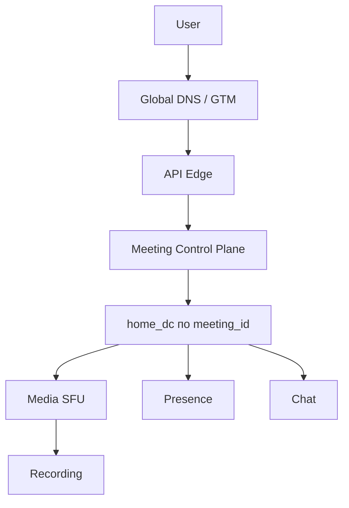
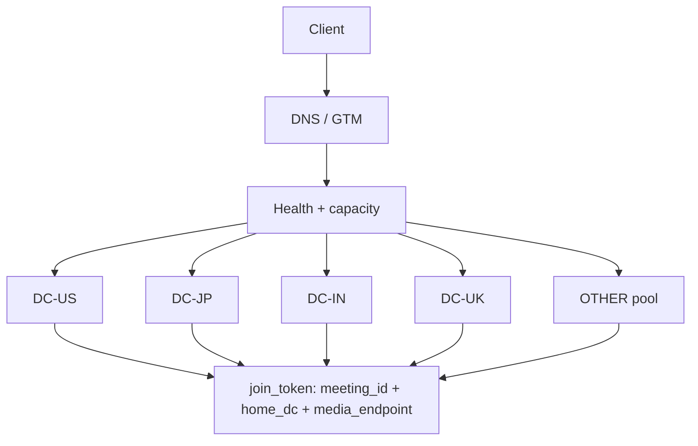
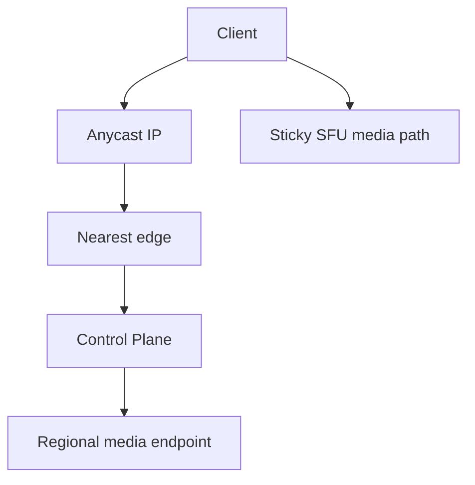
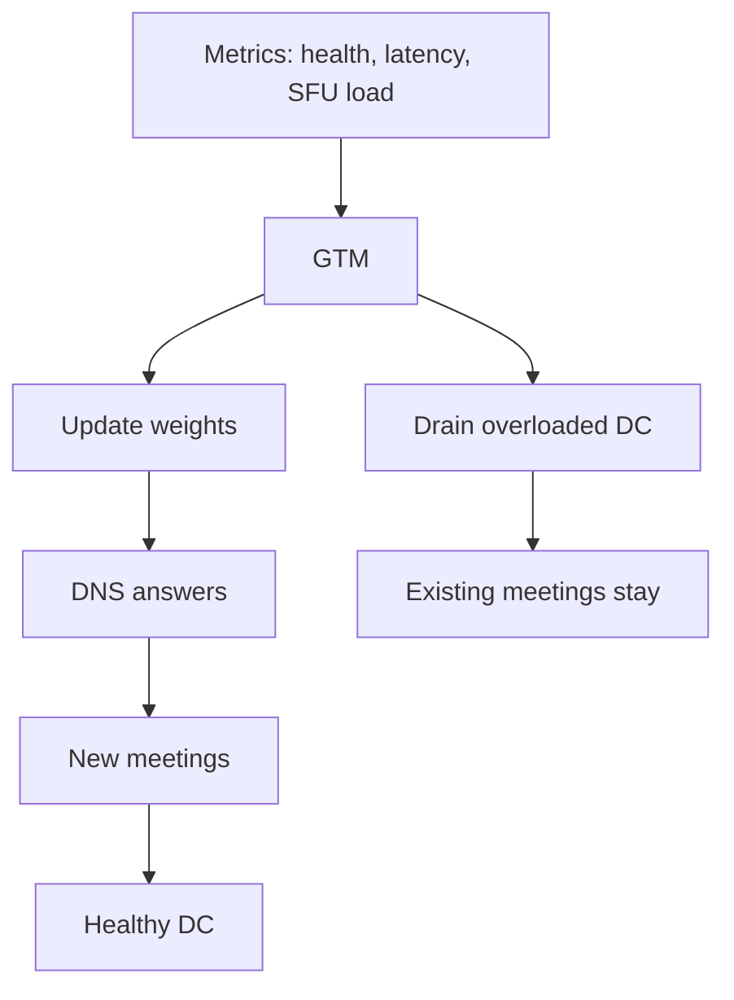
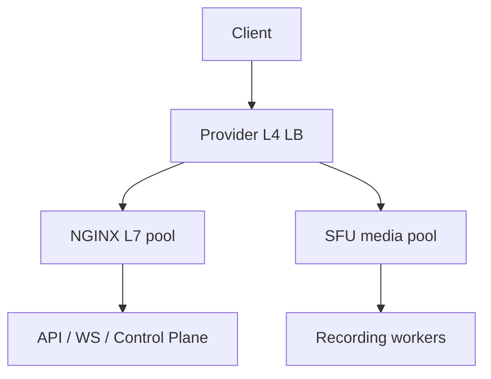
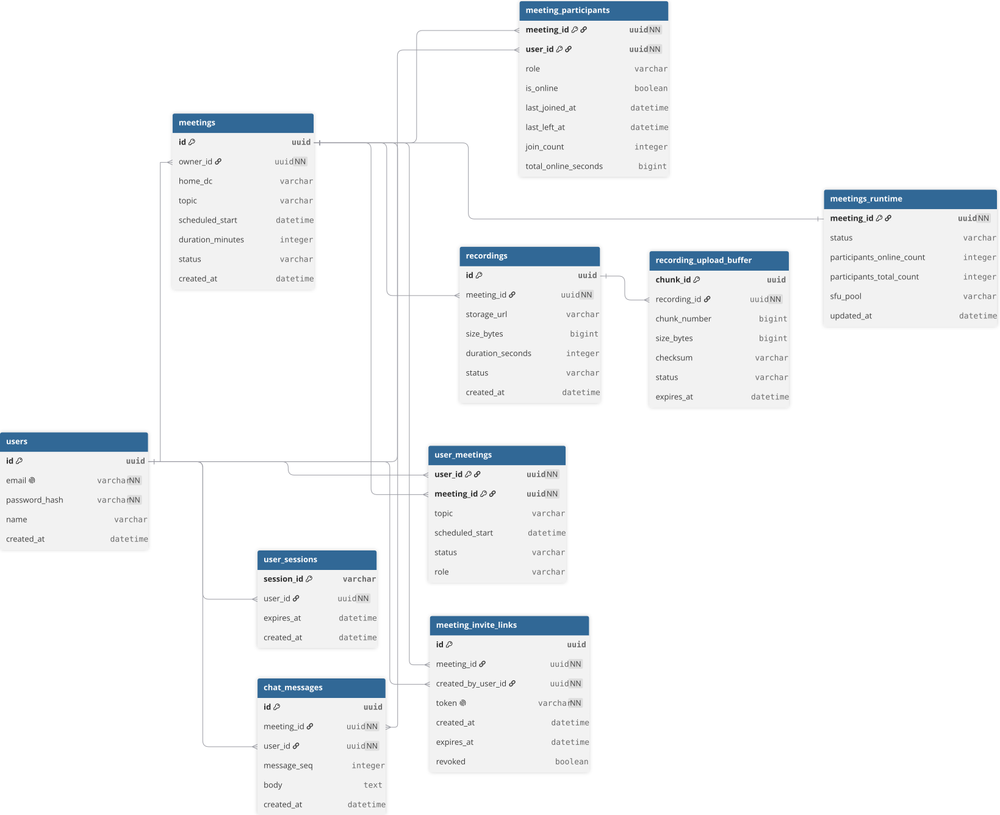
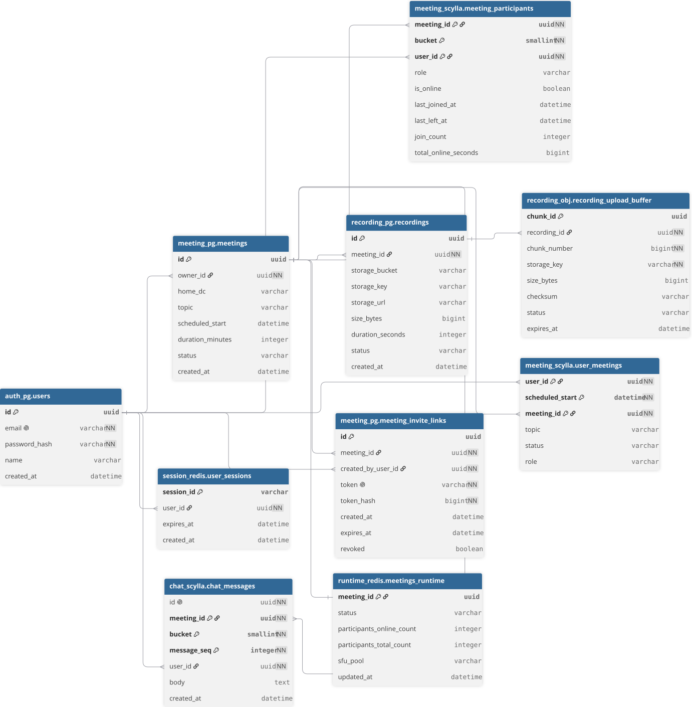

# Проектирование высоконагруженного Zoom-подобного сервиса видеовстреч

## Содержание

- [Основная часть](#основная-часть)
  - [1. Тема и целевая аудитория](#1-тема-и-целевая-аудитория)
    - [1.1. Тип сервиса](#11-тип-сервиса)
    - [1.2. Рыночная ниша и реальные аналоги](#12-рыночная-ниша-и-реальные-аналоги)
    - [1.3. Функционал MVP](#13-функционал-mvp)
    - [1.4. Ключевые продуктовые решения](#14-ключевые-продуктовые-решения)
    - [1.5. Целевая аудитория](#15-целевая-аудитория)
  - [2. Расчёт нагрузки](#2-расчёт-нагрузки)
    - [2.1. Исходные метрики и методика расчёта](#21-исходные-метрики-и-методика-расчёта)
    - [2.2. Продуктовая оценка видеовстреч](#22-продуктовая-оценка-видеовстреч)
    - [2.3. Хранилище пользователя и техническое хранение](#23-хранилище-пользователя-и-техническое-хранение)
    - [2.4. Сетевой трафик и RPS](#24-сетевой-трафик-и-rps)
  - [3. Глобальная балансировка нагрузки](#3-глобальная-балансировка-нагрузки)
    - [3.1. Функциональное разбиение по доменам](#31-функциональное-разбиение-по-доменам)
    - [3.2. Выбор и расположение дата-центров](#32-выбор-и-расположение-дата-центров)
    - [3.3. Распределение нагрузки по дата-центрам](#33-распределение-нагрузки-по-дата-центрам)
    - [3.4. Схема DNS-балансировки](#34-схема-dns-балансировки)
    - [3.5. Схема Anycast-балансировки](#35-схема-anycast-балансировки)
    - [3.6. Регулировка трафика между дата-центрами](#36-регулировка-трафика-между-дата-центрами)
    - [3.7. Вывод по глобальной балансировке](#37-вывод-по-глобальной-балансировке)
  - [4. Локальная балансировка нагрузки](#4-локальная-балансировка-нагрузки)
    - [4.1. Границы локальной балансировки](#41-границы-локальной-балансировки)
    - [4.2. Схема локальной балансировки](#42-схема-локальной-балансировки)
    - [4.3. Механизмы резервирования](#43-механизмы-резервирования)
    - [4.4. Ограничители для расчёта](#44-ограничители-для-расчёта)
    - [4.5. Расчёт количества L7-балансировщиков](#45-расчёт-количества-l7-балансировщиков)
    - [4.6. Итоговое количество балансировщиков](#46-итоговое-количество-балансировщиков)
  - [5. Логическая схема БД](#5-логическая-схема-бд)
    - [5.1. Список логических таблиц](#51-список-логических-таблиц)
    - [5.2. Размеры данных и QPS](#52-размеры-данных-и-qps)
    - [5.3. Требования к консистентности](#53-требования-к-консистентности)
    - [5.4. Распределение нагрузки по ключам](#54-распределение-нагрузки-по-ключам)
  - [6. Физическая схема БД](#6-физическая-схема-бд)
    - [6.1. Физическая схема](#61-физическая-схема)
    - [6.2. Где хранятся данные](#62-где-хранятся-данные)
    - [6.3. Выбор СУБД по таблицам](#63-выбор-субд-по-таблицам)
    - [6.4. Индексы](#64-индексы)
    - [6.5. Шардирование](#65-шардирование)
    - [6.6. Нагрузка на строки](#66-нагрузка-на-строки)
    - [6.7. API → запрос → БД](#67-api--запрос--бд)
    - [6.8. Кеш](#68-кеш)
    - [6.9. Денормализация и отказ от JOIN](#69-денормализация-и-отказ-от-join)
    - [6.10. Клиентские библиотеки](#610-клиентские-библиотеки)
- [Список источников](#список-источников)

## Основная часть

---

### 1. Тема и целевая аудитория

#### 1.1. Тип сервиса

| Параметр            | Значение                                                                                                   |
| ------------------- | ---------------------------------------------------------------------------------------------------------- |
| Учебное название    | **MeetFlow**                                                                                               |
| Тип сервиса         | Zoom-подобный сервис видеовстреч                                                                           |
| Основной сценарий   | Групповая онлайн-встреча с аудио, видео, демонстрацией экрана, чатом и записью                             |
| Целевые страны      | США, Европа, Россия, Япония                                                                                |
| Реальные аналоги    | Zoom, Microsoft Teams, Google Meet                                                                         |
| Масштаб для расчёта | `MF_MAU = 320 млн MAU`, `MF_DAU = 115 млн DAU`, `MF_DMP = 300 млн участий во встречах в день` [^1][^2][^3] |

#### 1.2. Рыночная ниша и реальные аналоги

| Аналог | Метрика | Что подтверждает |
| ------ | ------- | ---------------- |
| Microsoft Teams | 320 млн monthly active users, раскрыто в FY24 Q1 [^1] | Массовый размер аудитории коммуникационного сервиса |
| Microsoft Teams | 115 млн daily active users, октябрь 2020 [^2] | Нижнюю публичную границу daily-аудитории для расчёта |
| Zoom | 300 млн daily meeting participants, апрель 2020; это участники встреч, а не unique users [^3] | Массовую ежедневную нагрузку именно на видеовстречи |
| Zoom | Средняя встреча — 54 минуты и 10 участников, данные за 15.11.2020–15.11.2021 [^4] | Базу для продуктовой оценки видеозвонков |
| Zoom | $4.8688 млрд выручки за FY2026 и 4 468 клиентов с TTM-выручкой больше $100 000 [^10] | Актуальность ниши на 2026 год |

#### 1.3. Функционал MVP

| № | Функция MVP | Кратко | Метрика для расчёта |
| -: | ----------- | ------ | ------------------- |
| 1 | Создание встречи | Пользователь создаёт мгновенную или запланированную встречу | `MF_MEETINGS_DAY`, `POST /meetings` |
| 2 | Подключение к встрече | Участник входит по ссылке или приглашению | `MF_DMP`, `POST /meetings/{id}/join` |
| 3 | Групповая аудио- и видеосвязь | Участники общаются в 720p group video | `MF_VIDEO_UP_MBPS`, `MF_VIDEO_DOWN_MBPS`, `MF_AUDIO_MBPS` |
| 4 | Демонстрация экрана | Участник показывает экран | `MF_SCREEN_MBPS_MAX` |
| 5 | Чат во время встречи | Участники отправляют текстовые сообщения | `MF_CHAT_MSG_LIMIT` |
| 6 | Облачная запись | Организатор включает запись встречи | `MF_RECORD_QUOTA_GB`, `MF_RECORDING_SIZE_GB` |

#### 1.4. Ключевые продуктовые решения

| Решение | Значение для MVP | Что считается дальше |
| ------- | ---------------- | -------------------- |
| Расчёт ведётся от групповой встречи | Средняя встреча: `MF_MEET_SIZE = 10` участников | Количество встреч в сутки |
| Базовый профиль качества | 720p group video по официальным требованиям Zoom [^5] | Видео-трафик upload/download |
| Запись встречи включается в облако | Cloud recording сохраняет видео, аудио и текст чата [^7] | Хранилище записей |
| Хранилище записей ограничено квотой | Для Pro/Business у Zoom — 10 GB на licensed user [^8] | Верхняя граница object storage |
| Частота чата не выдумывается | Есть лимит сообщения, но нет публичной частоты сообщений на пользователя [^6] | Для чата оставлена формула без подстановки |

#### 1.5. Целевая аудитория

| Параметр | Значение |
| -------- | -------: |
| География | Глобальный рынок; Zoom использовался почти в 200 странах и территориях [^4] |
| Месячная аудитория | `MF_MAU = 320 000 000` пользователей/месяц |
| Дневная аудитория | `MF_DAU = 115 000 000` пользователей/день |
| Участий во встречах в день | `MF_DMP = 300 000 000` участий/день |
| Средний размер встречи | `MF_MEET_SIZE = 10` участников |
| Средняя длительность встречи | `MF_MEET_LEN_MIN = 54` минуты |

---

### 2. Расчёт нагрузки

#### 2.1. Исходные метрики и методика расчёта

| Название | Описание (бывшее значение) | Источник / расчёт |
| -------- | -------------------------- | ----------------- |
| `MF_MAU` | 320 000 000 monthly active users; публичное значение Microsoft Teams, FY24 Q1 / 2023 | Берётся как целевой месячный масштаб аналога; без пересчёта на 2026, потому что более новой публичной MAU-метрики Teams в открытых источниках не найдено [^1] |
| `MF_DAU` | 115 000 000 daily active users; публичное значение Microsoft Teams, октябрь 2020 | Берётся как консервативная daily-аудитория аналога; это не статистика Zoom и не результат экстраполяции [^2] |
| `MF_DMP` | 300 000 000 daily meeting participants; публичное значение Zoom, апрель 2020 | Используется для нагрузки на видеовстречи; это участники встреч, один пользователь может считаться несколько раз [^3] |
| `MF_MEET_SIZE` | 10 участников в средней Zoom-встрече; данные за 15.11.2020–15.11.2021 | Используется для расчёта `MF_MEETINGS_DAY = MF_DMP / MF_MEET_SIZE` [^4] |
| `MF_MEET_LEN_MIN` | 54 минуты — средняя длительность Zoom-встречи; данные за 15.11.2020–15.11.2021 | Используется для расчёта participant-minutes [^4] |
| `MF_VIDEO_UP_MBPS` | 2.6 Mbps на участника для 720p group video upload | Официальные требования Zoom к bandwidth [^5] |
| `MF_VIDEO_DOWN_MBPS` | 1.8 Mbps на участника для 720p group video download | Официальные требования Zoom к bandwidth [^5] |
| `MF_AUDIO_MBPS` | 0.08 Mbps на участника для VoIP audio | Верхняя граница диапазона 60–80 kbps из требований Zoom [^5] |
| `MF_SCREEN_MBPS_MAX` | 0.15 Mbps на участника для screen sharing upper-bound | Верхняя граница диапазона 50–150 kbps из требований Zoom [^5] |
| `MF_CHAT_MSG_LIMIT` | 4 000 символов на одно chat-сообщение | Лимит Zoom Team Chat; частота сообщений в открытых источниках не подставляется [^6] |
| `MF_RECORD_QUOTA_GB` | 10 GB cloud recording storage на licensed user | Квота Zoom для Pro/Business [^8] |
| `MF_HEARTBEAT_SEC` | 25 секунд между heartbeat-событиями | Дефолтный `pingInterval = 25000 ms` в Socket.IO [^9] |
| `MF_K_PEAK` | 3 | Проектный коэффициент суточного пика: используется одинаково для RPS и bandwidth |

Текущая актуальность ниши проверяется не устаревшими usage-числами, а финансовой метрикой: Zoom в FY2026 показал $4.8688 млрд выручки и 4 468 крупных клиентов с TTM-выручкой больше $100 000 [^10]. Старые usage-метрики используются только там, где они прямо подписаны по году и где показана формула расчёта.

#### 2.2. Продуктовая оценка видеовстреч

| Название | Расчёт | Значение |
| -------- | ------ | -------: |
| `MF_MEETINGS_DAY` | `MF_DMP / MF_MEET_SIZE` = `300 000 000 / 10` | **30 000 000 встреч/сутки** |
| `MF_JOINS_PER_DAU_DAY` | `MF_DMP / MF_DAU` = `300 000 000 / 115 000 000` | **2.61 подключения/DAU/день** |
| `MF_CREATED_MEETINGS_PER_DAU_DAY` | `MF_MEETINGS_DAY / MF_DAU` = `30 000 000 / 115 000 000` | **0.26 созданных встреч/DAU/день** |
| `MF_PARTICIPANT_MIN_DAY` | `MF_DMP * MF_MEET_LEN_MIN` = `300 000 000 * 54` | **16 200 000 000 participant-minutes/сутки** |
| `MF_AVG_ONLINE_PARTICIPANTS` | `MF_PARTICIPANT_MIN_DAY / 1440` | **11 250 000 участников online в среднем** |
| `MF_PEAK_ONLINE_PARTICIPANTS` | `MF_AVG_ONLINE_PARTICIPANTS * MF_K_PEAK` | **33 750 000 участников online в пик** |
| `MF_HEARTBEAT_EVENTS_DAY` | `MF_PARTICIPANT_MIN_DAY * 60 / MF_HEARTBEAT_SEC` | **38 880 000 000 heartbeat-событий/сутки** |

#### 2.3. Хранилище пользователя и техническое хранение

| Блок данных | Название | Расчёт | Общий объём |
| ----------- | -------- | ------ | ----------: |
| Профили пользователей | `MF_USERS_STORAGE_GB` | `MF_MAU * 256 B` | **81.92 GB** |
| Метаданные встреч, 30 дней | `MF_MEETINGS_META_STORAGE_GB` | `MF_MEETINGS_DAY * 30 * 256 B` | **230.4 GB** |
| Участники встреч, 30 дней | `MF_PARTICIPANTS_STORAGE_TB` | `MF_DMP * 30 * 128 B` | **1.152 TB** |
| Активные сессии | `MF_SESSIONS_STORAGE_GB` | `MF_DAU * 128 B` | **14.72 GB** |
| Суммарное техническое хранение без записей | `MF_TECH_STORAGE_TOTAL_TB` | `MF_USERS_STORAGE_GB + MF_MEETINGS_META_STORAGE_GB + MF_PARTICIPANTS_STORAGE_TB + MF_SESSIONS_STORAGE_GB` | **1.48 TB** |
| Квота облачных записей | `MF_RECORDING_QUOTA_EB` | `MF_MAU * MF_RECORD_QUOTA_GB` | **3.2 EB квоты** |
| Размер одной записи | `MF_RECORDING_SIZE_GB` | `(MF_VIDEO_DOWN_MBPS + MF_AUDIO_MBPS) * MF_MEET_LEN_MIN * 60 / 8 / 1000` | **0.761 GB** |
| Worst-case рост записей | `MF_RECORDING_WORST_PB_DAY` | `MF_MEETINGS_DAY * MF_RECORDING_SIZE_GB` | **22.842 PB/сутки** |
| Записи за 30 дней, worst-case | `MF_RECORDING_WORST_PB_30D` | `MF_RECORDING_WORST_PB_DAY * 30` | **685.26 PB за 30 дней** |
| Суммарное хранение, 30 дней | `MF_STORAGE_TOTAL_30D_PB` | `MF_RECORDING_WORST_PB_30D + MF_TECH_STORAGE_TOTAL_TB` | **≈ 685.261 PB** |
| Чат встречи | `MF_CHAT_STORAGE_FORMULA` | `messages_count * avg_message_size` | Считается после появления фактической частоты сообщений |

В итоговый суммарный объём не включается `MF_RECORDING_QUOTA_EB`, потому что это продуктовая квота, а не фактически занятое хранилище. Для sizing object storage используется worst-case 30-дневное хранение записей: `MF_RECORDING_WORST_PB_30D = 685.26 PB`.

#### 2.4. Сетевой трафик и RPS

##### Сетевой трафик

| Тип трафика | Название | Формула суточного объёма | Суточный объём | Средний bandwidth | Пиковый bandwidth |
| ----------- | -------- | ------------------------ | -------------: | ----------------: | ----------------: |
| Video upload | `MF_VIDEO_UP_GB_DAY` | `MF_PARTICIPANT_MIN_DAY * 60 * MF_VIDEO_UP_MBPS / 8 / 1000` | **315 900 000 GB/сутки** | **29 250 Gbps** | **87 750 Gbps** |
| Video download | `MF_VIDEO_DOWN_GB_DAY` | `MF_PARTICIPANT_MIN_DAY * 60 * MF_VIDEO_DOWN_MBPS / 8 / 1000` | **218 700 000 GB/сутки** | **20 250 Gbps** | **60 750 Gbps** |
| Audio VoIP | `MF_AUDIO_GB_DAY` | `MF_PARTICIPANT_MIN_DAY * 60 * MF_AUDIO_MBPS / 8 / 1000` | **9 720 000 GB/сутки** | **900 Gbps** | **2 700 Gbps** |
| Screen sharing upper-bound | `MF_SCREEN_GB_DAY_MAX` | `MF_PARTICIPANT_MIN_DAY * 60 * MF_SCREEN_MBPS_MAX / 8 / 1000` | **18 225 000 GB/сутки** | **1 687.5 Gbps** | **5 062.5 Gbps** |

Расчёт bandwidth в таблице:

```text
avg_bandwidth_Gbps  = MF_AVG_ONLINE_PARTICIPANTS * bitrate_Mbps / 1000
peak_bandwidth_Gbps = avg_bandwidth_Gbps * MF_K_PEAK
```

##### RPS по основным методам

| Метод / событие | Название | Событий в сутки | Средний RPS | Пиковый RPS |
| --------------- | -------- | --------------: | ----------: | ----------: |
| `POST /meetings` | `MF_CREATE_MEETING_RPS` | `MF_MEETINGS_DAY` = 30 000 000 | **347** | **1 042** |
| `POST /meetings/{id}/join` | `MF_JOIN_RPS` | `MF_DMP` = 300 000 000 | **3 472** | **10 417** |
| `POST /meetings/{id}/leave` | `MF_LEAVE_RPS` | `MF_DMP` = 300 000 000 | **3 472** | **10 417** |
| `WS /presence/heartbeat` | `MF_HEARTBEAT_RPS` | `MF_HEARTBEAT_EVENTS_DAY` = 38 880 000 000 | **450 000** | **1 350 000** |
| `POST /recordings/metadata` | `MF_RECORDING_META_RPS` | до `MF_MEETINGS_DAY` = 30 000 000 | **до 347** | **до 1 042** |
| `POST /meeting-chat/messages` | `MF_CHAT_RPS_FORMULA` | `MF_DAU * chat_messages_per_DAU_day` | формула | формула |

Формула для RPS:

```text
avg_RPS  = events_per_day / 86400
peak_RPS = avg_RPS * MF_K_PEAK
```


---

### 3. Глобальная балансировка нагрузки

#### 3.1. Функциональное разбиение по доменам

| Домен | Основная нагрузка | Как балансируем |
| ----- | ----------------- | --------------- |
| `Auth / Users` | Логин, профиль, токены | Любой здоровый ДЦ |
| `Meeting Control Plane` | `POST /meetings`, `join`, `leave` | Ближайший ДЦ, встрече выдаётся `home_dc` |
| `Media Plane / SFU` | Видео, аудио, screen sharing | Только ближайший/разрешённый media-ДЦ |
| `Presence / Heartbeat` | `WS /presence/heartbeat` | В том же ДЦ, что и встреча |
| `Meeting Chat` | Сообщения внутри встречи | В `home_dc`, репликация асинхронно |
| `Recording` | Запись встречи | В `home_dc`, object storage реплицируется отдельно |


```mermaid
flowchart TD
    U["User"] --> DNS["Global DNS / GTM"]
    DNS --> API["API Edge"]
    API --> CP["Meeting Control Plane"]
    CP --> HOME["home_dc по meeting_id"]
    HOME --> SFU["Media SFU"]
    SFU --> REC["Recording"]
    HOME --> PRES["Presence"]
    HOME --> CHAT["Chat"]
```

#### 3.2. Расположение ДЦ по статистике использования

Для численного распределения берём: U.S. — 40.73%, Japan — 5%, India — 4.35%, UK — 3.72%, Canada — 3.69%, Other — 42.5% [^12].

`Other` не дробится по странам, потому что в источнике нет детализации. Поэтому для расчёта он оставлен как отдельный `OTHER_REGIONAL_POOL`.

| Страна / группа |     Доля | Логический ДЦ / пул   | Почему так                                                 |
| --------------- | -------: | --------------------- | ---------------------------------------------------------- |
| U.S.            |   40.73% | `DC-US-NORTHAMERICA`  | Самая большая доля пользователей                           |
| Canada          |    3.69% | `DC-US-NORTHAMERICA`  | Близко к североамериканскому ДЦ                            |
| Japan           |    5.00% | `DC-JP-TOKYO`         | Отдельный ДЦ снижает media RTT в Японии                    |
| India           |    4.35% | `DC-IN-MUMBAI`        | Отдельный ДЦ нужен из-за удалённости от США/Европы         |
| UK              |    3.72% | `DC-UK-LONDON`        | Низкая задержка для UK и близкий вход в Европу             |
| Other           |   42.51% | `OTHER_REGIONAL_POOL` | Остальные страны направляются по geo/latency routing       |
| **Итого**       | **100%** | —                     | `Other` увеличен на 0.01 п.п. из-за округления в источнике |

Zoom как реальный аналог позволяет платным аккаунтам выбирать дата-центры, которые будут обрабатывать real-time video/audio/shared content meeting traffic [^13]. Поэтому для MeetFlow тоже разделяем **control-plane** и **media-plane**: API можно балансировать шире, а медиа — только в разрешённый/ближайший регион.

| ДЦ / пул | Доля нагрузки | На какие продуктовые метрики влияет |
| -------- | ------------: | ----------------------------------- |
| `DC-US-NORTHAMERICA` | 44.42% | `join latency`, media RTT, стабильность видео для США/Канады |
| `DC-JP-TOKYO` | 5.00% | media RTT для Японии, меньше packet loss на видео |
| `DC-IN-MUMBAI` | 4.35% | latency для Индии, стабильность screen sharing |
| `DC-UK-LONDON` | 3.72% | latency для UK, быстрый вход в европейский сегмент |
| `OTHER_REGIONAL_POOL` | 42.51% | глобальный fallback; точная разбивка появится после real GEO analytics |

#### 3.3. Распределение нагрузки по ДЦ

Формула:

```text
dc_metric = global_metric * dc_share
```

##### Продуктовая нагрузка

| ДЦ / пул | Доля | DAU | Участий/сутки | Встреч/сутки | Peak online |
| -------- | ---: | --: | ------------: | -----------: | ----------: |
| `DC-US-NORTHAMERICA` | 44.42% | **51 083 000** | **133 260 000** | **13 326 000** | **14 991 750** |
| `DC-JP-TOKYO` | 5.00% | **5 750 000** | **15 000 000** | **1 500 000** | **1 687 500** |
| `DC-IN-MUMBAI` | 4.35% | **5 002 500** | **13 050 000** | **1 305 000** | **1 468 125** |
| `DC-UK-LONDON` | 3.72% | **4 278 000** | **11 160 000** | **1 116 000** | **1 255 500** |
| `OTHER_REGIONAL_POOL` | 42.51% | **48 886 500** | **127 530 000** | **12 753 000** | **14 347 125** |
| **Итого** | **100%** | **115 000 000** | **300 000 000** | **30 000 000** | **33 750 000** |

##### Пиковый RPS

| ДЦ / пул | `POST /meetings` | `POST /join` | `POST /leave` | `WS /heartbeat` | `POST /recordings/metadata` |
| -------- | ---------------: | -----------: | ------------: | ---------------: | ---------------------------: |
| `DC-US-NORTHAMERICA` | **463** | **4 627** | **4 627** | **599 670** | **463** |
| `DC-JP-TOKYO` | **52** | **521** | **521** | **67 500** | **52** |
| `DC-IN-MUMBAI` | **45** | **453** | **453** | **58 725** | **45** |
| `DC-UK-LONDON` | **39** | **388** | **388** | **50 220** | **39** |
| `OTHER_REGIONAL_POOL` | **443** | **4 428** | **4 428** | **573 885** | **443** |
| **Итого** | **1 042** | **10 417** | **10 417** | **1 350 000** | **1 042** |

##### Пиковый media bandwidth

| ДЦ / пул | Video upload | Video download | Audio | Screen sharing | Суммарно |
| -------- | -----------: | -------------: | ----: | -------------: | -------: |
| `DC-US-NORTHAMERICA` | **38 978.6 Gbps** | **26 985.2 Gbps** | **1 199.3 Gbps** | **2 248.8 Gbps** | **69 411.8 Gbps** |
| `DC-JP-TOKYO` | **4 387.5 Gbps** | **3 037.5 Gbps** | **135.0 Gbps** | **253.1 Gbps** | **7 813.1 Gbps** |
| `DC-IN-MUMBAI` | **3 817.1 Gbps** | **2 642.6 Gbps** | **117.4 Gbps** | **220.2 Gbps** | **6 797.4 Gbps** |
| `DC-UK-LONDON` | **3 264.3 Gbps** | **2 259.9 Gbps** | **100.4 Gbps** | **188.3 Gbps** | **5 813.0 Gbps** |
| `OTHER_REGIONAL_POOL` | **37 302.5 Gbps** | **25 824.8 Gbps** | **1 147.8 Gbps** | **2 152.1 Gbps** | **66 427.2 Gbps** |
| **Итого** | **87 750.0 Gbps** | **60 750.0 Gbps** | **2 700.0 Gbps** | **5 062.5 Gbps** | **156 262.5 Gbps** |

##### Записи встреч

| ДЦ / пул | Worst-case запись/сутки | Worst-case запись за 30 дней |
| -------- | ----------------------: | ---------------------------: |
| `DC-US-NORTHAMERICA` | **10.146 PB/сутки** | **304.392 PB** |
| `DC-JP-TOKYO` | **1.142 PB/сутки** | **34.263 PB** |
| `DC-IN-MUMBAI` | **0.994 PB/сутки** | **29.809 PB** |
| `DC-UK-LONDON` | **0.850 PB/сутки** | **25.492 PB** |
| `OTHER_REGIONAL_POOL` | **9.710 PB/сутки** | **291.304 PB** |
| **Итого** | **22.842 PB/сутки** | **685.260 PB** |

#### 3.4. DNS-балансировка

DNS используется для первого выбора региона. Latency-based routing выбирает регион с меньшей задержкой среди доступных регионов [^15]. Geo/traffic steering нужен, чтобы учитывать страну, health и веса пулов [^16].

| DNS-имя | Что выбирает | Политика |
| ------- | ------------ | -------- |
| `api.meetflow.example` | API edge | latency + health |
| `ws.meetflow.example` | WebSocket edge | geo + session affinity |
| `media.meetflow.example` | media bootstrap | возвращает regional SFU endpoint |
| `recording.meetflow.example` | запись встречи | routing в `home_dc` |


```mermaid
flowchart TD
    C["Client"] --> DNS["DNS / GTM"]
    DNS --> H["Health + capacity"]
    H --> US["DC-US"]
    H --> JP["DC-JP"]
    H --> IN["DC-IN"]
    H --> UK["DC-UK"]
    H --> O["OTHER pool"]
    US --> T["join_token: meeting_id + home_dc + media_endpoint"]
    JP --> T
    IN --> T
    UK --> T
    O --> T
```

#### 3.5. Anycast-балансировка

Anycast используем только для входного front door. Google Cloud описывает глобальные proxy load balancers с одним Anycast IP и backends в разных регионах [^18]. Для media-flow после join нужен конкретный regional endpoint, иначе активная встреча может пострадать при смене маршрута.

| Трафик | Anycast | Почему |
| ------ | ------- | ------ |
| API | Да | Короткие HTTPS-запросы |
| WebSocket bootstrap | Да, до закрепления | Нужен быстрый вход |
| RTP/SRTP media | Нет | Встреча sticky к SFU-региону |
| Recording upload | Нет | Запись идёт в `home_dc` |


```mermaid
flowchart TD
    C["Client"] --> A["Anycast IP"]
    A --> EDGE["Nearest edge"]
    EDGE --> CP["Control Plane"]
    CP --> R["Regional media endpoint"]
    C --> SFU["Sticky SFU media path"]
```

#### 3.6. Регулировка трафика между ДЦ

Регулировка идёт через веса в GTM. Cloudflare Load Balancing использует healthy pools для traffic steering, а monitors регулярно проверяют endpoints и выводят unhealthy pool из ротации [^16][^17].

```text
effective_weight = geo_match * health * capacity_weight * manual_weight
```

| Ситуация | Что делаем |
| -------- | ---------- |
| Норма | Страна пользователя → ближайший healthy ДЦ |
| ДЦ перегружен | Уменьшаем `capacity_weight`, новые встречи уходят в fallback |
| Maintenance | `manual_weight = 0`, старые встречи доживают |
| ДЦ down | `health = 0`, ДЦ убирается из DNS/GTM |
| SFU pool degraded | Новые `meeting_id` не выдаются на этот SFU pool |

| Основной ДЦ / пул | Fallback |
| ----------------- | -------- |
| `DC-US-NORTHAMERICA` | `DC-UK-LONDON`, затем `OTHER_REGIONAL_POOL` |
| `DC-JP-TOKYO` | `OTHER_REGIONAL_POOL`, затем `DC-US-NORTHAMERICA` |
| `DC-IN-MUMBAI` | `OTHER_REGIONAL_POOL`, затем `DC-UK-LONDON` |
| `DC-UK-LONDON` | `OTHER_REGIONAL_POOL`, затем `DC-US-NORTHAMERICA` |
| `OTHER_REGIONAL_POOL` | Ближайший healthy ДЦ по latency |


```mermaid
flowchart TD
    M["Metrics: health, latency, SFU load"] --> GTM["GTM"]
    GTM --> W["Update weights"]
    W --> DNS["DNS answers"]
    DNS --> NEW["New meetings"]
    NEW --> DC["Healthy DC"]
    GTM --> DRAIN["Drain overloaded DC"]
    DRAIN --> OLD["Existing meetings stay"]
```


---

### 4. Локальная балансировка нагрузки

#### 4.1. Границы локальной балансировки

| Поток | Где балансируется | В расчёте NGINX L7 |
| ----- | ----------------- | ----------------- |
| HTTPS API | Provider L4 → NGINX L7 | Да |
| WSS / heartbeat | Provider L4 → NGINX L7 | Да |
| RTP/SRTP media | Provider L4 → SFU pool | Нет |
| Recording metadata | Provider L4 → NGINX L7 | Да |
| Recording media upload | Provider L4 → object storage / recording workers | Нет |

#### 4.2. Схема локальной балансировки


```mermaid
flowchart TD
    U["Client"] --> L4["Provider L4 LB"]
    L4 --> L7["NGINX L7 pool"]
    L7 --> API["API / WS / Control Plane"]
    L4 --> SFU["SFU media pool"]
    SFU --> REC["Recording workers"]
```

#### 4.3. Механизмы резервирования

| Уровень | Что делает | Резервирование | Формула |
| ------- | ---------- | -------------- | ------- |
| Provider L4 LB | TCP/UDP вход в ДЦ | Managed HA у провайдера | Не считаем |
| NGINX L7 pool | HTTPS/WSS, SSL Termination, routing | Active-active + health checks | `N+1` |
| NGINX L7 strict HA | Потеря AZ / стойки | Полное дублирование ёмкости | `N*2` |
| SFU media pool | Видео, аудио, screen sharing | Sticky meeting + health checks | `N+1` |

#### 4.4. Ограничители для расчёта

| Ограничитель | Значение | Источник / расчёт |
| ------------ | -------: | ----------------- |
| `LB_SSL_TPS` | **58 811 SSL TPS** | NGINX Ingress Controller, 24 CPU, HT enabled [^19] |
| `LB_NET_GBPS` | **8.8 Gbps** | NGINX Ingress Controller throughput [^19] |
| `LB_HTTPS_CPS` | **10 274 CPS** | NGINX HTTPS CPS, 24 CPU [^20] |
| `MF_L7_REQ_SIZE` | **1 KB** | Базовый размер из NGINX Ingress HTTPS/RPS benchmark [^19] |
| Provider L4 | Внешний `LoadBalancer` | Kubernetes: внешний LB создаётся провайдером, провайдер решает как балансировать [^21] |

#### 4.5. Расчёт количества L7-балансировщиков

```text
MF_L7_PEAK_RPS  = create + join + leave + heartbeat + recording_metadata
MF_L7_PEAK_CPS  = create + join + leave + recording_metadata
MF_L7_PEAK_GBPS = MF_L7_PEAK_RPS * 1 KB * 8 / 1_000_000

N_ssl  = ceil(MF_L7_PEAK_RPS / 58 811)
N_cps  = ceil(MF_L7_PEAK_CPS / 10 274)
N_net  = ceil(MF_L7_PEAK_GBPS / 8.8)
N_base = max(N_ssl, N_cps, N_net)

N+1 = N_base + 1
N*2 = N_base * 2
```

| ДЦ / пул | L7 peak RPS | L7 peak CPS | L7 Gbps |
| -------- | ----------: | -----------: | ------: |
| `DC-US-NORTHAMERICA` | **609 850** | 10 180 | 4.88 |
| `DC-JP-TOKYO` | **68 646** | 1 146 | 0.55 |
| `DC-IN-MUMBAI` | **59 721** | 996 | 0.48 |
| `DC-UK-LONDON` | **51 074** | 854 | 0.41 |
| `OTHER_REGIONAL_POOL` | **583 627** | 9 742 | 4.67 |
| **Сумма по ДЦ** | **1 372 918** | **22 918** | **10.98** |

| ДЦ / пул | `N_ssl` | `N_cps` | `N_net` | `N+1` | `N*2` |
| -------- | ------: | ------: | ------: | ----: | ----: |
| `DC-US-NORTHAMERICA` | 11 | 1 | 1 | **12** | 22 |
| `DC-JP-TOKYO` | 2 | 1 | 1 | **3** | 4 |
| `DC-IN-MUMBAI` | 2 | 1 | 1 | **3** | 4 |
| `DC-UK-LONDON` | 1 | 1 | 1 | **2** | 2 |
| `OTHER_REGIONAL_POOL` | 10 | 1 | 1 | **11** | 20 |
| **Сумма по ДЦ** | **26** | **5** | **5** | **31** | **52** |

#### 4.6. Итоговое количество балансировщиков

| Режим | Количество NGINX L7 | Что закладываем |
| ----- | ------------------: | --------------- |
| Рабочий вариант | **31** | `N+1` по каждому ДЦ/пулу |
| Жёсткое резервирование | **52** | `N*2` по каждому ДЦ/пулу |
| Provider L4 | Не считаем | Отдаётся на сторону провайдера |

| Что ограничивает расчёт | Итог |
| ----------------------- | ---- |
| SSL Termination | Основной ограничитель |
| Пропускная способность сети | Не основной ограничитель для control-plane |
| Media traffic | Не проходит через NGINX L7 |


---

### 5. Логическая схема БД

#### 5.1. Список логических таблиц

Логическая схема не привязана к конкретной СУБД, шардингу и физическим индексам. В схему включены только основные сущности сервиса и связи между ними.

##### Логическая схема
Для получения картинки использовался сервис [dbdiagram](https://dbdiagram.io/) с кодом из [этого файла](resource/logic-database-sql.md) ([интерактивная ссылка на работу](https://dbdiagram.io/d/logic-database-6a3bcd543b9b0de59965ea98)).



##### Группы данных

| Группа | Таблицы | Что хранит |
| ------ | ------- | ---------- |
| Пользователи | `users`, `user_sessions` | Аккаунты и активные сессии |
| Встречи | `meetings`, `meeting_participants`, `meeting_invite_links`, `user_meetings` | Создание, вход, роли, список встреч пользователя |
| Чат | `chat_messages` | Сообщения внутри встречи |
| Файлы | `recordings`, `recording_upload_buffer` | Метаданные записей и временные чанки загрузки |

##### Описание таблиц

| Таблица | Тип данных | Назначение | Ключ | Основные связи |
| ------- | ---------- | ---------- | ---- | -------------- |
| `users` | persistent | Аккаунт пользователя | `id` | Создаёт встречи, пишет чат, имеет сессии |
| `user_sessions` | session state | Авторизованные пользовательские сессии | `session_id` | N:1 к `users` |
| `meetings` | persistent | Основная карточка встречи | `id` | N:1 к `users`, 1:N к участникам, чату и записям |
| `meeting_participants` | persistent | Участники встречи и их состояние | `meeting_id + user_id` | N:1 к `meetings`, N:1 к `users` |
| `meeting_invite_links` | persistent | Ссылки-приглашения во встречу | `id` | N:1 к `meetings`, N:1 к `users` |
| `user_meetings` | read model | Список встреч пользователя | `user_id + meeting_id` | N:1 к `users`, N:1 к `meetings` |
| `chat_messages` | persistent | Сообщения чата встречи | `id` | N:1 к `meetings`, N:1 к `users` |
| `recordings` | persistent / file metadata | Записи встреч и ссылки на файлы | `id` | N:1 к `meetings` |
| `recording_upload_buffer` | upload buffer | Временные чанки записи до финализации | `chunk_id` | N:1 к `recordings` |

#### 5.2. Размеры данных и QPS

##### Допущения для таблиц

| Допущение | Значение | Основание |
| --------- | -------: | --------- |
| Активная сессия | 1 на `DAU` | Упрощённая модель входа |
| Invite link | 1 на встречу | Для MVP достаточно одной ссылки на встречу |
| Файлы записи | Видео, аудио и текст чата | Cloud recording у аналога хранит эти типы данных [^7] |
| Данные по чатам | Частота сообщений не задана | В открытых источниках есть лимит сообщения, но нет частоты сообщений на пользователя [^6] |

##### Таблицы, объём и нагрузка

| Таблица | Строки / окно | Байт / строка | Объём | Read QPS peak | Write QPS peak | Основание |
| ------- | :-----------: | ------------: | ----: | ------------: | -------------: | --------- |
| `users` | 320 000 000 | 256 B | 81.92 GB | 11 459 | formula | Чтение при `join`, запись = регистрации/профиль |
| `user_sessions` | 115 000 000 | 128 B | 14.72 GB | 11 459 | 3 993 | 1 активная сессия на DAU |
| `meetings` | 900 000 000 / 30 дней | 256 B | 230.4 GB | 21 876 | 1 042 | `create`, `join`, `leave`, `recording_metadata` |
| `meeting_participants` | 9 000 000 000 / 30 дней | 128 B | 1.152 TB | 10 417 | 20 834 | `join + leave` |
| `meeting_invite_links` | 900 000 000 / 30 дней | 128 B | 115.2 GB | 10 417 | 1 042 | 1 ссылка на встречу |
| `user_meetings` | 9 000 000 000 / 30 дней | 128 B | 1.152 TB | formula | 20 834 | Быстрый список встреч пользователя |
| `chat_messages` | formula | до 10 KB | formula | formula | formula | Частота чата не задана в открытых источниках; лимит сообщения есть [^6] |
| `recordings` | 900 000 000 / 30 дней | 256 B + file | 230.4 GB metadata + 685.26 PB files | formula | 1 042 | Метаданные + файлы записей |
| `recording_upload_buffer` | formula | `chunk_size` | formula | formula | formula | Буфер чанков до сборки итогового файла |

#### 5.3. Требования к консистентности

| Таблица | Консистентность | Почему |
| ------- | --------------- | ------ |
| `users` | Strong | Нельзя авторизовать несуществующего пользователя |
| `user_sessions` | Strong | Ошибка сессии ломает вход во встречу |
| `meetings` | Strong в `home_dc` | `join` должен видеть актуальный статус встречи |
| `meeting_participants` | Strong в `home_dc` | Нельзя дважды добавить одного участника |
| `meeting_invite_links` | Strong | Токен должен быть однозначно валиден или отозван |
| `user_meetings` | Eventual | Список встреч может обновиться с небольшой задержкой |
| `chat_messages` | Strong append внутри `meeting_id` | Внутри встречи важен порядок сообщений |
| `recordings` | Strong metadata + immutable file | UI должен видеть корректный статус записи |
| `recording_upload_buffer` | At-least-once + checksum | Чанк можно перезалить, итоговый файл проверяется |

#### 5.4. Распределение нагрузки по ключам

| Ключ | Где используется | Распределение | Риск hot key | Что делаем логически |
| ---- | ---------------- | ------------- | ------------ | -------------------- |
| `user_id` | `users`, `user_sessions`, `user_meetings` | Почти равномерно | Низкий | Храним пользовательские данные отдельно от встреч |
| `meeting_id` | `meetings`, `participants`, `chat`, `recordings` | Неравномерно | Высокий на больших встречах | Встреча закрепляется за `home_dc` |
| `meeting_id + user_id` | `meeting_participants`, `user_meetings` | Равномернее, чем один `meeting_id` | Средний | Участники пишутся отдельными строками |
| `session_id` | `user_sessions` | Равномерно | Низкий | Сессия ищется по прямому ключу |
| `token` | `meeting_invite_links` | Равномерно | Низкий | Уникальный токен приглашения |
| `message_id` | `chat_messages` | Равномерно | Низкий | Порядок задаётся внутри `meeting_id` |
| `recording_id` | `recordings`, `recording_upload_buffer` | По созданным записям | Средний | Файл после финализации не изменяется |
| `storage_url` | `recordings` | Может перекоситься по ДЦ/дате | Средний | Путь строится как `home_dc/date/hash(recording_id)` |

---

### 6. Физическая схема БД

#### 6.1. Физическая схема БД

Для получения картинки использовался сервис [dbdiagram](https://dbdiagram.io/) с кодом из [этого файла](resource/physical-database-sql.md) ([интерактивная ссылка на работу](https://dbdiagram.io/d/6a3beef2d0074fe75d15ee2c)).


#### 6.2. Где хранятся данные

| Таблица | Где хранится | Что хранится физически | Главный ключ доступа |
| ------- | ------------ | ---------------------- | -------------------- |
| `users` | PostgreSQL, `auth_pg` | Аккаунты пользователей | `id`, `email` |
| `user_sessions` | Redis Cluster, `session_redis` | Активные сессии с TTL | `session_id` |
| `meetings` | PostgreSQL + Citus, `meeting_pg` | Метаданные встреч | `id = meeting_id` |
| `meeting_participants` | ScyllaDB, `meeting_scylla` | Участники и состояние входа | `meeting_id + bucket + user_id` |
| `meeting_invite_links` | PostgreSQL + Citus, `meeting_pg` | Токены приглашений | `token_hash`, `token` |
| `user_meetings` | ScyllaDB, `meeting_scylla` | Список последних встреч пользователя | `user_id + scheduled_start` |
| `meetings_runtime` | Redis Cluster, `runtime_redis` | Онлайн-состояние встречи | `meeting_id` |
| `chat_messages` | ScyllaDB, `chat_scylla` | Append-only лог сообщений | `meeting_id + bucket + message_seq` |
| `recordings` | PostgreSQL + Citus, `recording_pg` | Метаданные записей | `meeting_id`, `id` |
| `recording_upload_buffer` | S3-compatible Object Storage + Redis TTL | Временные чанки записи | `recording_id + chunk_number` |

#### 6.3. Выбор СУБД по таблицам

| Таблица | СУБД | Почему так |
| ------- | ---- | ---------- |
| `users` | PostgreSQL | Нужны транзакции, уникальный `email`, индексы |
| `user_sessions` | Redis Cluster | TTL и быстрый lookup сессии |
| `meetings` | PostgreSQL + Citus | SQL-метаданные + шардирование по `meeting_id` |
| `meeting_participants` | ScyllaDB | Много записей `join/leave`, JOIN не нужен |
| `meeting_invite_links` | PostgreSQL + Citus | Точечный lookup по токену и TTL-индекс |
| `user_meetings` | ScyllaDB | Top-100 встреч пользователя без JOIN |
| `meetings_runtime` | Redis Cluster | `1 350 000` heartbeat RPS в пике |
| `chat_messages` | ScyllaDB | Append-only лог, чтение диапазона по `message_seq` |
| `recordings` | PostgreSQL + Citus | Статусы и метаданные записей |
| `recording_upload_buffer` | S3-compatible Object Storage | Чанки и большие файлы не хранятся в SQL |

#### 6.4. Индексы

| Таблица | Индекс | Для какого запроса |
| ------- | ------ | ------------------ |
| `users` | `PK(id)` | Получение пользователя по `user_id` |
| `users` | `UNIQUE(email)` | Логин и проверка дубля |
| `users` | `INDEX(created_at)` | Админские выборки по дате |
| `user_sessions` | `KEY session:{session_id}` | Проверка сессии |
| `user_sessions` | `TTL(expires_at)` | Автоудаление сессий |
| `meetings` | `PK(id)` | `join`, `leave`, `recording_metadata` |
| `meetings` | `INDEX(owner_id, scheduled_start)` | Список встреч владельца |
| `meetings` | `INDEX(home_dc, status)` | Выбор активных встреч в ДЦ |
| `meeting_participants` | `PK(meeting_id, bucket, user_id)` | Вход/выход участника |
| `meeting_participants` | `INDEX(user_id, last_joined_at)` | История участника |
| `meeting_invite_links` | `UNIQUE(token)` | Вход по ссылке |
| `meeting_invite_links` | `INDEX(token_hash)` | Выбор шарда по токену |
| `meeting_invite_links` | `INDEX(expires_at)` | Удаление истёкших ссылок |
| `user_meetings` | `PK(user_id, scheduled_start, meeting_id)` | Top-100 встреч пользователя |
| `meetings_runtime` | `KEY runtime:{meeting_id}` | Heartbeat и счётчики |
| `chat_messages` | `PK(meeting_id, bucket, message_seq)` | Чтение сообщений по порядку |
| `chat_messages` | `UNIQUE(id)` | Идемпотентная запись сообщения |
| `recordings` | `PK(id)` | Карточка записи |
| `recordings` | `INDEX(meeting_id, created_at)` | Список записей встречи |
| `recordings` | `INDEX(status, created_at)` | Очередь обработки |
| `recording_upload_buffer` | `UNIQUE(recording_id, chunk_number)` | Идемпотентная загрузка чанка |
| `recording_upload_buffer` | `TTL(expires_at)` | Удаление временных чанков |

Индекс в шардированной таблице работает внутри шарда. Поэтому запрос должен сначала попадать в правильный шард по `meeting_id`, `user_id` или `token_hash`.

#### 6.5. Шардирование

| Таблица | Что шардируем | Ключ шардинга | Почему |
| ------- | ------------- | ------------- | ------ |
| `users` | Не шардируем на MVP | `id` как partition key | `81.92 GB`, запись низкая |
| `user_sessions` | Да | `session_id` | `115 млн` активных сессий |
| `meetings` | Да | `meeting_id` | `900 млн` строк за 30 дней |
| `meeting_participants` | Да | `meeting_id + bucket` | `9 млрд` строк за 30 дней |
| `meeting_invite_links` | Да | `token_hash` | `join` начинается с токена |
| `user_meetings` | Да | `user_id` | Пользователь читает свой сплошной список |
| `meetings_runtime` | Да | `meeting_id` | `1.35 млн` heartbeat RPS |
| `chat_messages` | Да | `meeting_id + bucket` | Чат читается по встрече и диапазону `seq` |
| `recordings` | Да | `meeting_id` | Записи читаются по встрече |
| `recording_upload_buffer` | Да | `recording_id` | Чанки собираются в одну запись |

| Правило | Как применено |
| ------- | ------------- |
| Репликация масштабирует чтение | Для чтения можно использовать read-replica |
| Репликация не масштабирует запись | Запись масштабируется шардингом |
| JOIN на больших RPS не делаем | Hot-path разбит на point queries |
| Таблицы в разных СУБД не JOIN-ятся | Связи логические, не физические FK |
| Top-100 списка пользователя | Шард по `user_id`, чтение без fan-out |
| Чат встречи | `message_seq integer`, чтение от `last_seen_seq` до `head_seq` |

#### 6.6. Нагрузка на строки

| API / событие | Peak RPS | Что трогаем | Строк / ключей на запрос | Lines per second |
| ------------- | -------: | ----------- | ------------------------: | ---------------: |
| `POST /meetings` | **1 042** | `meetings`, `meeting_invite_links`, `user_meetings`, `meetings_runtime` | 4 | **4 168** |
| `POST /meetings/{id}/join` | **10 417** | `user_sessions`, `meeting_invite_links`, `meetings`, `meeting_participants`, `user_meetings`, `meetings_runtime` | 6 | **62 502** |
| `POST /meetings/{id}/leave` | **10 417** | `meeting_participants`, `user_meetings`, `meetings_runtime` | 3 | **31 251** |
| `WS /presence/heartbeat` | **1 350 000** | `user_sessions`, `meetings_runtime` | 2 | **2 700 000** |
| `POST /meeting-chat/messages` | **52 083** | `chat_seq:{meeting_id}`, `chat_messages` | 2 | **104 166** |
| `GET /users/{id}/meetings?limit=100` | **11 979** | `user_meetings` | 100 | **1 197 900** |
| `POST /recordings/metadata` | **1 042** | `recordings`, `meetings` | 2 | **2 084** |

Допущение для чата: `5` сообщений на одно участие во встрече. Тогда `300 млн * 5 = 1.5 млрд` сообщений/сутки, peak RPS = `52 083`.

#### 6.7. API -> запрос -> БД

| API | Запрос к БД | Где выполняется | Индекс |
| --- | ----------- | --------------- | ------ |
| `POST /meetings` | `INSERT INTO meetings ...` | PostgreSQL + Citus | `PK(id)` |
| `POST /meetings` | `INSERT INTO meeting_invite_links ...` | PostgreSQL + Citus | `UNIQUE(token)` |
| `POST /meetings` | `HSET runtime:{meeting_id} ...` | Redis Cluster | `meeting_id` |
| `POST /meetings/{id}/join` | `GET session:{session_id}` | Redis Cluster | `session_id` |
| `POST /meetings/{id}/join` | `SELECT meeting_id FROM meeting_invite_links WHERE token = ?` | PostgreSQL + Citus | `UNIQUE(token)` |
| `POST /meetings/{id}/join` | `SELECT id, status, home_dc FROM meetings WHERE id = ?` | PostgreSQL + Citus | `PK(id)` |
| `POST /meetings/{id}/join` | `INSERT INTO meeting_participants ...` | ScyllaDB | `meeting_id, bucket, user_id` |
| `POST /meetings/{id}/join` | `INSERT INTO user_meetings ...` | ScyllaDB | `user_id, scheduled_start` |
| `POST /meetings/{id}/leave` | `UPDATE meeting_participants SET ...` | ScyllaDB | `meeting_id, bucket, user_id` |
| `WS /presence/heartbeat` | `HSET runtime:{meeting_id} updated_at ...` | Redis Cluster | `meeting_id` |
| `POST /meeting-chat/messages` | `INCR chat_seq:{meeting_id}` | Redis Cluster | `meeting_id` |
| `POST /meeting-chat/messages` | `INSERT INTO chat_messages ...` | ScyllaDB | `meeting_id, bucket, message_seq` |
| `GET /meeting-chat/messages?after_seq=N` | `SELECT ... WHERE meeting_id=? AND bucket=? AND message_seq>? LIMIT 100` | ScyllaDB | `meeting_id, bucket, message_seq` |
| `GET /users/{id}/meetings?limit=100` | `SELECT ... WHERE user_id=? LIMIT 100` | ScyllaDB | `user_id, scheduled_start` |
| `POST /recordings/metadata` | `INSERT INTO recordings ...` | PostgreSQL + Citus | `meeting_id, created_at` |
| `PUT /recordings/{id}/chunks/{n}` | `PUT object storage_key` | S3-compatible storage | `recording_id, chunk_number` |

#### 6.8. Кеш

| Кеш | Raw size | Peak ops | Cache heat | Решение |
| --- | -------: | -------: | ---------- | ------- |
| `meetings_runtime` | **1.73 GB** | **1 370 834 ops/s** | Очень высокий | Обязательно Redis |
| `user_sessions` | **14.72 GB** | **11 459 ops/s** | Высокий | Обязательно Redis |
| `active_invite_tokens` | **3.84 GB** | **10 417 ops/s** | Высокий только на join | Можно Redis + PostgreSQL как source of truth |
| `user_meetings_top100` | **1.472 TB** для всех DAU | **1 197 900 rows/s** | Большой объём | Не кешировать полностью, хранить read model в ScyllaDB |
| `chat_last100` | **337.5 GB** raw | зависит от активных встреч | Средний | In-memory room buffer, не общий Redis |

| Формула | Значение |
| ------- | -------- |
| `meetings_runtime` | `3 375 000 active meetings * 512 B = 1.73 GB` |
| `active_invite_tokens` | `30 000 000 meetings/day * 128 B = 3.84 GB` |
| `user_meetings_top100` | `115 000 000 DAU * 100 * 128 B = 1.472 TB` |
| `chat_last100` | `3 375 000 active meetings * 100 * 1 KB = 337.5 GB` |

#### 6.9. Денормализация и отказ от JOIN

| Денормализация | Где хранится | Зачем |
| -------------- | ------------ | ----- |
| `topic`, `scheduled_start`, `status`, `role` в `user_meetings` | ScyllaDB | Список встреч пользователя без JOIN с `meetings` |
| `participants_online_count` в `meetings_runtime` | Redis | Не считать `COUNT(*)` по участникам |
| `home_dc` в `meetings` | PostgreSQL + Citus | Быстро направлять meeting traffic |
| `storage_bucket`, `storage_key` в `recordings` | PostgreSQL + Citus | UI получает ссылку без обхода object storage |
| `message_seq` в `chat_messages` | ScyllaDB | Клиент читает лог от `last_seen_seq` до `head_seq` |

| Сценарий | Физическая проекция | Ключ чтения | JOIN в hot-path |
| -------- | ------------------- | ----------- | ---------------- |
| Top-100 актуальных встреч пользователя | `user_meetings` | `user_id` | Нет |
| События конкретной встречи | `meetings`, `meeting_participants`, `chat_messages` | `meeting_id` | Нет |
| Доступ пользователя к своим встречам | `user_meetings` | `user_id` | Нет |
| Доступ встречи к участникам | `meeting_participants` | `meeting_id + bucket` | Нет |
| Чтение новых сообщений | `chat_messages` | `meeting_id + bucket + message_seq` | Нет |

#### 6.10. Клиентские библиотеки

| Хранилище | C++-клиент | Есть ли для C++ | Источник |
| --------- | ---------- | --------------- | -------- |
| PostgreSQL | `libpqxx`, `libpq` | Да | `libpqxx` — C++ API, `libpq` — C API PostgreSQL [^35][^36] |
| PostgreSQL + Citus | `libpqxx` через PostgreSQL protocol | Да | Citus работает как расширение PostgreSQL [^29] |
| Redis Cluster | `hiredis`, `redis-plus-plus` | Да | `hiredis` — официальный C-клиент, `redis-plus-plus` — C++ wrapper [^37][^38] |
| ScyllaDB | ScyllaDB C/C++ Driver / Cassandra CQL driver | Да | ScyllaDB поддерживает CQL-драйверы [^34] |
| S3-compatible storage | AWS SDK for C++ | Да | Есть официальный AWS SDK for C++ [^39] |
| PgBouncer | PostgreSQL protocol | Да | Для приложения это обычный PostgreSQL endpoint [^32] |


---

## Список источников

[^1]: [Microsoft Tech Community — Teams Grows to 320 Million Monthly Active Users](https://techcommunity.microsoft.com/discussions/microsoftteams/teams-grows-to-320-million-monthly-active-users/3964746)

[^2]: [Microsoft 365 Blog — Microsoft Teams reaches 115 million DAU](https://www.microsoft.com/en-us/microsoft-365/blog/2020/10/28/microsoft-teams-reaches-115-million-dau-plus-a-new-daily-collaboration-minutes-metric-for-microsoft-365/)

[^3]: [Reuters — Zoom says it has 300 million daily meeting participants, not users](https://www.reuters.com/article/business/zoom-says-it-has-300-million-daily-meeting-participants-not-users-idUSKBN22C1IE/)

[^4]: [Zoom Blog — Here’s How You Zoomed Over the Past Year](https://www.zoom.com/en/blog/how-you-zoomed-over-the-past-year-2021/)

[^5]: [Zoom Support — Zoom system requirements: Zoom Web App](https://support.zoom.com/hc/en/article?id=zm_kb&sysparm_article=KB0058323)

[^6]: [Zoom Support — Zoom Chat specifications and limitations](https://support.zoom.com/hc/en/article?id=zm_kb&sysparm_article=KB0079326)

[^7]: [Zoom Support — Starting a cloud recording](https://support.zoom.com/hc/en/article?id=zm_kb&sysparm_article=KB0062627)

[^8]: [Zoom Support — Cloud recording storage capacity](https://support.zoom.com/hc/en/article?id=zm_kb&sysparm_article=KB0067670)

[^9]: [Socket.IO Documentation — Server options](https://socket.io/docs/v4/server-options/)

[^10]: [Zoom Investor Relations — Zoom Communications Reports Fourth Quarter and Fiscal Year 2026 Financial Results](https://investors.zoom.us/news-releases/news-release-details/zoom-communications-reports-fourth-quarter-and-fiscal-year-2026)

[^11]: [WebbyCrown — Zoom Users by Country: Insights on Global Adoption and Trends in 2026](https://www.webbycrown.com/zoom-users-by-country/)

[^12]: [WallStreetZen — Zoom Users by Country, source: SimilarWeb](https://www.wallstreetzen.com/stocks/us/nasdaq/zm/statistics)

[^13]: [Zoom Support — Selecting data center for meetings, webinars, whiteboards, notes and docs](https://support.zoom.com/hc/en/article?id=zm_kb&sysparm_article=KB0060026)

[^14]: [mediasoup Documentation — SFU overview](https://mediasoup.org/documentation/overview/)

[^15]: [AWS Route 53 Documentation — Latency-based routing](https://docs.aws.amazon.com/Route53/latest/DeveloperGuide/routing-policy-latency.html)

[^16]: [Cloudflare Docs — Global traffic steering policies](https://developers.cloudflare.com/load-balancing/understand-basics/traffic-steering/steering-policies/)

[^17]: [Cloudflare Docs — Load Balancing monitors](https://developers.cloudflare.com/load-balancing/monitors/)

[^18]: [Google Cloud Documentation — Cloud Load Balancing overview](https://docs.cloud.google.com/load-balancing/docs/load-balancing-overview)

[^19]: [NGINX Community Blog — Testing the Performance of NGINX Ingress Controller for Kubernetes](https://blog.nginx.org/blog/testing-performance-nginx-ingress-controller-kubernetes)

[^20]: [NGINX Community Blog — Testing the Performance of NGINX and NGINX Plus Web Servers](https://blog.nginx.org/blog/testing-the-performance-of-nginx-and-nginx-plus-web-servers)

[^21]: [Kubernetes Documentation — Service type LoadBalancer](https://kubernetes.io/docs/concepts/services-networking/service/#loadbalancer)

[^22]: [Redis Docs — Key expiration](https://redis.io/docs/latest/develop/using-commands/keyspace/)

[^23]: [Amazon S3 — Strong Consistency](https://aws.amazon.com/s3/consistency/)

[^24]: [Google Cloud Storage — Consistency](https://docs.cloud.google.com/storage/docs/consistency)

[^25]: [PostgreSQL Documentation — Multicolumn Indexes](https://www.postgresql.org/docs/current/indexes-multicolumn.html)

[^26]: [PostgreSQL Documentation — Declarative Partitioning](https://www.postgresql.org/docs/current/ddl-partitioning.html)

[^27]: [PostgreSQL Documentation — Replication](https://www.postgresql.org/docs/current/runtime-config-replication.html)

[^28]: [PostgreSQL Documentation — Continuous Archiving and Point-in-Time Recovery](https://www.postgresql.org/docs/current/continuous-archiving.html)

[^29]: [Citus Documentation — Choosing Distribution Column](https://docs.citusdata.com/en/stable/sharding/data_modeling.html)

[^30]: [Citus Documentation — Distributed Tables and Colocation](https://github.com/citusdata/citus)

[^31]: [Redis Documentation — Redis Cluster Specification](https://redis.io/docs/latest/operate/oss_and_stack/reference/cluster-spec/)

[^32]: [PgBouncer Documentation — Features](https://www.pgbouncer.org/features.html)

[^33]: [ScyllaDB Documentation — Fault Tolerance](https://docs.scylladb.com/manual/stable/architecture/architecture-fault-tolerance.html)

[^34]: [ScyllaDB Documentation — C/C++ Driver](https://cpp-driver.docs.scylladb.com/master/)

[^35]: [PostgreSQL Documentation — libpq C Library](https://www.postgresql.org/docs/current/libpq.html)

[^36]: [libpqxx — C++ connector for PostgreSQL](https://pqxx.org/libpqxx/)

[^37]: [Redis Documentation — hiredis guide](https://redis.io/docs/latest/develop/clients/hiredis/)

[^38]: [redis-plus-plus — C++ Redis client](https://github.com/sewenew/redis-plus-plus)

[^39]: [AWS Documentation — AWS SDK for C++](https://docs.aws.amazon.com/sdk-for-cpp/v1/developer-guide/welcome.html)
