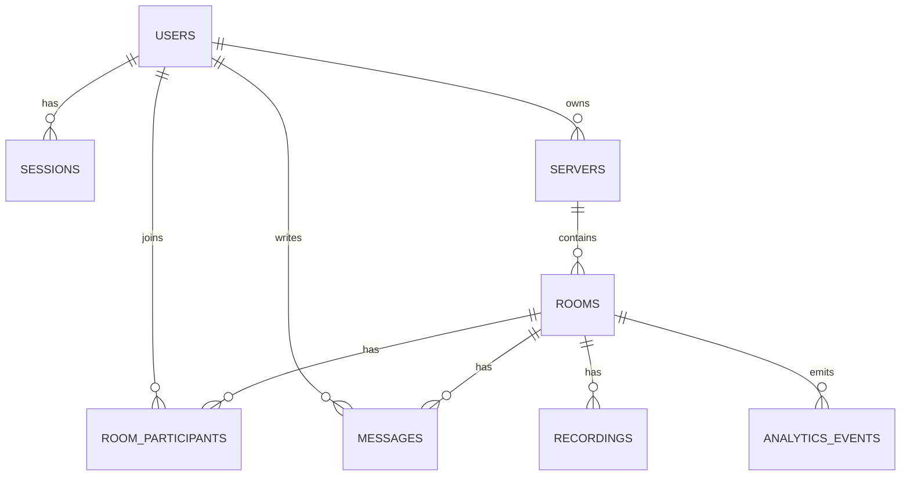

# 05. Логическая схема БД — расширенное обоснование

## Функциональное разбиение по доменам

| Домен | Основные сущности | Характер нагрузки | Приоритет по SLA |
|---|---|---|---|
| Auth / Identity | `users`, `sessions` | medium write, high read | critical |
| Community | `servers`, `rooms` | medium write, high read | high |
| Realtime state | `room_participants`, `presence` | very high write/read | critical |
| Messaging | `messages`, `message_reactions` | high write/read | high |
| Media | `recordings`, `attachments` | medium write/read | medium |
| Analytics | `analytics_events` | very high write, batch read | medium |

## ER-модель (логический уровень)

## Описание сущностей

| Сущность | Назначение | Что хранится | Примечание |
|---|---|---|---|
| `users` | Учетная запись | email/phone, auth-атрибуты, профиль | авторитетные данные пользователя |
| `sessions` | Активные сессии | токен, ttl, device metadata | multi-device вход |
| `servers` | Сообщества | owner, title, ACL-конфигурация | домен community |
| `rooms` | Каналы/комнаты | тип комнаты, server_id, параметры | voice/video/text room |
| `room_participants` | Runtime состав | user_id, room_id, role, join/leave state | горячая realtime-таблица |
| `messages` | История сообщений | room_id, author_id, body, created_at | основной write/read hot path |
| `message_reactions` | Реакции | message_id, user_id, emoji | fan-out friendly |
| `recordings` | Метаданные записи | room_id, object_key, duration, size | бинарные данные вне SQL |
| `analytics_events` | События аналитики | event_type, ts, actor_id, payload | append-only поток |
| `presence` | Онлайн-статус | user/device status, last_seen | эфемерное состояние |

## Размеры и нагрузка (оценка)

| Сущность | Средний размер строки | Запись QPS avg / peak | Чтение QPS avg / peak | Основание |
|---|---:|---:|---:|---|
| `users` | 256 B | 10 / 30 | 336 / 1008 | auth/read profile |
| `sessions` | 192 B | 336 / 1008 | 2,000 / 6,000 | validate token + refresh |
| `servers` | 256 B | 100 / 300 | 2,000 / 6,000 | список сообществ |
| `rooms` | 192 B | 500 / 1,500 | 5,000 / 15,000 | join/list rooms |
| `room_participants` | 96 B | 80,000 / 240,000 | 80,000 / 240,000 | join/leave + presence sync |
| `messages` | 640 B | 9,838 / 29,514 | 98,380 / 295,140 | send + history/read fan-out |
| `message_reactions` | 80 B | 1,500 / 4,500 | 6,000 / 18,000 | реакции в активных комнатах |
| `recordings` | 160 B | 500 / 1,500 | 1,500 / 4,500 | metadata только |
| `analytics_events` | 220 B | 60,000 / 180,000 | 500 / 1,500 | async ingestion |
| `presence` | 64 B | 40,000 / 120,000 | 40,000 / 120,000 | heartbeat/reconnect |

## Суточный поток данных (оценка)

| Сущность | Формула | Результат |
|---|---|---:|
| `messages` запись | `9,838 * 640 * 86400` | ~543 GB/day |
| `messages` чтение | `98,380 * 640 * 86400` | ~5.43 TB/day |
| `room_participants` запись | `80,000 * 96 * 86400` | ~663 GB/day |
| `analytics_events` запись | `60,000 * 220 * 86400` | ~1.14 TB/day |

## Требования к консистентности

| Связка данных | Тип консистентности | Что должно быть согласовано |
|---|---|---|
| `users` + `sessions` | strong | валидация и отзыв токенов |
| `rooms` + ACL/member checks | strong | контроль прав входа/публикации |
| `messages` + order внутри room | strong in-partition | монотонный порядок сообщений в комнате |
| `room_participants` | eventual | online/offline и счетчики участников |
| `presence` | eventual | допускается задержка статуса |
| `recordings` metadata -> object | eventual | объект может появляться чуть позже метаданных |
| `analytics_events` | eventual | асинхронный контур |

## Распределение нагрузки и hot keys

| Сущность | Ключ нагрузки | Характер распределения | Потенциальные hot keys |
|---|---|---|---|
| `messages` | `room_id` | room-centric | крупные публичные комнаты |
| `room_participants` | `room_id` | room-centric | массовые voice rooms |
| `presence` | `user_id` | user-centric | пользователи с множеством устройств |
| `sessions` | `token`, `user_id` | mixed | всплески reconnect |
| `analytics_events` | `event_time` | time-centric | пиковые интервалы событий |

## Допущения

1. Peak коэффициент принят `x3` относительно среднего (как в основном sizing).
2. Для `messages` read-path принят `x10` к write-path, чтобы учесть историю и fan-out чтения.
3. Бинарные файлы (recordings/attachments) не включены в SQL объемы, учитываются отдельно в object storage.
